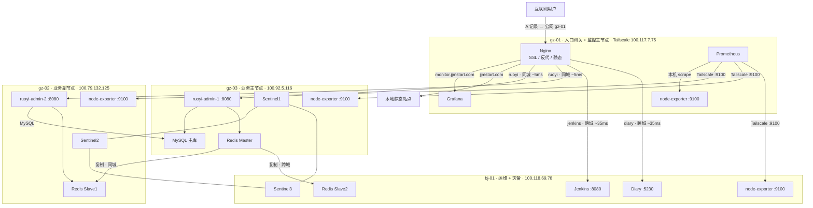

> ⚠️ 此文件已归档。请参阅重整后的文档结构，详见 [README.md](README.md)。

# 服务器架构（V1.1）

> 本文档由 `集群架构-V1.0.md` 演进而来，**V1.1** 主要变更：**监控栈（Prometheus + Grafana）从 bj-01 迁至 gz-01**，并补齐各节点 Node Exporter 采集拓扑说明。

---

## V1.1 相对 V1.0 的演进说明

### 演进动机

- **监控与业务/运维节点解耦**：原先 Prometheus、Grafana 与 Jenkins、Diary 同机（bj-01），存在「被监控节点宕机时监控与告警链路同时不可用」的风险；迁至入口网关同城的 **gz-01** 后，监控栈与跨城业务节点分离，更符合「监控独立」原则。
- **访问路径优化**：`monitor.jjmstart.com` 经 gz-01 Nginx 反代；Grafana 与 Nginx 同机后，**跨城 ~35ms 的 Grafana 回源延迟消除为本地 ~0ms**（仍保留 Jenkins、Diary 等跨城后端）。
- **全节点可观测性**：Prometheus 经 Tailscale 抓取各节点 `node-exporter`；补齐 **gz-02、gz-03** 仅部署 Exporter 的标准 compose，与 **gz-01（全栈）**、**bj-01（仅 Exporter）** 分工一致。

### 架构更新前（V1.0）

```
互联网用户 → gz-01(Nginx) ──跨城~35ms──→ bj-01: Grafana（monitor 域名）
                        └── 其他域名仍按原拓扑

bj-01：Prometheus + Grafana + Jenkins + Diary + Redis 哨兵 …
gz-01：仅 Nginx（无监控栈）
gz-02 / gz-03：无独立 node-exporter compose（或未纳入统一说明）
```

### 架构更新后（V1.1）

```
互联网用户 → gz-01(Nginx) ──本地──→ Grafana（monitor 域名）
            gz-01：Prometheus + Grafana + node-exporter（本机）
            gz-02 / gz-03：仅 node-exporter（Tailscale IP:9100）
            bj-01：仅 node-exporter（Tailscale IP:9100）+ Jenkins + Diary + …

Prometheus 抓取：gz-01（Docker 服务名）+ gz-02 + gz-03 + bj-01 的 :9100
```

### 配置文件与仓库约定

| 文件 | 用途 |
|---|---|
| `/opt/docker/monitor/docker-compose.yml` | **gz-01**：Prometheus + Grafana + node-exporter |
| `/opt/docker/monitor/docker-compose.bj-01.yml` | **bj-01**：仅 node-exporter；原 Prometheus/Grafana 已**注释保留**作对照 |
| `/opt/docker/monitor/prometheus/prometheus.yml` | **gz-01**：采集全节点 targets |

---

## 节点总览

| 节点 | 配置 | 云厂商 | Tailscale IP | 公网 IP | 角色 |
|---|---|---|---|---|---|
| gz-01 | 2C2G | 阿里云·广州 | 100.117.7.75 | 8.163.9.112 | 入口网关 + **监控主节点** |
| gz-02 | 4C4G | 腾讯云·广州 | 100.79.132.125 | 123.207.59.177 | 业务副节点 + 采集端 |
| gz-03 | 4C8G | 火山引擎·广州 | 100.92.5.116 | 118.145.70.66 | 业务主节点 + 采集端 |
| bj-01 | 4C16G | 京东云·北京 | 100.118.69.78 | 117.72.174.148 | 运维 + 灾备 + 采集端 |

---

## 架构拓扑

```
互联网用户
    │
    ▼
gz-01（入口网关 + 监控主节点）
├── Nginx（反向代理 + SSL 卸载 + 静态主站）
│     ├── jjmstart.com         → 本地静态文件 (0ms)
│     ├── ruoyi.jjmstart.com   → gz-03 + gz-02 负载均衡 (同城 ~5ms)
│     ├── diary.jjmstart.com   → bj-01 (跨城 ~35ms)
│     ├── jenkins.jjmstart.com → bj-01 (跨城 ~35ms)
│     └── monitor.jjmstart.com → 本地 Grafana (0ms)   ← V1.1：由 bj-01 迁入
│
├── Prometheus + Grafana（仅 gz-01）
│
├────────── 同城 ~5ms ──────────┐
│                              │
gz-03（业务主节点）             gz-02（业务副节点）
├── ruoyi-admin-1              ├── ruoyi-admin-2
├── MySQL 主库                 ├── Redis Slave1
├── Redis Master               ├── node-exporter（:9100）
├── Sentinel1                  └── Sentinel2
├── node-exporter（:9100）
                  ↕ Tailscale ~35ms
           bj-01（运维 + 灾备）
           ├── Jenkins CI/CD
           ├── node-exporter（:9100）
           ├── Diary (Memos)
           ├── Redis Slave2（异地灾备）
           └── Sentinel3
```

---

## 各节点服务详情

### gz-01（入口网关 + 监控主节点）

| 服务 | 容器名 | 端口 | 说明 |
|---|---|---|---|
| Nginx | nginx | 80, 8443→443 | 全站统一入口，SSL 卸载，负载均衡 |
| Prometheus | prometheus | 容器内 9090 | 时序库；经 Tailscale 抓取各节点 Exporter |
| Grafana | grafana | 100.117.7.75:3000 | 监控面板；Nginx 反代 `monitor.jjmstart.com` |
| Node Exporter | node-exporter | Docker 内网 9100 | 本机系统指标；Prometheus 用服务名 `node-exporter:9100` 抓取 |

### gz-03（业务主节点）

| 服务 | 容器名 | 端口 | 说明 |
|---|---|---|---|
| 若依后端 | ruoyi-admin-1 | 100.92.5.116:8080 | 本地访问 MySQL(0ms) + Redis Master(0ms) |
| MySQL | mysql | 127.0.0.1:3306 + 100.92.5.116:3306 | 主库，gz-02 通过 Tailscale 访问 |
| Redis Master | redis | 100.92.5.116:6379 | 主写节点 |
| Sentinel | redis-sentinel | 100.92.5.116:26379 | 哨兵节点 1 |
| Node Exporter | node-exporter | 100.92.5.116:9100 | 仅采集端（compose 于 `/opt/docker/monitor`） |

### gz-02（业务副节点）

| 服务 | 容器名 | 端口 | 说明 |
|---|---|---|---|
| 若依后端 | ruoyi-admin-2 | 100.79.132.125:8080 | MySQL 走 Tailscale 到 gz-03(~5ms) |
| Redis Slave1 | redis | 100.79.132.125:6379 | 同城从节点，故障切换优先级 100 |
| Sentinel | redis-sentinel | 100.79.132.125:26379 | 哨兵节点 2 |
| Node Exporter | node-exporter | 100.79.132.125:9100 | 仅采集端（compose 于 `/opt/docker/monitor`） |

### bj-01（运维 + 灾备）

| 服务 | 容器名 | 端口 | 说明 |
|---|---|---|---|
| Jenkins | jenkins | 127.0.0.1:8080 + 100.118.69.78:8080 | CI/CD |
| Node Exporter | node-exporter | 100.118.69.78:9100 | 仅采集端；**Prometheus/Grafana 已迁出**（见 `docker-compose.bj-01.yml`） |
| Diary | diary | 100.118.69.78:5230 | Memos 日记应用 |
| Redis Slave2 | redis | 100.118.69.78:6379 | 异地灾备，优先级 200 |
| Sentinel | redis-sentinel | 100.118.69.78:26379 | 哨兵节点 3 |

---

## Redis 哨兵集群

```
gz-03 Master ──复制──→ gz-02 Slave1（同城，priority=100）
     │
     └─────复制──→ bj-01 Slave2（异地，priority=200）

Sentinel 集群：3 节点（gz-03 / gz-02 / bj-01），quorum=2
故障切换顺序：gz-02(同城) > bj-01(异地)
```

---

## 网络互联

所有节点通过 Tailscale WireGuard 加密隧道互联，不依赖公网端口暴露。

| 链路 | 延迟 | 用途 |
|---|---|---|
| gz-01 ↔ gz-03 | ~5ms | Nginx → ruoyi-admin-1 |
| gz-01 ↔ gz-02 | ~5ms | Nginx → ruoyi-admin-2 |
| gz-01 ↔ bj-01 | ~35ms | Nginx → Jenkins / Diary；Prometheus → Exporter |
| gz-03 ↔ gz-02 | ~5ms | MySQL 跨节点访问、Redis 同城复制 |
| gz-03 ↔ bj-01 | ~35ms | Redis 异地复制 |

---

## 域名与 DNS

| 域名 | A 记录 | 端口 |
|---|---|---|
| jjmstart.com / www.jjmstart.com | 8.163.9.112 (gz-01) | 8443 |
| ruoyi.jjmstart.com | 8.163.9.112 (gz-01) | 8443 |
| diary.jjmstart.com | 8.163.9.112 (gz-01) | 8443 |
| jenkins.jjmstart.com | 8.163.9.112 (gz-01) | 8443 |
| monitor.jjmstart.com | 8.163.9.112 (gz-01) | 8443 |

> 备案通过后将 8443 改为标准 443 端口。

---

## 演进方向

（与 V1.0 一致，以下仅作延续性索引；实施时以当时集群为准。）

### 第一阶段：备案通过后立即执行（优先级：高）

**1. 端口标准化** — 8443 → 443，同步 conf.d 跳转与 `error_page 497`。

**2. 开启 HTTPS 全站强制 + HSTS**

**3. 接入 Cloudflare CDN**

### 第二阶段：提升可靠性（优先级：中）

**4. Nginx 双节点高可用**

**5. MySQL 主从复制**

**6. 监控告警完善** — Alertmanager、关键规则、若依 JVM 等（监控主栈已在 gz-01，便于统一接入告警组件）。

### 第三阶段：自动化与效率（优先级：中低）

**7. CI/CD 流水线改造**

**8. 基础设施即代码（IaC）**

**9. 日志集中管理** — Loki + Promtail；可与 **gz-01 Grafana** 同域部署或就近部署。

### 第四阶段：长期规划（优先级：低）

**10. Kubernetes 迁移评估**

**11. 数据库云托管评估**

### 演进路线图

```
V1.0 ──→ V1.1（监控迁至 gz-01 + 全节点 Exporter）
  │
  └── 后续：备案 / CDN / MySQL 主从 / 告警 / IaC …（见上各阶段）
```

---

## 文档版本

| 版本 | 说明 |
|---|---|
| V1.0 | 初始拓扑；Grafana/Prometheus 位于 bj-01 |
| V1.1 | 监控栈迁至 gz-01；bj-01 仅 Exporter；gz-02/gz-03 补齐 Exporter；`docker-compose.bj-01.yml` 注释保留旧服务 |

---

## 整体集群架构（V1.1 一览）

下图汇总当前四节点职责、统一入口、跨城链路、MySQL/Redis 数据面与 Prometheus 采集面（与上文「架构拓扑」「Redis 哨兵」「网络互联」一致）。



**ASCII 速览（无 Mermaid 渲染时）：**

```
                    ┌─────────────────────────────────────────┐
                    │ gz-01（入口 + 监控）                      │
  互联网 ──8443──►  │ Nginx ──┬─ 静态 / ruoyi LB / diary /     │
                    │         │   jenkins / monitor→Grafana     │
                    │ Prometheus ──scrape(:9100)──┐           │
                    │ Grafana（本地）              │ Tailscale │
                    └──────────────────────────────┼───────────┘
                                                   │
     同城 ~5ms ◄──────────────────────────────────┼──────────────────► 跨城 ~35ms
            ┌─────────────────────┐    ┌─────────────────────┐         ┌─────────────────────┐
            │ gz-03 业务主         │    │ gz-02 业务副         │         │ bj-01 运维+灾备      │
            │ ruoyi-1 / MySQL 主   │◄───│ ruoyi-2 / Redis S1  │         │ Jenkins / Diary     │
            │ Redis M / Sentinel1  │    │ Sentinel2           │         │ Redis S2 / Sentinel3│
            │ node-exporter        │    │ node-exporter       │         │ node-exporter       │
            └──────────┬───────────┘    └──────────┬──────────┘         └──────────┬──────────┘
                       │ Redis 复制 ────────────────┘                    Redis 复制 │
                       └────────────────────────────────────────────────────────────┘
                       Sentinel 集群 ×3（quorum=2）；故障切换：gz-02 优先于 bj-01
```
