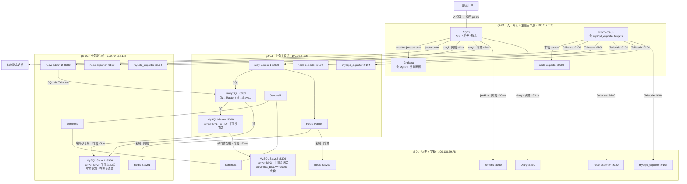

> ⚠️ 此文件已归档。请参阅重整后的文档结构，详见 [README.md](README.md)。

# 服务器架构（V1.2）

> 本文档由 `集群架构-V1.1.md` 演进而来，**V1.2** 主要变更：**MySQL 由单点主库升级为一主两从（gz-03 主 / gz-02 同城从 / bj-01 异地延迟从），开启半同步复制与 GTID，引入 ProxySQL 读写分离，并接入 mysqld_exporter 监控**。

---

## 给模型的阅读约定（Context Bootstrap）

> **本节专供 AI 模型快速建立上下文，人工阅读可跳过。**

**你正在协助用户完成从 V1.1 → V1.2 的集群升级，核心变更是 MySQL 高可用（HA）。以下是你需要知道的全部背景：**

### 项目基本情况

- 仓库根目录：`/opt/docker`
- 所有服务均以 Docker Compose 管理，网络为 `global_gateway`（`docker network create global_gateway` 已在各节点存在）
- 节点间通过 **Tailscale WireGuard** 加密隧道互联，不依赖公网端口
- 节点 hostname 约定：`gz-01` / `gz-02` / `gz-03` / `bj-01`

### 四节点信息一览

| 节点 | 规格 | 云厂商 | Tailscale IP | 公网 IP | 当前角色 |
|------|------|--------|--------------|---------|---------|
| gz-01 | 2C2G | 阿里云·广州 | 100.117.7.75 | 8.163.9.112 | 入口网关 + 监控主节点（Nginx / Prometheus / Grafana）|
| gz-02 | 4C4G | 腾讯云·广州 | 100.79.132.125 | 123.207.59.177 | 业务副节点（ruoyi-admin-2 / Redis Slave1 / Sentinel2）|
| gz-03 | 4C8G | 火山引擎·广州 | 100.92.5.116 | 118.145.70.66 | 业务主节点（ruoyi-admin-1 / MySQL 主库 / Redis Master / Sentinel1）|
| bj-01 | 4C16G | 京东云·北京 | 100.118.69.78 | 117.72.174.148 | 运维 + 灾备（Jenkins / Diary / Redis Slave2 / Sentinel3）|

### 当前 MySQL 基线（V1.1 状态）

- **仅 gz-03** 有 MySQL，**单点主库**，无从库
- Compose 路径：`/opt/docker/backend/mysql/docker-compose.yml`
- 镜像：`mysql:8.0`
- 数据卷：`./data:/var/lib/mysql`（即 `/opt/docker/backend/mysql/data/`）
- 当前 `command` 中**尚未开启 binlog / GTID**，这是 Phase 1 首要任务
- 端口绑定：`127.0.0.1:3306`（本机调试）+ `100.92.5.116:3306`（Tailscale，供 gz-02 访问）
- 内存限制：2G（gz-03 总 8G，Redis + ruoyi 约 2G，MySQL 独享较宽裕）

### V1.2 目标 MySQL 角色

| 节点 | MySQL 角色 | server-id | 说明 |
|------|-----------|-----------|------|
| gz-03 | Master | 1 | 主写；binlog + GTID；半同步主端 |
| gz-02 | Slave1 | 2 | 同城从；实时复制；读分担；故障接管优先；半同步从端 |
| bj-01 | Slave2 | 3 | 异地从；**延迟复制 3600s**；灾备防误删；半同步从端 |

### 已确定的技术决策

| 决策点 | 选型 | 理由 |
|--------|------|------|
| 复制模式 | **半同步复制（Semi-sync）** | 主库 ACK 需至少一个从库写入 relay log，降低 RPO；同城 gz-02 ~5ms ACK，写延迟增加极小；超时自动降级 async 保可用性 |
| binlog 格式 | **ROW** | MySQL 8.0 默认，复制一致性最佳 |
| GTID | **开启** | 简化从库接入、故障恢复与 PITR |
| 快照工具 | **mysqldump** | 当前数据量小，`--single-transaction` 不锁表 |
| bj-01 延迟复制 | **开启，SOURCE_DELAY=3600s** | 防止误操作（DROP/TRUNCATE）在 1 小时内向异地从扩散，提供操作级灾备窗口 |
| 读写分离 | **ProxySQL（gz-03 集中部署）** | 与应用解耦，规则路由 SELECT → gz-02 Slave1；应用连接 ProxySQL :6033，无需感知后端拓扑 |
| ProxySQL 读节点范围 | **仅 gz-02 Slave1** | bj-01 Slave2 因延迟复制数据最多落后 1 小时，不纳入在线读流量；仅作灾备 |
| 自动切换 | **手动切换 + 告警** | 当前规模不引入 MHA/Orchestrator；依赖 Prometheus 告警 + 人工操作 |

### 关键文件路径索引

```
/opt/docker/
├── backend/
│   ├── mysql/
│   │   └── docker-compose.yml          # gz-03 主库（Phase 1 修改：binlog/GTID/半同步）
│   ├── proxysql/
│   │   ├── docker-compose.yml          # gz-03 ProxySQL（Phase 4 新建）
│   │   └── proxysql.cnf                # Phase 4 新建：路由规则、用户、后端节点
│   ├── ruoyi/
│   │   └── docker-compose.yml          # gz-03 ruoyi-admin-1（Phase 4：数据源改指向 ProxySQL）
│   └── redis/
│       ├── docker-compose.yml          # gz-03 Redis 主 + Sentinel1（无需修改）
│       └── conf/
│           ├── redis.conf
│           └── sentinel.conf
├── monitor/
│   ├── docker-compose.yml              # gz-01 Prometheus + Grafana（Phase 5 增加 mysqld_exporter target）
│   ├── docker-compose.bj-01.yml        # bj-01 node-exporter
│   └── prometheus/
│       └── prometheus.yml              # Phase 5 新增 mysqld_exporter scrape
└── Docs/
    ├── 集群架构-V1.0.md
    ├── 集群架构-V1.1.md
    ├── 集群架构-V1.2.md                # 本文档
    └── 系统初始化指令-V15.0-MySQL高可用.md
```

### 交互约定（重要）

> **用户希望通过实操锻炼技能，你必须严格遵守以下约定：**
>
> 1. **分步交互**：每次只告知当前步骤的操作，等用户完成并反馈后再给出下一步。
> 2. **不要一次性发出所有命令**：哪怕某阶段步骤很简单，也要逐步推进。
> 3. **每步包含**：① 目标说明（做什么、为什么）② 具体命令 ③ 预期结果 ④ 验证方法。
> 4. **遇到报错**：引导用户提供完整错误输出，再给出排障方向。
> 5. **跨节点操作**：每次明确告知在哪个节点（gz-03 / gz-02 / bj-01）执行。
> 6. **起始状态**：升级从 **Phase 1** 开始，用户当前处于 V1.1 状态（MySQL 单点，无 binlog/GTID）。

---

## V1.2 相对 V1.1 的演进说明

### 演进动机

- **消除 MySQL 单点**：V1.1 中 gz-03 MySQL 宕机则全站数据库不可用；V1.2 引入同城 + 异地两个从库，提供故障接管能力。
- **读写分离**：业务读流量（报表、列表查询等）可路由至从库，缓解主库压力。
- **可靠 PITR 基础**：开启 binlog + GTID 后，配合定期全量备份，可实现任意时间点恢复。
- **监控可观测性补齐**：三节点 `mysqld_exporter` 接入 Prometheus，Grafana 展示复制延迟、主从断连告警。

### 架构更新前（V1.1 MySQL 部分）

```
ruoyi-admin-1 (gz-03) ──┐
                          ├──► MySQL 主库 (gz-03) ← 单点，无 binlog/GTID
ruoyi-admin-2 (gz-02) ──┘     100.92.5.116:3306
```

### 架构更新后（V1.2 MySQL 部分）

```
ruoyi-admin-1 (gz-03) ──┐
                          ├──► ProxySQL (gz-03) :6033
ruoyi-admin-2 (gz-02) ──┘  （写 → Master，读 → Slave1）
                                │          │
                               写          读
                                ▼          ▼
                    MySQL Master (gz-03)  MySQL Slave1 (gz-02)
                    binlog·GTID·          read_only=ON
                    server-id=1           server-id=2·同城 ~5ms
                    半同步主端
                         │
          ┌──────────────┴─────────────────────┐
          ▼ 半同步复制·同城 ~5ms ACK              ▼ 半同步复制·跨城 ~35ms
    gz-02 MySQL Slave1                   bj-01 MySQL Slave2
    实时复制·在线读流量                    SOURCE_DELAY=3600s
                                         灾备防误删（不参与在线读）
```

---

## 节点总览（V1.2）

| 节点 | 配置 | 云厂商 | Tailscale IP | 公网 IP | 角色 |
|------|------|--------|--------------|---------|------|
| gz-01 | 2C2G | 阿里云·广州 | 100.117.7.75 | 8.163.9.112 | 入口网关 + 监控主节点 |
| gz-02 | 4C4G | 腾讯云·广州 | 100.79.132.125 | 123.207.59.177 | 业务副节点 + **MySQL Slave1**（实时复制·在线读） |
| gz-03 | 4C8G | 火山引擎·广州 | 100.92.5.116 | 118.145.70.66 | 业务主节点 + **MySQL Master** + **ProxySQL** |
| bj-01 | 4C16G | 京东云·北京 | 100.118.69.78 | 117.72.174.148 | 运维 + 灾备 + **MySQL Slave2**（延迟 3600s·灾备） |

---

## 架构拓扑（V1.2）

```
互联网用户
    │
    ▼
gz-01（入口网关 + 监控主节点）
├── Nginx（反向代理 + SSL 卸载 + 静态主站）
│     ├── jjmstart.com         → 本地静态文件 (0ms)
│     ├── ruoyi.jjmstart.com   → gz-03 + gz-02 负载均衡 (同城 ~5ms)
│     ├── diary.jjmstart.com   → bj-01 (跨城 ~35ms)
│     ├── jenkins.jjmstart.com → bj-01 (跨城 ~35ms)
│     └── monitor.jjmstart.com → 本地 Grafana (0ms)
│
├── Prometheus + Grafana
│     └── 新增 mysqld_exporter 采集（gz-03:9104 / gz-02:9104 / bj-01:9104）
│
├──────────── 同城 ~5ms ───────────┐
│                                  │
gz-03（业务主节点）                gz-02（业务副节点）
├── ruoyi-admin-1 ──┐              ├── ruoyi-admin-2 ──┐
├── ProxySQL（:6033）◄─────────────────────────────────┘
│     ├── 写 ──────► MySQL Master（本机 :3306）
│     └── 读 ──────► MySQL Slave1（gz-02 :3306，via Tailscale）
├── MySQL Master（server-id=1）    ├── MySQL Slave1（server-id=2，新增）
│   半同步主端                     │   实时复制·read_only·在线读流量
│   └── 半同步复制 ─────────────────►   半同步从端·ACK ~5ms
│   └── 半同步复制                 ├── mysqld_exporter（:9104，新增）
├── mysqld_exporter（:9104）        ├── Redis Slave1
└── node-exporter（:9100）          ├── Sentinel2
                                    └── node-exporter（:9100）
                    ↕ Tailscale ~35ms
             bj-01（运维 + 灾备）
             ├── Jenkins CI/CD
             ├── Diary (Memos)
             ├── MySQL Slave2（server-id=3，新增）
             │   ├── 半同步从端·ACK ~35ms
             │   └── SOURCE_DELAY=3600s（延迟应用，防误删扩散）
             │   不参与在线读流量（数据最多落后 1 小时）
             ├── mysqld_exporter（:9104，新增）
             ├── Redis Slave2
             ├── Sentinel3
             └── node-exporter（:9100）
```

---

## 各节点服务详情（V1.2）

### gz-01（入口网关 + 监控主节点）

| 服务 | 容器名 | 端口 | 说明 |
|------|--------|------|------|
| Nginx | nginx | 80, 8443→443 | 全站统一入口，SSL 卸载，负载均衡 |
| Prometheus | prometheus | 容器内 9090 | **V1.2 新增** mysqld_exporter targets |
| Grafana | grafana | 100.117.7.75:3000 | **V1.2 新增** MySQL 复制监控面板 |
| Node Exporter | node-exporter | Docker 内网 9100 | 本机系统指标 |

### gz-03（业务主节点）

| 服务 | 容器名 | 端口 | 说明 |
|------|--------|------|------|
| 若依后端 | ruoyi-admin-1 | 100.92.5.116:8080 | **V1.2**：数据源改连本机 ProxySQL :6033 |
| **MySQL Master** | mysql | 127.0.0.1:3306 + 100.92.5.116:3306 | **V1.2**：binlog·GTID·server-id=1·**半同步主端** |
| **ProxySQL** | proxysql | 100.92.5.116:6033（MySQL）/ 100.92.5.116:6032（Admin）| **新增**：写 → Master :3306；读 → gz-02 Slave1 :3306 |
| **mysqld_exporter** | mysqld-exporter | 100.92.5.116:9104 | **新增**：暴露 MySQL 指标 |
| Redis Master | redis | 100.92.5.116:6379 | 主写节点（无变化） |
| Sentinel1 | redis-sentinel | 100.92.5.116:26379 | 哨兵节点 1（无变化） |
| Node Exporter | node-exporter | 100.92.5.116:9100 | 系统指标（无变化） |

### gz-02（业务副节点）

| 服务 | 容器名 | 端口 | 说明 |
|------|--------|------|------|
| 若依后端 | ruoyi-admin-2 | 100.79.132.125:8080 | **V1.2**：数据源改连 gz-03 ProxySQL :6033（via Tailscale） |
| **MySQL Slave1** | mysql | 127.0.0.1:3306 + 100.79.132.125:3306 | **新增**：read_only=ON·server-id=2·**半同步从端**·实时复制 |
| **mysqld_exporter** | mysqld-exporter | 100.79.132.125:9104 | **新增** |
| Redis Slave1 | redis | 100.79.132.125:6379 | 同城从节点（无变化） |
| Sentinel2 | redis-sentinel | 100.79.132.125:26379 | 哨兵节点 2（无变化） |
| Node Exporter | node-exporter | 100.79.132.125:9100 | 系统指标（无变化） |

### bj-01（运维 + 灾备）

| 服务 | 容器名 | 端口 | 说明 |
|------|--------|------|------|
| Jenkins | jenkins | 127.0.0.1:8080 + 100.118.69.78:8080 | CI/CD（无变化） |
| **MySQL Slave2** | mysql | 127.0.0.1:3306 + 100.118.69.78:3306 | **新增**：server-id=3·**半同步从端**·**SOURCE_DELAY=3600s**·不参与在线读 |
| **mysqld_exporter** | mysqld-exporter | 100.118.69.78:9104 | **新增** |
| Diary | diary | 100.118.69.78:5230 | Memos（无变化） |
| Redis Slave2 | redis | 100.118.69.78:6379 | 异地灾备（无变化） |
| Sentinel3 | redis-sentinel | 100.118.69.78:26379 | 哨兵节点 3（无变化） |
| Node Exporter | node-exporter | 100.118.69.78:9100 | 系统指标（无变化） |

---

## MySQL 主从复制架构

```
gz-03 MySQL Master（server-id=1）
    binlog: mysql-bin.xxxxxx · binlog_format=ROW
    GTID: ON · gtid_mode=ON · enforce_gtid_consistency=ON
    半同步主端：rpl_semi_sync_source_enabled=ON
               rpl_semi_sync_source_wait_for_replica_count=1
               rpl_semi_sync_source_timeout=5000ms（超时降级 async）
    │
    ├──── 半同步复制 ─► gz-02 MySQL Slave1（server-id=2）
    │                   同城 ~5ms ACK，read_only=ON
    │                   实时复制（无延迟）
    │                   rpl_semi_sync_replica_enabled=ON
    │                   ProxySQL 读流量目标节点（在线读）
    │                   故障接管优先候选
    │
    └──── 半同步复制 ─► bj-01 MySQL Slave2（server-id=3）
                        跨城 ~35ms ACK，read_only=ON
                        rpl_semi_sync_replica_enabled=ON
                        SOURCE_DELAY=3600s（延迟应用，binlog 实时接收）
                        不纳入 ProxySQL 读流量（数据最多落后 1 小时）
                        异地灾备：误删恢复窗口 ≤ 1 小时

复制账号：repl_user（REPLICATION SLAVE 最小权限）
快照工具：mysqldump --single-transaction --master-data=2 --set-gtid-purged=ON
故障切换：手动切换 + Prometheus 告警（无自动 Failover）
读写分离：ProxySQL（gz-03 :6033）→ 写 Master / 读 Slave1
```

---

## 网络互联（含 MySQL 复制链路）

所有节点通过 Tailscale WireGuard 加密隧道互联。

| 链路 | 延迟 | 用途 |
|------|------|------|
| gz-01 ↔ gz-03 | ~5ms | Nginx → ruoyi-admin-1；Prometheus → mysqld_exporter |
| gz-01 ↔ gz-02 | ~5ms | Nginx → ruoyi-admin-2；Prometheus → mysqld_exporter |
| gz-01 ↔ bj-01 | ~35ms | Nginx → Jenkins/Diary；Prometheus → mysqld_exporter |
| gz-03 ↔ gz-02 | ~5ms | **MySQL 主从复制**；Redis 同城复制 |
| gz-03 ↔ bj-01 | ~35ms | **MySQL 主从复制（异地）**；Redis 异地复制 |

---

## V1.2 升级过程说明（Phase 清单）

> 升级采用**交互式分步推进**，每个 Phase 完成后验收再进入下一阶段。模型在协助时**每次只输出当前步骤**，不提前展示后续内容。

### Phase 1：主库准备（gz-03）

**目标**：开启 binlog、GTID、半同步主端插件，创建复制账号，零停机或极短停机窗口。

- 修改 `/opt/docker/backend/mysql/docker-compose.yml` 的 `command` 块，增加：
  ```
  --log-bin=mysql-bin
  --server-id=1
  --gtid_mode=ON
  --enforce_gtid_consistency=ON
  --binlog_format=ROW
  --binlog_expire_logs_seconds=604800
  --plugin-load-add=rpl_semi_sync_source=semisync_source.so
  --rpl_semi_sync_source_enabled=ON
  --rpl_semi_sync_source_wait_for_replica_count=1
  --rpl_semi_sync_source_timeout=5000
  ```
- `docker compose up -d --force-recreate` 重启主库容器
- 进入容器创建复制账号 `repl_user`（REPLICATION SLAVE 权限）
- 验证：`SHOW MASTER STATUS`、`SHOW VARIABLES LIKE 'rpl_semi_sync%'` 确认 binlog + GTID + 半同步已生效

**注意**：此时半同步主端启动但无从库，会立即触发超时降级为异步（正常现象），不影响业务。

**回滚**：去掉新增 `command` 参数重启即可，从库尚未建立，主库独立可服务。

---

### Phase 2：同城从库（gz-02）

**目标**：gz-02 部署 MySQL Slave1，开启半同步从端，完成实时主从复制建立。

- 在 gz-02 创建 `/opt/docker/backend/mysql/docker-compose.yml`，`server-id=2`，并在 `command` 中加入：
  ```
  --server-id=2
  --read_only=ON
  --gtid_mode=ON
  --enforce_gtid_consistency=ON
  --plugin-load-add=rpl_semi_sync_replica=semisync_replica.so
  --rpl_semi_sync_replica_enabled=ON
  ```
- 在 gz-03 上执行 `mysqldump --single-transaction --master-data=2 --set-gtid-purged=ON` 备份
- 通过 Tailscale 传输快照至 gz-02（`scp` 或 `rsync`，走 Tailscale IP 100.79.132.125）
- gz-02 导入数据，执行 `CHANGE REPLICATION SOURCE TO`（GTID 模式）+ `START REPLICA`
- 验证：`SHOW REPLICA STATUS\G` 确认 `Seconds_Behind_Source=0`
- 回到 gz-03：`SHOW STATUS LIKE 'rpl_semi_sync_source_status'` 确认半同步已从 OFF → ON（有从库 ACK）

---

### Phase 3：异地从库（bj-01）

**目标**：bj-01 部署 MySQL Slave2，开启半同步从端与 1 小时延迟复制，异地防误删灾备。

- 在 bj-01 创建 `/opt/docker/backend/mysql/docker-compose.yml`，`server-id=3`，`command` 加入：
  ```
  --server-id=3
  --read_only=ON
  --gtid_mode=ON
  --enforce_gtid_consistency=ON
  --plugin-load-add=rpl_semi_sync_replica=semisync_replica.so
  --rpl_semi_sync_replica_enabled=ON
  ```
- 同 Phase 2 方式传输快照、导入、建立复制
- **额外步骤**：连入 bj-01 MySQL 执行延迟复制配置：
  ```sql
  STOP REPLICA SQL_THREAD;
  CHANGE REPLICATION SOURCE TO SOURCE_DELAY = 3600;
  START REPLICA SQL_THREAD;
  ```
- 验证：`SHOW REPLICA STATUS\G` 确认 `SQL_Delay=3600`、`Seconds_Behind_Source` 约等于 3600（正常）
- 关注跨城（~35ms）对 IO_Thread 延迟的影响，记录 `Master_Log_File` / `Read_Master_Log_Pos` 基线

---

### Phase 4：ProxySQL 读写分离（gz-03）

**目标**：在 gz-03 部署 ProxySQL，配置路由规则，应用改连 ProxySQL，实现读写分离与应用解耦。

- 在 gz-03 创建 `/opt/docker/backend/proxysql/docker-compose.yml`，部署 `proxysql/proxysql:latest`
  - 绑定 `100.92.5.116:6033`（MySQL 协议）、`100.92.5.116:6032`（Admin 管理端口）
- 编写 `proxysql.cnf` 配置：
  - `mysql_servers`：hostgroup 0（写）→ gz-03 Master :3306，hostgroup 1（读）→ gz-02 Slave1 :3306
  - `mysql_query_rules`：SELECT 路由至 hostgroup 1；其余写 hostgroup 0
  - `mysql_users`：配置若依数据库账号，`default_hostgroup=0`
- 修改 ruoyi-admin-1 / ruoyi-admin-2 的数据源 URL，指向 `100.92.5.116:6033`
- 重启 ruoyi 服务，验证：
  - `SELECT`（纯读）通过 ProxySQL → Slave1（gz-02）
  - `INSERT / UPDATE / DELETE` 通过 ProxySQL → Master（gz-03 本机）
  - 可通过 ProxySQL Admin 端口执行 `SELECT * FROM stats_mysql_query_digest` 观察路由统计

---

### Phase 5：监控接入（gz-01 Prometheus）

**目标**：三节点 `mysqld_exporter` 上线，Grafana 展示 MySQL 复制状态。

- 各节点 Compose 增加 `mysqld-exporter` 容器，绑定 Tailscale IP:9104
- 修改 `monitor/prometheus/prometheus.yml`，新增三个 mysqld_exporter target
- Grafana 导入 MySQL Overview 面板（dashboard id: 7362 或同类）
- 配置告警：复制延迟 > 10s、主从断连

---

### Phase 6：故障演练

**目标**：验证 RTO / RPO，固化切换 SOP。

- 模拟 gz-03 MySQL 不可用 → 将 gz-02 Slave1 提升为新主
  1. `STOP REPLICA; RESET REPLICA ALL;`（gz-02 脱离从库角色）
  2. `SET GLOBAL read_only=OFF;`（gz-02 升为主库）
  3. 更新 ProxySQL 写 hostgroup → 指向 gz-02 :3306（或临时修改应用连接串）
  4. bj-01 Slave2 重新指向新主（gz-02）
- 记录切换时间（**RTO 目标 < 5 分钟**）
- RPO 分析：半同步保证主库 ACK 时至少 gz-02 已收到 relay log，**RPO ≈ 0**（正常情况下）；极端网络分区场景超时降级 async 后，RPO ≤ 超时窗口（默认 5s）
- 恢复原拓扑，文档化切换 SOP，并验证 bj-01 延迟复制是否能回放误删操作

---

## 整体集群架构（V1.2 一览）



---

## 文档版本

| 版本 | 说明 |
|------|------|
| V1.0 | 初始拓扑；Grafana/Prometheus 位于 bj-01 |
| V1.1 | 监控栈迁至 gz-01；bj-01 仅 Exporter；gz-02/gz-03 补齐 Exporter |
| V1.2 | MySQL 升级为一主两从（gz-03 主 / gz-02 同城从 / bj-01 异地延迟从）；半同步复制 + GTID；ProxySQL 读写分离；mysqld_exporter 监控；故障演练 |

---

## 演进方向（V1.2 之后）

```
V1.2（本版本）── MySQL 1主2从 + 半同步 + GTID + ProxySQL读写分离 + bj-01延迟复制 + mysqld_exporter
  │
  └──► V1.3（候选）── 以下按优先级排序
         ├── 备案通过 → 8443 改 443 + HSTS + Cloudflare CDN
         ├── Nginx 双节点 HA（gz-01 + gz-03 Keepalived）
         ├── ProxySQL 高可用（ProxySQL Cluster 或双节点热备）
         ├── Orchestrator 或 MHA 自动 Failover
         ├── 日志集中管理（Loki + Promtail）
         └── Kubernetes 迁移评估
```
