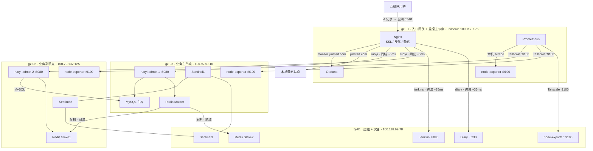

# 架构快照 v1.1

## 文档说明

V1.1 相对 V1.0 的核心变更：**监控栈（Prometheus + Grafana）从 bj-01 迁至 gz-01**，并补齐各节点 Node Exporter 采集拓扑。**本版本为历史归档，非当前最新版本，请参阅 [v1.2.md](v1.2.md)。**

---

## AI 上下文引导（Context Bootstrap）

> 本节供 AI 快速建立上下文，人工阅读可跳过。

**仓库根目录与管理方式**

- 仓库根目录：`/opt/docker`
- 所有服务均以 Docker Compose 管理
- 网络：`global_gateway`（各节点已创建）

**节点互联方式**

所有节点通过 **Tailscale WireGuard** 加密隧道互联，不依赖公网端口暴露。

**关键文件路径索引**

| 文件路径 | 节点 | 用途 |
|----------|------|------|
| `/opt/docker/monitor/docker-compose.yml` | gz-01 | Prometheus + Grafana + node-exporter |
| `/opt/docker/monitor/docker-compose.bj-01.yml` | bj-01 | 仅 node-exporter；原 Prometheus/Grafana 已注释保留作对照 |
| `/opt/docker/monitor/prometheus/prometheus.yml` | gz-01 | 采集全节点 targets（含四节点 :9100） |
| `/opt/docker/backend/mysql/docker-compose.yml` | gz-03 | MySQL 主库（单点，尚无 binlog/GTID） |
| `/opt/docker/backend/redis/docker-compose.yml` | gz-03 | Redis 主 + Sentinel1 |

**本版本核心技术决策**

| 决策点 | 选型 | 理由 |
|--------|------|------|
| 监控主节点 | **gz-01**（由 bj-01 迁入） | 监控独立原则：避免被监控节点宕机时监控链路同时不可用 |
| Grafana 访问延迟 | 本地 ~0ms（由跨城 ~35ms 优化） | Grafana 与 Nginx 同机，monitor 域名本地回源 |
| Node Exporter 覆盖 | 四节点全覆盖（gz-01/gz-02/gz-03/bj-01） | 补齐 gz-02、gz-03 仅有 Exporter 的标准 compose |
| 数据库 | MySQL 单点主库（gz-03，不变） | 监控演进阶段保持数据库现状 |

---

## 节点总览

| 节点 | 配置 | 云厂商 | Tailscale IP | 公网 IP | 角色 |
|------|------|--------|--------------|---------|------|
| gz-01 | 2C2G | 阿里云·广州 | 100.117.7.75 | 8.163.9.112 | 入口网关 + **监控主节点** |
| gz-02 | 4C4G | 腾讯云·广州 | 100.79.132.125 | 123.207.59.177 | 业务副节点 + 采集端 |
| gz-03 | 4C8G | 火山引擎·广州 | 100.92.5.116 | 118.145.70.66 | 业务主节点 + 采集端 |
| bj-01 | 4C16G | 京东云·北京 | 100.118.69.78 | 117.72.174.148 | 运维 + 灾备 + 采集端 |

---

## 各节点服务详情

### gz-01（入口网关 + 监控主节点）

| 服务 | 容器名 | 端口 | 说明 |
|------|--------|------|------|
| Nginx | nginx | 80, 8443→443 | 全站统一入口，SSL 卸载，负载均衡 |
| Prometheus | prometheus | 容器内 9090 | 时序库；经 Tailscale 抓取各节点 Exporter |
| Grafana | grafana | 100.117.7.75:3000 | 监控面板；Nginx 反代 `monitor.jjmstart.com` |
| Node Exporter | node-exporter | Docker 内网 9100 | 本机系统指标；Prometheus 用服务名 `node-exporter:9100` 抓取 |

### gz-03（业务主节点）

| 服务 | 容器名 | 端口 | 说明 |
|------|--------|------|------|
| 若依后端 | ruoyi-admin-1 | 100.92.5.116:8080 | 本地访问 MySQL(0ms) + Redis Master(0ms) |
| MySQL | mysql | 127.0.0.1:3306 + 100.92.5.116:3306 | 单点主库，gz-02 通过 Tailscale 访问 |
| Redis Master | redis | 100.92.5.116:6379 | 主写节点 |
| Sentinel | redis-sentinel | 100.92.5.116:26379 | 哨兵节点 1 |
| Node Exporter | node-exporter | 100.92.5.116:9100 | 仅采集端（compose 于 `/opt/docker/monitor`） |

### gz-02（业务副节点）

| 服务 | 容器名 | 端口 | 说明 |
|------|--------|------|------|
| 若依后端 | ruoyi-admin-2 | 100.79.132.125:8080 | MySQL 走 Tailscale 到 gz-03(~5ms) |
| Redis Slave1 | redis | 100.79.132.125:6379 | 同城从节点，故障切换优先级 100 |
| Sentinel | redis-sentinel | 100.79.132.125:26379 | 哨兵节点 2 |
| Node Exporter | node-exporter | 100.79.132.125:9100 | 仅采集端（compose 于 `/opt/docker/monitor`） |

### bj-01（运维 + 灾备）

| 服务 | 容器名 | 端口 | 说明 |
|------|--------|------|------|
| Jenkins | jenkins | 127.0.0.1:8080 + 100.118.69.78:8080 | CI/CD |
| Node Exporter | node-exporter | 100.118.69.78:9100 | 仅采集端；Prometheus/Grafana 已迁出（见 `docker-compose.bj-01.yml`） |
| Diary | diary | 100.118.69.78:5230 | Memos 日记应用 |
| Redis Slave2 | redis | 100.118.69.78:6379 | 异地灾备，优先级 200 |
| Sentinel | redis-sentinel | 100.118.69.78:26379 | 哨兵节点 3 |

---

## 架构拓扑图

```
互联网用户
    │
    ▼
gz-01（入口网关 + 监控主节点）
├── Nginx（反向代理 + SSL 卸载 + 静态主站）
│     ├── jjmstart.com         → 本地静态文件 (0ms)
│     ├── ruoyi.jjmstart.com   → gz-03 + gz-02 负载均衡 (同城 ~5ms)
│     ├── diary.jjmstart.com   → bj-01 (跨城 ~35ms)
│     ├── jenkins.jjmstart.com → bj-01 (跨城 ~35ms)
│     └── monitor.jjmstart.com → 本地 Grafana (0ms)   ← V1.1：由 bj-01 迁入
│
├── Prometheus + Grafana（仅 gz-01）
│
├────────── 同城 ~5ms ──────────┐
│                              │
gz-03（业务主节点）             gz-02（业务副节点）
├── ruoyi-admin-1              ├── ruoyi-admin-2
├── MySQL 主库                 ├── Redis Slave1
├── Redis Master               ├── node-exporter（:9100）
├── Sentinel1                  └── Sentinel2
├── node-exporter（:9100）
                  ↕ Tailscale ~35ms
           bj-01（运维 + 灾备）
           ├── Jenkins CI/CD
           ├── node-exporter（:9100）
           ├── Diary (Memos)
           ├── Redis Slave2（异地灾备）
           └── Sentinel3
```

Mermaid 全景图：



Redis 哨兵集群：

```
gz-03 Master ──复制──→ gz-02 Slave1（同城，priority=100）
     │
     └─────复制──→ bj-01 Slave2（异地，priority=200）

Sentinel 集群：3 节点（gz-03 / gz-02 / bj-01），quorum=2
故障切换顺序：gz-02(同城) > bj-01(异地)
```

---

## 网络互联

所有节点通过 Tailscale WireGuard 加密隧道互联，不依赖公网端口暴露。

| 链路 | 延迟 | 用途 |
|------|------|------|
| gz-01 ↔ gz-03 | ~5ms | Nginx → ruoyi-admin-1 |
| gz-01 ↔ gz-02 | ~5ms | Nginx → ruoyi-admin-2 |
| gz-01 ↔ bj-01 | ~35ms | Nginx → Jenkins / Diary；Prometheus → Exporter |
| gz-03 ↔ gz-02 | ~5ms | MySQL 跨节点访问、Redis 同城复制 |
| gz-03 ↔ bj-01 | ~35ms | Redis 异地复制 |

---

## 与上一版本的差异（相对 v1.0）

- **监控栈迁移**：Prometheus + Grafana 从 bj-01 迁至 gz-01，`monitor.jjmstart.com` 回源延迟由跨城 ~35ms 降至本地 ~0ms。
- **Node Exporter 全节点覆盖**：gz-02、gz-03 补齐独立 node-exporter compose，bj-01 保留仅 Exporter 的 `docker-compose.bj-01.yml`（原 Prometheus/Grafana 配置注释保留作对照）。
- **Prometheus 抓取目标扩展**：`prometheus.yml` 新增 gz-02、gz-03、bj-01 的 `:9100` targets，实现四节点全量采集。
