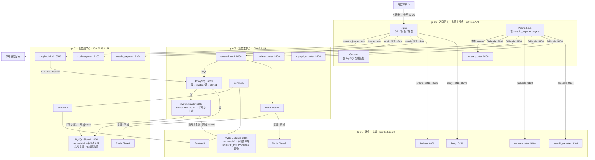

# 架构快照 v1.2

## 文档说明

V1.2 相对 V1.1 的核心变更：**MySQL 由单点主库升级为一主两从（gz-03 主 / gz-02 同城从 / bj-01 异地延迟从），开启半同步复制与 GTID，引入 ProxySQL 读写分离，并接入 mysqld_exporter 监控**。**本版本为历史归档，非当前最新版本，请参阅 [v1.3.md](v1.3.md)。**

---

## AI 上下文引导（Context Bootstrap）

> 本节供 AI 快速建立上下文，人工阅读可跳过。

**仓库根目录与管理方式**

- 仓库根目录：`/opt/docker`
- 所有服务均以 Docker Compose 管理
- 网络：`global_gateway`（`docker network create global_gateway` 已在各节点存在）
- 节点 hostname 约定：`gz-01` / `gz-02` / `gz-03` / `bj-01`

**节点互联方式**

所有节点通过 **Tailscale WireGuard** 加密隧道互联，不依赖公网端口暴露。

**关键文件路径索引**

```
/opt/docker/
├── backend/
│   ├── mysql/
│   │   └── docker-compose.yml          # gz-03 主库（binlog/GTID/半同步已开启）
│   ├── proxysql/
│   │   ├── docker-compose.yml          # gz-03 ProxySQL
│   │   └── proxysql.cnf                # 路由规则、用户、后端节点
│   ├── ruoyi/
│   │   └── docker-compose.yml          # gz-03 ruoyi-admin-1（数据源指向 ProxySQL）
│   └── redis/
│       ├── docker-compose.yml          # gz-03 Redis 主 + Sentinel1
│       └── conf/
│           ├── redis.conf
│           └── sentinel.conf
├── monitor/
│   ├── docker-compose.yml              # gz-01 Prometheus + Grafana（含 mysqld_exporter target）
│   ├── docker-compose.bj-01.yml        # bj-01 node-exporter
│   └── prometheus/
│       └── prometheus.yml              # 含 mysqld_exporter scrape
└── Docs/
    ├── architecture/                   # 架构快照（本文件夹）
    ├── runbooks/                       # 操作手册
    └── retrospectives/                 # 演进总结
```

**本版本核心技术决策**

| 决策点 | 选型 | 理由 |
|--------|------|------|
| 复制模式 | **半同步复制（Semi-sync）** | 主库 ACK 需至少一个从库写入 relay log，降低 RPO；同城 gz-02 ~5ms ACK，写延迟增加极小；超时自动降级 async 保可用性 |
| binlog 格式 | **ROW** | MySQL 8.0 默认，复制一致性最佳 |
| GTID | **开启** | 简化从库接入、故障恢复与 PITR |
| 快照工具 | **mysqldump** | 当前数据量小，`--single-transaction` 不锁表 |
| bj-01 延迟复制 | **SOURCE_DELAY=3600s** | 防止误操作（DROP/TRUNCATE）在 1 小时内向异地从扩散，提供操作级灾备窗口 |
| 读写分离 | **ProxySQL（gz-03 集中部署）** | 与应用解耦，规则路由 SELECT → gz-02 Slave1；应用连接 ProxySQL :6033，无需感知后端拓扑 |
| ProxySQL 读节点范围 | **仅 gz-02 Slave1** | bj-01 Slave2 因延迟复制数据最多落后 1 小时，不纳入在线读流量 |
| 自动切换 | **手动切换 + 告警** | 当前规模不引入 MHA/Orchestrator；依赖 Prometheus 告警 + 人工操作 |

---

## 节点总览

| 节点 | 配置 | 云厂商 | Tailscale IP | 公网 IP | 角色 |
|------|------|--------|--------------|---------|------|
| gz-01 | 2C2G | 阿里云·广州 | 100.117.7.75 | 8.163.9.112 | 入口网关 + 监控主节点 |
| gz-02 | 4C4G | 腾讯云·广州 | 100.79.132.125 | 123.207.59.177 | 业务副节点 + **MySQL Slave1**（实时复制·在线读） |
| gz-03 | 4C8G | 火山引擎·广州 | 100.92.5.116 | 118.145.70.66 | 业务主节点 + **MySQL Master** + **ProxySQL** |
| bj-01 | 4C16G | 京东云·北京 | 100.118.69.78 | 117.72.174.148 | 运维 + 灾备 + **MySQL Slave2**（延迟 3600s·灾备） |

---

## 各节点服务详情

### gz-01（入口网关 + 监控主节点）

| 服务 | 容器名 | 端口 | 说明 |
|------|--------|------|------|
| Nginx | nginx | 80, 8443→443 | 全站统一入口，SSL 卸载，负载均衡 |
| Prometheus | prometheus | 容器内 9090 | 含 mysqld_exporter targets |
| Grafana | grafana | 100.117.7.75:3000 | 含 MySQL 复制监控面板 |
| Node Exporter | node-exporter | Docker 内网 9100 | 本机系统指标 |

### gz-03（业务主节点）

| 服务 | 容器名 | 端口 | 说明 |
|------|--------|------|------|
| 若依后端 | ruoyi-admin-1 | 100.92.5.116:8080 | 数据源连本机 ProxySQL :6033 |
| **MySQL Master** | mysql | 127.0.0.1:3306 + 100.92.5.116:3306 | binlog·GTID·server-id=1·半同步主端 |
| **ProxySQL** | proxysql | 100.92.5.116:6033（MySQL）/ 100.92.5.116:6032（Admin）| 写 → Master :3306；读 → gz-02 Slave1 :3306 |
| **mysqld_exporter** | mysqld-exporter | 100.92.5.116:9104 | 暴露 MySQL 指标 |
| Redis Master | redis | 100.92.5.116:6379 | 主写节点 |
| Sentinel1 | redis-sentinel | 100.92.5.116:26379 | 哨兵节点 1 |
| Node Exporter | node-exporter | 100.92.5.116:9100 | 系统指标 |

### gz-02（业务副节点）

| 服务 | 容器名 | 端口 | 说明 |
|------|--------|------|------|
| 若依后端 | ruoyi-admin-2 | 100.79.132.125:8080 | 数据源连 gz-03 ProxySQL :6033（via Tailscale） |
| **MySQL Slave1** | mysql | 127.0.0.1:3306 + 100.79.132.125:3306 | read_only=ON·server-id=2·半同步从端·实时复制 |
| **mysqld_exporter** | mysqld-exporter | 100.79.132.125:9104 | 暴露 MySQL 指标 |
| Redis Slave1 | redis | 100.79.132.125:6379 | 同城从节点 |
| Sentinel2 | redis-sentinel | 100.79.132.125:26379 | 哨兵节点 2 |
| Node Exporter | node-exporter | 100.79.132.125:9100 | 系统指标 |

### bj-01（运维 + 灾备）

| 服务 | 容器名 | 端口 | 说明 |
|------|--------|------|------|
| Jenkins | jenkins | 127.0.0.1:8080 + 100.118.69.78:8080 | CI/CD |
| **MySQL Slave2** | mysql | 127.0.0.1:3306 + 100.118.69.78:3306 | server-id=3·半同步从端·SOURCE_DELAY=3600s·不参与在线读 |
| **mysqld_exporter** | mysqld-exporter | 100.118.69.78:9104 | 暴露 MySQL 指标 |
| Diary | diary | 100.118.69.78:5230 | Memos 日记应用 |
| Redis Slave2 | redis | 100.118.69.78:6379 | 异地灾备 |
| Sentinel3 | redis-sentinel | 100.118.69.78:26379 | 哨兵节点 3 |
| Node Exporter | node-exporter | 100.118.69.78:9100 | 系统指标 |

---

## 架构拓扑图

```
互联网用户
    │
    ▼
gz-01（入口网关 + 监控主节点）
├── Nginx（反向代理 + SSL 卸载 + 静态主站）
│     ├── jjmstart.com         → 本地静态文件 (0ms)
│     ├── ruoyi.jjmstart.com   → gz-03 + gz-02 负载均衡 (同城 ~5ms)
│     ├── diary.jjmstart.com   → bj-01 (跨城 ~35ms)
│     ├── jenkins.jjmstart.com → bj-01 (跨城 ~35ms)
│     └── monitor.jjmstart.com → 本地 Grafana (0ms)
│
├── Prometheus + Grafana
│     └── 新增 mysqld_exporter 采集（gz-03:9104 / gz-02:9104 / bj-01:9104）
│
├──────────── 同城 ~5ms ───────────┐
│                                  │
gz-03（业务主节点）                gz-02（业务副节点）
├── ruoyi-admin-1 ──┐              ├── ruoyi-admin-2 ──┐
├── ProxySQL（:6033）◄─────────────────────────────────┘
│     ├── 写 ──────► MySQL Master（本机 :3306）
│     └── 读 ──────► MySQL Slave1（gz-02 :3306，via Tailscale）
├── MySQL Master（server-id=1）    ├── MySQL Slave1（server-id=2）
│   半同步主端                     │   实时复制·read_only·在线读流量
│   └── 半同步复制 ─────────────────►   半同步从端·ACK ~5ms
│   └── 半同步复制                 ├── mysqld_exporter（:9104）
├── mysqld_exporter（:9104）        ├── Redis Slave1
└── node-exporter（:9100）          ├── Sentinel2
                                    └── node-exporter（:9100）
                    ↕ Tailscale ~35ms
             bj-01（运维 + 灾备）
             ├── Jenkins CI/CD
             ├── Diary (Memos)
             ├── MySQL Slave2（server-id=3）
             │   ├── 半同步从端·ACK ~35ms
             │   └── SOURCE_DELAY=3600s（延迟应用，防误删扩散）
             │   不参与在线读流量（数据最多落后 1 小时）
             ├── mysqld_exporter（:9104）
             ├── Redis Slave2
             ├── Sentinel3
             └── node-exporter（:9100）
```

MySQL 主从复制架构：

```
gz-03 MySQL Master（server-id=1）
    binlog: mysql-bin.xxxxxx · binlog_format=ROW
    GTID: ON · gtid_mode=ON · enforce_gtid_consistency=ON
    半同步主端：rpl_semi_sync_source_enabled=ON
               rpl_semi_sync_source_wait_for_replica_count=1
               rpl_semi_sync_source_timeout=5000ms（超时降级 async）
    │
    ├──── 半同步复制 ─► gz-02 MySQL Slave1（server-id=2）
    │                   同城 ~5ms ACK，read_only=ON
    │                   实时复制（无延迟）
    │                   ProxySQL 读流量目标节点（在线读）
    │                   故障接管优先候选
    │
    └──── 半同步复制 ─► bj-01 MySQL Slave2（server-id=3）
                        跨城 ~35ms ACK，read_only=ON
                        SOURCE_DELAY=3600s（延迟应用，binlog 实时接收）
                        不纳入 ProxySQL 读流量
                        异地灾备：误删恢复窗口 ≤ 1 小时
```

Mermaid 全景图：



---

## 网络互联

所有节点通过 Tailscale WireGuard 加密隧道互联。

| 链路 | 延迟 | 用途 |
|------|------|------|
| gz-01 ↔ gz-03 | ~5ms | Nginx → ruoyi-admin-1；Prometheus → mysqld_exporter |
| gz-01 ↔ gz-02 | ~5ms | Nginx → ruoyi-admin-2；Prometheus → mysqld_exporter |
| gz-01 ↔ bj-01 | ~35ms | Nginx → Jenkins/Diary；Prometheus → mysqld_exporter |
| gz-03 ↔ gz-02 | ~5ms | **MySQL 主从复制**；Redis 同城复制 |
| gz-03 ↔ bj-01 | ~35ms | **MySQL 主从复制（异地）**；Redis 异地复制 |

---

## 与上一版本的差异（相对 v1.1）

- **MySQL 由单点升级为一主两从**：gz-03 开启 binlog + GTID + 半同步主端；gz-02 新增 MySQL Slave1（实时复制，在线读）；bj-01 新增 MySQL Slave2（延迟 3600s，纯灾备）。
- **引入 ProxySQL 读写分离**：部署于 gz-03，应用统一连接 `:6033`，写路由 Master，读路由 Slave1；bj-01 因延迟复制不纳入在线读 hostgroup。
- **mysqld_exporter 三节点接入**：gz-03 / gz-02 / bj-01 各新增 `:9104`，Prometheus 增加采集 targets，Grafana 新增 MySQL 复制监控面板。
