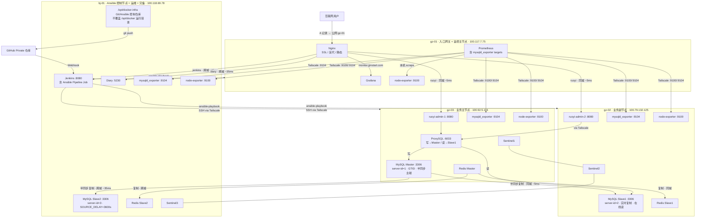

# 架构快照 v1.4

## 文档说明

V1.4 相对 V1.3 的核心变更：**废弃 V1.3 的 "各节点 clone 仓库 + 手动 git pull" 同步方案，引入 Ansible 统一配置管理；bj-01 成为唯一 Ansible 控制节点并持有 Git 仓库；敏感信息迁移至 ansible-vault 加密管理；通过 Jenkins Pipeline 实现 git push → 自动 ansible-playbook → 各节点配置精准下发 + 优雅重启的全自动 CI/CD 工作流**。集群服务拓扑与 V1.2/V1.3 完全相同，变更仅在管理层。**本版本为当前最新版本。**

---

## AI 上下文引导（Context Bootstrap）

> 本节供 AI 快速建立上下文，人工阅读可跳过。

**仓库根目录与管理方式**

- Ansible 控制仓库：`/opt/docker-infra`（仅 bj-01 持有 Git 仓库）
- 各节点线上运行目录：`/opt/docker`（由 Ansible 渲染/下发配置，不在该目录执行 git pull/clone）
- **V1.4 起：Git 仓库仅 bj-01 持有**，其他三个节点不 clone 仓库，由 Ansible 推送配置管理
- 所有服务均以 Docker Compose 管理，网络为 `global_gateway`
- 节点 hostname 约定：`gz-01` / `gz-02` / `gz-03` / `bj-01`
- **Ansible 控制节点：bj-01**（100.118.69.78），通过 Tailscale SSH 管理全部节点
- **敏感信息管理**：所有服务密码统一存入 `vault/secrets.yml`，经 ansible-vault 加密后进入 Git；各节点不再手动维护 `.env` 文件，由 Ansible role 在部署时渲染生成
- **当前落地状态（2026-04-25）**：四节点已完成 Ansible 正式纳管；Jenkins Pipeline + GitHub Webhook 已跑通，测试提交 `7f943ac` 自动触发 `ansible-deploy #4`，最终全节点 `changed=0 failed=0`；里程碑 tag `arch-v1.4` 已推送。
- **已知遗留项**：gz-01 的 `nginx` 容器在迁移前已为 `unhealthy`，但 HTTP 入口返回 301，外部入口可用；后续单独修复 healthcheck。

**CI/CD 自动化工作流**

```
开发者 git push → GitHub Private 仓库
    → GitHub Webhook 触发 bj-01 Jenkins Job
    → Jenkins checkout 最新代码
    → Jenkins 执行 ansible-playbook playbooks/site.yml
    → Ansible SSH（via Tailscale）到各节点
    → 精准替换配置文件（仅有变更的文件才写入）
    → 按服务类型优雅重启（详见各 role 的 handler）
```

**节点互联方式**

所有节点通过 **Tailscale WireGuard** 加密隧道互联，不依赖公网端口暴露。Ansible SSH 连接同样走 Tailscale IP，无需额外开放端口。

**关键文件路径索引**

bj-01（Ansible 控制节点，Git 仓库所在机器）：

```
/opt/docker-infra/                        ← Git/Ansible 控制仓库（仅 bj-01）
├── inventory/
│   ├── hosts.yml                        ← 节点清单、分组与主机专属变量
│   └── group_vars/
│       └── all.yml                      ← 公共非敏感变量（镜像版本等）
├── vault/
│   └── secrets.yml                      ← ansible-vault 加密，含全部服务密码
├── roles/
│   ├── mysql-master/                    ← gz-03：MySQL Master
│   │   ├── tasks/main.yml
│   │   └── templates/docker-compose.yml.j2
│   ├── mysql-replica/                   ← gz-02、bj-01：MySQL Slave
│   ├── redis-master/                    ← gz-03：Redis Master + Sentinel1
│   ├── redis-replica/                   ← gz-02、bj-01：Redis Slave + Sentinel
│   ├── proxysql/                        ← gz-03：ProxySQL
│   ├── ruoyi/                           ← gz-03（admin-1）、gz-02（admin-2）：若依后端
│   ├── monitor-stack/                   ← gz-01：Nginx + Prometheus + Grafana
│   └── node-exporter/                   ← 全节点：node-exporter（gz-02/03/bj-01 含 mysqld_exporter）
├── playbooks/
│   ├── site.yml                         ← 全量部署入口（Jenkins Pipeline 主调用）
│   ├── setup_database.yml
│   ├── setup_redis.yml
│   ├── setup_app.yml
│   ├── setup_gateway.yml
│   ├── setup_monitor.yml
│   └── setup_ops.yml
├── Jenkinsfile                          ← Jenkins Pipeline 定义
├── .gitignore
└── Docs/
```

远程节点（gz-01 / gz-02 / gz-03）由 Ansible 管理，无 Git，文件由 Ansible 推送：

```
/opt/docker/                              ← 由 Ansible 管理，无 .git 目录
├── backend/
│   ├── mysql/                           ← mysql-master 或 mysql-replica role 部署
│   ├── proxysql/                        ← proxysql role 部署（gz-03）
│   ├── ruoyi/                           ← ruoyi role 部署（gz-03 / gz-02）
│   └── redis/                           ← redis-master 或 redis-replica role 部署
└── monitor/                             ← monitor-stack 或 node-exporter role 部署
```

**本版本核心技术决策**

| 决策点 | 选型 | 理由 |
|--------|------|------|
| 配置管理工具 | **Ansible** | 无需在各节点安装 Git；控制节点统一推送；与 Jenkins 自然集成；运维岗高频考察工具 |
| Ansible 控制节点 | **bj-01** | 运维定位一致；已有 Jenkins；资源最充裕（4C16G）；与灾备节点复用降低基础设施复杂度 |
| 敏感信息管理 | **ansible-vault** | 加密后的 `secrets.yml` 可安全进 Git，告别手动维护 `.env`；一次配置永久生效；团队协作友好 |
| CI/CD 触发方式 | **Jenkins Pipeline + GitHub Webhook** | 利用已有 Jenkins 基础设施；Webhook 实时触发优于定时轮询 |
| 优雅重启策略 | **按服务类型区分** | 无状态服务（ruoyi）滚动重启实现零停机；配置可热重载的服务（Nginx/Prometheus）只 reload 不重启；有状态服务（MySQL/Redis）非必要不重启，保障数据安全 |
| Ansible 在 Jenkins 中的运行方式 | **自定义 Jenkins Docker 镜像（内置 Ansible）** | 避免宿主机与容器的 SSH 复杂性；Pipeline 内直接调用 `ansible-playbook`；环境一致性最佳 |

---

## 节点总览

| 节点 | 配置 | 云厂商 | Tailscale IP | 公网 IP | 角色 |
|------|------|--------|--------------|---------|------|
| gz-01 | 2C2G | 阿里云·广州 | 100.117.7.75 | 8.163.9.112 | 入口网关 + 监控主节点 |
| gz-02 | 4C4G | 腾讯云·广州 | 100.79.132.125 | 123.207.59.177 | 业务副节点 + MySQL Slave1 |
| gz-03 | 4C8G | 火山引擎·广州 | 100.92.5.116 | 118.145.70.66 | 业务主节点 + MySQL Master + ProxySQL |
| bj-01 | 4C16G | 京东云·北京 | 100.118.69.78 | 117.72.174.148 | **Ansible 控制节点** + 运维 + 灾备 + MySQL Slave2 |

> 服务拓扑与 V1.2/V1.3 完全相同，仅管理层变化（引入 Ansible + CI/CD）。

---

## 各节点服务详情

### gz-01（入口网关 + 监控主节点）

| 服务 | 容器名 | 端口 | 说明 |
|------|--------|------|------|
| Nginx | nginx | 80, 8443→443 | 无变化 |
| Prometheus | prometheus | 容器内 9090 | 无变化 |
| Grafana | grafana | 100.117.7.75:3000 | 无变化 |
| Node Exporter | node-exporter | Docker 内网 9100 | 无变化 |

### gz-03（业务主节点）

| 服务 | 容器名 | 端口 | 说明 |
|------|--------|------|------|
| 若依后端 | ruoyi-admin-1 | 100.92.5.116:8080 | 无变化 |
| MySQL Master | mysql | 127.0.0.1:3306 + 100.92.5.116:3306 | 无变化 |
| ProxySQL | proxysql | 100.92.5.116:6033 / :6032 | 无变化 |
| mysqld_exporter | mysqld-exporter | 100.92.5.116:9104 | 无变化 |
| Redis Master | redis | 100.92.5.116:6379 | 无变化 |
| Sentinel1 | redis-sentinel | 100.92.5.116:26379 | 无变化 |
| Node Exporter | node-exporter | 100.92.5.116:9100 | 无变化 |

### gz-02（业务副节点）

| 服务 | 容器名 | 端口 | 说明 |
|------|--------|------|------|
| 若依后端 | ruoyi-admin-2 | 100.79.132.125:8080 | 无变化 |
| MySQL Slave1 | mysql | 127.0.0.1:3306 + 100.79.132.125:3306 | 无变化 |
| mysqld_exporter | mysqld-exporter | 100.79.132.125:9104 | 无变化 |
| Redis Slave1 | redis | 100.79.132.125:6379 | 无变化 |
| Sentinel2 | redis-sentinel | 100.79.132.125:26379 | 无变化 |
| Node Exporter | node-exporter | 100.79.132.125:9100 | 无变化 |

### bj-01（Ansible 控制节点 + 运维 + 灾备）

| 服务 | 容器名 | 端口 | 说明 |
|------|--------|------|------|
| Jenkins | jenkins | 127.0.0.1:8080 + 100.118.69.78:8080 | 无变化；**V1.4：新增 Ansible Pipeline Job** |
| MySQL Slave2 | mysql | 127.0.0.1:3306 + 100.118.69.78:3306 | 无变化 |
| mysqld_exporter | mysqld-exporter | 100.118.69.78:9104 | 无变化 |
| Diary | diary | 100.118.69.78:5230 | 无变化 |
| Redis Slave2 | redis | 100.118.69.78:6379 | 无变化 |
| Sentinel3 | redis-sentinel | 100.118.69.78:26379 | 无变化 |
| Node Exporter | node-exporter | 100.118.69.78:9100 | 无变化 |

---

## 架构拓扑图

服务拓扑与 V1.2/V1.3 相同，管理层替换为 Ansible + Jenkins CI/CD：

```
互联网用户
    │
    ▼
gz-01（入口网关 + 监控主节点）
├── Nginx / Prometheus / Grafana / node-exporter
│
├──────────── 同城 ~5ms ───────────┐
│                                  │
gz-03（业务主节点）                gz-02（业务副节点）
├── ruoyi-admin-1                  ├── ruoyi-admin-2
├── ProxySQL（:6033）               ├── MySQL Slave1（read_only）
├── MySQL Master                   ├── mysqld_exporter / node-exporter
├── mysqld_exporter / node-exporter ├── Redis Slave1 / Sentinel2
├── Redis Master / Sentinel1
│
│   ★ V1.4 管理层（替换 V1.3 的 git pull 方案）：
│     bj-01 持有唯一 Git 仓库
│     bj-01 运行 Ansible，SSH via Tailscale 下发配置
│     Jenkins Pipeline：git push → Webhook → ansible-playbook → 各节点自动部署
│
                    ↕ Tailscale ~35ms
             bj-01（Ansible 控制节点 + 运维 + 灾备）
             ├── Jenkins（含 Ansible Pipeline Job）
             ├── Diary / MySQL Slave2 / Redis Slave2 / Sentinel3
             ├── mysqld_exporter / node-exporter
             └── Git 仓库（/opt/docker-infra）← 全集群配置唯一来源
```

Mermaid 全景图：



---

## 网络互联

与 V1.2/V1.3 相同，新增 Ansible 管理流量（走已有 Tailscale 链路，无新增链路）：

| 链路 | 延迟 | 用途 |
|------|------|------|
| gz-01 ↔ gz-03 | ~5ms | Nginx → ruoyi-admin-1；Prometheus → mysqld_exporter；**Ansible SSH 配置下发** |
| gz-01 ↔ gz-02 | ~5ms | Nginx → ruoyi-admin-2；Prometheus → mysqld_exporter；**Ansible SSH 配置下发** |
| gz-01 ↔ bj-01 | ~35ms | Nginx → Jenkins/Diary；Prometheus → mysqld_exporter |
| gz-03 ↔ gz-02 | ~5ms | MySQL 主从复制；Redis 同城复制 |
| gz-03 ↔ bj-01 | ~35ms | MySQL 主从复制（异地）；Redis 异地复制；**Ansible SSH 配置下发** |

---

## 与上一版本的差异（相对 v1.3）

- **废弃 "各节点 clone + git pull" 方案，引入 Ansible**：V1.3 的 Phase 6（各节点 clone 仓库）因设计缺陷未执行即废弃；V1.4 改由 bj-01 作为唯一 Ansible 控制节点，通过 `ansible-playbook` 将配置精准推送到各节点，其他节点无需 Git。
- **敏感信息迁移至 ansible-vault**：告别手动维护各节点 `.env` 文件；所有服务密码统一存入 `vault/secrets.yml`，经 ansible-vault 加密后安全进入 Git 仓库；Ansible role 在部署时自动渲染生成各节点的 `.env`。
- **建立 Jenkins CI/CD 自动化工作流**：在 bj-01 Jenkins 中新增 Ansible Pipeline Job，配合 GitHub Webhook 实现 git push → 自动 ansible-playbook → 各节点配置下发 + 优雅重启的完整闭环，告别手动操作。
