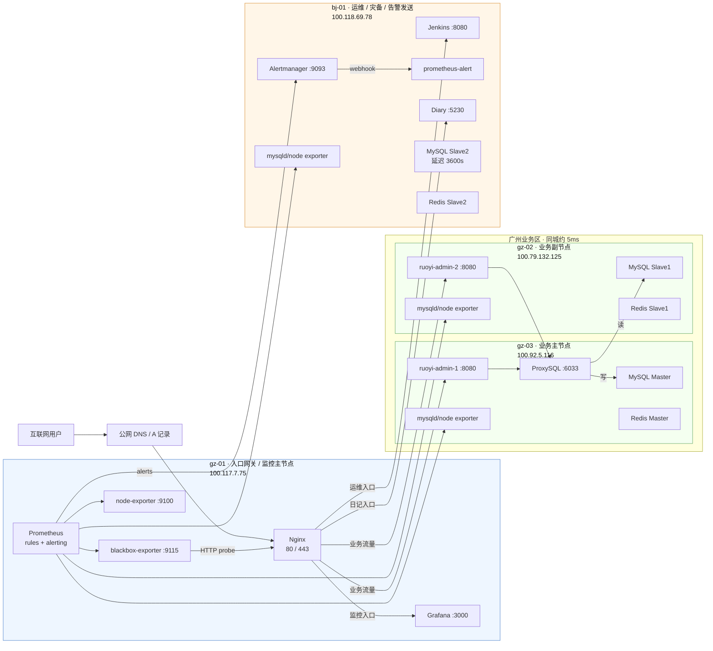
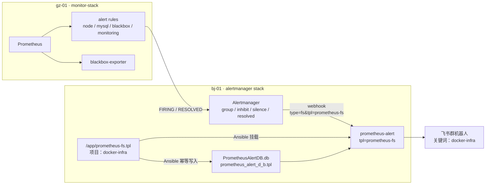
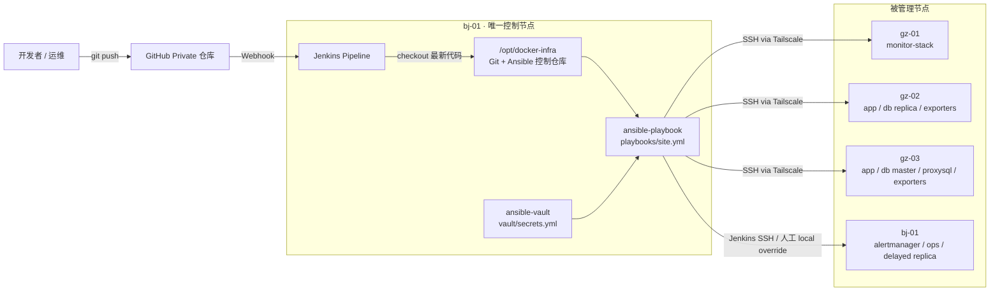

# 架构快照 v1.5

## 文档说明

V1.5 相对 V1.4 的核心变更：在既有 Ansible + Jenkins 配置管理体系上，新增 Prometheus 告警规则、blackbox-exporter、Alertmanager 和 `prometheus-alert` 飞书通知组件，形成"指标采集 → 规则判断 → 告警聚合 → 飞书通知"的告警闭环。V1.5 已通过基础功能验证、故障演练验收、关键词兜底持久化和最终幂等检查；本版本用于 Git tag `arch-v1.5` 对应的正式架构快照。

上一版本请参阅 [v1.4.md](v1.4.md)。

---

## AI 上下文引导（Context Bootstrap）

> 本节供 AI 快速建立上下文，人工阅读可跳过。

**仓库根目录与管理方式**

- Ansible 控制仓库：`/opt/docker-infra`（仅 bj-01 持有 Git 仓库）
- 各节点线上运行目录：`/opt/docker`（由 Ansible 渲染/下发配置，不在该目录执行 git pull/clone）
- Git 仓库仅 bj-01 持有，gz-01 / gz-02 / gz-03 均由 Ansible 推送配置
- 所有服务均以 Docker Compose 管理，网络为 `global_gateway`
- 节点 hostname 约定：`gz-01` / `gz-02` / `gz-03` / `bj-01`
- Ansible 控制节点：bj-01（100.118.69.78），通过 Tailscale SSH 管理远端节点
- 敏感信息管理：所有服务密码和飞书 webhook URL 统一存入 `vault/secrets.yml`，经 ansible-vault 加密后进入 Git
- 当前落地状态：V1.5 告警链路已部署并验收；`gz-01 monitor-stack` 与 `bj-01 alertmanager` 重复执行均为 `changed=0 failed=0`

**CI/CD 自动化工作流**

```
开发者 git push → GitHub Private 仓库
    → GitHub Webhook 触发 bj-01 Jenkins Job
    → Jenkins checkout 最新代码
    → Jenkins 执行 ansible-playbook playbooks/site.yml
    → Ansible SSH（via Tailscale）到各节点
    → 精准替换配置文件（仅有变更的文件才写入）
    → 按服务类型触发 handler reload / restart / compose up
```

**节点互联方式**

所有节点通过 **Tailscale WireGuard** 加密隧道互联，不依赖公网端口暴露。Ansible SSH、Prometheus 指标采集、Alertmanager 接入、MySQL / Redis 复制均走 Tailscale 内网地址。

**关键文件路径索引**

bj-01（Ansible 控制节点，Git 仓库所在机器）：

```
/opt/docker-infra/
├── inventory/
│   ├── hosts.yml                        ← 节点清单、分组与主机专属变量
│   └── group_vars/
│       └── all.yml                      ← 公共非敏感变量、端口、镜像、告警阈值
├── vault/
│   └── secrets.yml                      ← ansible-vault 加密，含服务密码和飞书 webhook URL
├── roles/
│   ├── monitor-stack/                   ← gz-01：Prometheus / Grafana / blackbox-exporter / rules
│   │   ├── templates/prometheus.yml.j2
│   │   ├── templates/blackbox.yml.j2
│   │   └── templates/rules/
│   ├── alertmanager/                    ← bj-01：Alertmanager + prometheus-alert
│   │   ├── files/prometheus-fs.tpl      ← 飞书模板关键词兜底，原样下发
│   │   ├── templates/docker-compose.yml.j2
│   │   └── templates/alertmanager.yml.j2
│   ├── node-exporter/                   ← 全节点：node-exporter；DB 节点含 mysqld_exporter
│   ├── mysql-master/                    ← gz-03：MySQL Master
│   ├── mysql-replica/                   ← gz-02、bj-01：MySQL Slave
│   ├── redis-master/                    ← gz-03：Redis Master + Sentinel1
│   ├── redis-replica/                   ← gz-02、bj-01：Redis Slave + Sentinel
│   ├── proxysql/                        ← gz-03：ProxySQL
│   └── ruoyi/                           ← gz-03 / gz-02：若依后端
├── playbooks/
│   ├── site.yml                         ← 全量部署入口（Jenkins Pipeline 主调用）
│   ├── setup_monitor.yml                ← monitor-stack、alertmanager、exporters
│   └── 其他业务 / 数据库 / Redis / 网关 playbook
├── Jenkinsfile
└── Docs/
```

远程节点（gz-01 / gz-02 / gz-03）由 Ansible 管理，无 Git：

```
/opt/docker/
├── backend/                             ← MySQL / ProxySQL / RuoYi / Redis / Diary 等服务
└── monitor/
    ├── docker-compose.yml               ← gz-01 monitor-stack 或 bj-01 alertmanager stack
    ├── prometheus/                      ← Prometheus 配置、规则与数据（gz-01）
    ├── blackbox/                        ← blackbox-exporter 配置（gz-01）
    └── alertmanager/                    ← Alertmanager / prometheus-alert 配置与数据（bj-01）
```

**本版本核心技术决策**

| 决策点 | 选型 | 理由 |
|--------|------|------|
| 告警规则引擎 | Prometheus alert rules | 沿用现有 Prometheus 指标体系，直接基于 node / MySQL / blackbox / 自监控规则触发告警 |
| 入口可用性探测 | blackbox-exporter | 从 Prometheus 侧主动探测若依和 Diary 入口，覆盖"服务进程活着但入口不可用"的场景 |
| 告警聚合与抑制 | Alertmanager | 支持 group、repeat、silence、inhibit 和 resolved 通知，是 Prometheus 告警链路标准组件 |
| 飞书通知组件 | `feiyu563/prometheus-alert:v4.9.2` | 最终验证能以 `type=fs&tpl=prometheus-fs&fsurl=...` 发送飞书自定义机器人消息；旧 adapter 已因飞书消息结构不兼容被替换 |
| 飞书安全策略 | 自定义关键词 `docker-infra` | 当前工具链不支持飞书 HMAC 签名校验；关键词方案简单有效，并通过 `prometheus-fs` 模板统一兜底 |
| 关键词兜底持久化 | `roles/alertmanager/files/prometheus-fs.tpl` + SQLite DB 幂等写入 | `prometheus-alert` 的模板存储在容器 SQLite DB 中，必须由 Ansible 下发模板并写入 DB，避免容器重建或镜像升级后退化 |
| 控制节点自管理 | 手工执行时 `--connection=local`，不写入 inventory | bj-01 既是控制节点也是被管理节点；inventory 保持 Jenkins SSH 兼容，本机人工命令临时覆盖 connection |

---

## 节点总览

| 节点 | 配置 | 云厂商 | Tailscale IP | 公网 IP | 角色 |
|------|------|--------|--------------|---------|------|
| gz-01 | 2C2G | 阿里云·广州 | 100.117.7.75 | 8.163.9.112 | 入口网关 + 监控主节点 + Prometheus + Grafana + blackbox-exporter |
| gz-02 | 4C4G | 腾讯云·广州 | 100.79.132.125 | 123.207.59.177 | 业务副节点 + MySQL 实时从库 + Redis 从库 + exporters |
| gz-03 | 4C8G | 火山引擎·广州 | 100.92.5.116 | 118.145.70.66 | 业务主节点 + MySQL Master + ProxySQL + Redis Master + exporters |
| bj-01 | 4C16G | 京东云·北京 | 100.118.69.78 | 117.72.174.148 | Ansible 控制节点 + Jenkins + Alertmanager + prometheus-alert + 运维 + 灾备 + MySQL 延迟从库 |

---

## 各节点服务详情

### gz-01（入口网关 + 监控主节点）

| 服务 | 容器名 | 端口 | 说明 |
|------|--------|------|------|
| Nginx | nginx | 80, 443 | 对外入口，承载业务、运维和监控入口转发 |
| Prometheus | prometheus | 容器内 9090 | 指标采集、规则评估、向 Alertmanager 发送告警 |
| Grafana | grafana | 100.117.7.75:3000 | 监控面板 |
| blackbox-exporter | blackbox-exporter | 容器内 9115 | HTTP 入口探测，供 Prometheus scrape |
| Node Exporter | node-exporter | Docker 内网 9100 | 主机指标采集 |

### gz-03（业务主节点）

| 服务 | 容器名 | 端口 | 说明 |
|------|--------|------|------|
| 若依后端 | ruoyi-admin-1 | 100.92.5.116:8080 | 业务主实例 |
| MySQL Master | mysql | 127.0.0.1:3306 + 100.92.5.116:3306 | MySQL 主库，server-id=1 |
| ProxySQL | proxysql | 100.92.5.116:6033 / :6032 | 应用侧读写分离入口 |
| mysqld_exporter | mysqld-exporter | 100.92.5.116:9104 | MySQL 指标采集 |
| Redis Master | redis | 100.92.5.116:6379 | Redis 主节点 |
| Sentinel1 | redis-sentinel | 100.92.5.116:26379 | Redis Sentinel |
| Node Exporter | node-exporter | 100.92.5.116:9100 | 主机指标采集 |

### gz-02（业务副节点）

| 服务 | 容器名 | 端口 | 说明 |
|------|--------|------|------|
| 若依后端 | ruoyi-admin-2 | 100.79.132.125:8080 | 业务副实例 |
| MySQL Slave1 | mysql | 127.0.0.1:3306 + 100.79.132.125:3306 | MySQL 实时只读从库，server-id=2 |
| mysqld_exporter | mysqld-exporter | 100.79.132.125:9104 | MySQL 指标采集 |
| Redis Slave1 | redis | 100.79.132.125:6379 | Redis 同城从库 |
| Sentinel2 | redis-sentinel | 100.79.132.125:26379 | Redis Sentinel |
| Node Exporter | node-exporter | 100.79.132.125:9100 | 主机指标采集 |

### bj-01（Ansible 控制节点 + 运维 + 灾备 + 告警发送）

| 服务 | 容器名 | 端口 | 说明 |
|------|--------|------|------|
| Jenkins | jenkins | 127.0.0.1:8080 + 100.118.69.78:8080 | Ansible Pipeline 自动部署入口 |
| Alertmanager | alertmanager | 100.118.69.78:9093 | 告警聚合、分组、静默、抑制、resolved 通知 |
| prometheus-alert | prometheus-alert | Compose 内网 8080 | Alertmanager webhook → 飞书自定义机器人消息转换 |
| MySQL Slave2 | mysql | 127.0.0.1:3306 + 100.118.69.78:3306 | MySQL 延迟从库，延迟 3600s |
| mysqld_exporter | mysqld-exporter | 100.118.69.78:9104 | MySQL 指标采集 |
| Diary | diary | 100.118.69.78:5230 | Diary 服务 |
| Redis Slave2 | redis | 100.118.69.78:6379 | Redis 异地从库 |
| Sentinel3 | redis-sentinel | 100.118.69.78:26379 | Redis Sentinel |
| Node Exporter | node-exporter | 100.118.69.78:9100 | 主机指标采集 |

---

## 架构拓扑图

### 业务、数据与监控采集



### 告警链路



### 管理与 CI/CD 链路



---

## 告警规则与通知策略

### 规则文件

Prometheus 规则由 `roles/monitor-stack/templates/rules/` 管理，渲染到 gz-01 的 `/opt/docker/monitor/prometheus/rules/`：

| 规则文件 | 关注对象 | 典型告警 |
|----------|----------|----------|
| `node.yml` | 主机和 node-exporter | `NodeDown`、磁盘空间、inode、内存、CPU |
| `mysql.yml` | MySQL 主从复制和 mysqld-exporter | `MySQLReplicationDown`、复制延迟、exporter down |
| `blackbox.yml` | 对外入口 HTTP 探测 | `BlackboxProbeFailed` |
| `monitoring.yml` | 监控系统自身 | `PrometheusTargetDown`、Alertmanager 可达性 |

### Alertmanager 策略

- Alertmanager 部署在 bj-01，绑定 `100.118.69.78:9093`
- receiver 为 `feishu`
- webhook URL 指向 compose 内网的 `prometheus-alert`
- `send_resolved: true`，故障恢复后会发送 RESOLVED 通知
- `group_by` 包含 `alertname`、`cluster`、`job`、`instance`、`severity`
- `NodeDown` firing 时抑制同一 instance 上的 node 资源类告警，避免一次节点宕机触发大量噪音

### 飞书关键词兜底

飞书机器人启用“自定义关键词”安全策略，关键词为 `docker-infra`。V1.5 的关键词兜底不依赖每条规则手写 description，而是统一写入 `prometheus-alert` 的 `prometheus-fs` 模板：

- Git 源文件：`roles/alertmanager/files/prometheus-fs.tpl`
- 运行目录：`/opt/docker/monitor/alertmanager/prometheus-fs.tpl`
- 容器挂载：`/app/prometheus-fs.tpl`
- SQLite DB：`/app/db/PrometheusAlertDB.db` 表 `prometheus_alert_d_b` 的 `tpl` 字段
- 验证结果：`prometheus-fs|55`，表示运行时模板包含 `docker-infra`

---

## 网络互联

| 链路 | 延迟 | 用途 |
|------|------|------|
| gz-01 ↔ gz-03 | ~5ms | Nginx → ruoyi-admin-1；Prometheus → exporters；Ansible SSH 配置下发 |
| gz-01 ↔ gz-02 | ~5ms | Nginx → ruoyi-admin-2；Prometheus → exporters；Ansible SSH 配置下发 |
| gz-01 ↔ bj-01 | ~35ms | Nginx → Jenkins/Diary；Prometheus → Alertmanager / exporters；跨城灾备链路 |
| gz-03 ↔ gz-02 | ~5ms | MySQL 主从复制；Redis 同城复制 |
| gz-03 ↔ bj-01 | ~35ms | MySQL 延迟从复制；Redis 异地复制；Ansible SSH 配置下发 |

---

## 与上一版本的差异（相对 v1.4）

- **新增告警闭环**：V1.4 已有 Prometheus / Grafana / exporters，但没有正式告警通知链路；V1.5 新增 Alertmanager、`prometheus-alert` 和飞书机器人通知。
- **扩展 monitor-stack**：gz-01 新增 blackbox-exporter、Prometheus alerting 配置和四类规则文件，覆盖主机、MySQL、HTTP 入口和监控系统自身。
- **新增 alertmanager role**：bj-01 新增 `roles/alertmanager` 管理 Alertmanager、`prometheus-alert`、飞书模板文件和运行时 DB 写入。
- **飞书通知从旧 adapter 迁移到 prometheus-alert**：`bougou/alertmanager-webhook-adapter` 因消息结构不兼容被替换为 `feiyu563/prometheus-alert:v4.9.2`。
- **关键词兜底纳入配置管理**：`项目：docker-infra` 已写入 `roles/alertmanager/files/prometheus-fs.tpl`，并由 Ansible 挂载和写入 SQLite DB，不再依赖容器内手工修改。
- **引入故障演练验收**：V1.5 不只验证容器 healthy，还验证 FIRING / RESOLVED、silence 抑制、blackbox 临时故障、MySQL 复制线程停止等端到端行为。

---

## 已验证状态

| 指标 | 目标状态 |
|------|----------|
| Ansible 幂等 | `gz-01 monitor-stack` 重复执行 `changed=0 failed=0`；`bj-01 alertmanager` 重复执行 `changed=0 failed=0` |
| gz-01 监控栈 | `prometheus`、`grafana`、`node-exporter`、`blackbox-exporter` 均为 Up |
| bj-01 告警发送栈 | `alertmanager`、`prometheus-alert` 均为 Up，`prometheus-alert` healthy |
| Prometheus 健康检查 | `/-/healthy` 返回 `Prometheus Server is Healthy.` |
| Alertmanager 健康检查 | `http://100.118.69.78:9093/-/healthy` 返回 `OK` |
| blackbox-exporter 健康检查 | `/-/healthy` 返回 `Healthy` |
| Prometheus rules | `node.yml`、`mysql.yml`、`blackbox.yml`、`monitoring.yml` 加载成功 |
| 若依入口探测 | `probe_success{service="ruoyi"} = 1` |
| Diary 入口探测 | `probe_success{service="diary"} = 1` |
| MySQL 实时从库 | `Replica_IO_Running=Yes`、`Replica_SQL_Running=Yes`、`Seconds_Behind_Source` 回到正常范围 |
| 飞书通知 | `NodeDown` / `PrometheusTargetDown`、`BlackboxProbeFailed`、`MySQLReplicationDown` 均验证 FIRING 与 RESOLVED 通知 |
| Silence | 匹配告警状态为 `suppressed`，且未发送飞书 |
| 关键词兜底 | `prometheus-fs|55`，模板中包含 `docker-infra` |
| 临时演练目标清理 | `blackbox-drill` 在仓库模板和 Prometheus 容器实际配置中均无残留 |
| 敏感信息检查 | 普通文件中不出现真实飞书 webhook token |

---

## 已知遗留项

- Prometheus 的 `prometheus.yml` 仍使用文件级 bind mount。Ansible `template` 模块采用 atomic rename 写文件后可能产生 inode 不一致，必要时需要 `docker compose up -d --force-recreate prometheus`。后续建议改为目录级 bind mount。
- bj-01 作为控制节点自管理时，本机人工执行需要临时加 `--connection=local`；不要把 `ansible_connection: local` 写入 inventory，否则 Jenkins 容器内执行可能失败。
- Alertmanager silence 和告警状态保存在 `/opt/docker/monitor/alertmanager/data`，暂未纳入备份体系。
- 当前飞书机器人安全策略为自定义关键词 `docker-infra`；如后续需要更强校验，可在 V1.6 评估飞书 HMAC 签名校验适配。
- 告警阈值仍是经验值，需结合一段时间的线上观测继续调优。
