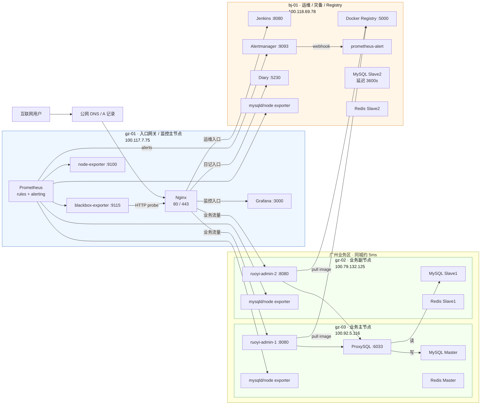
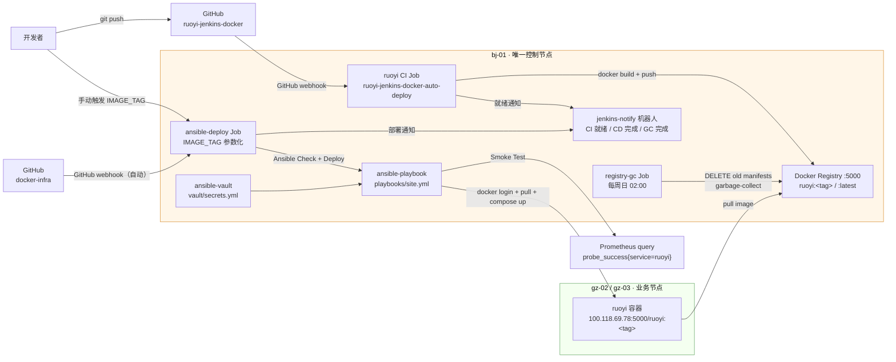
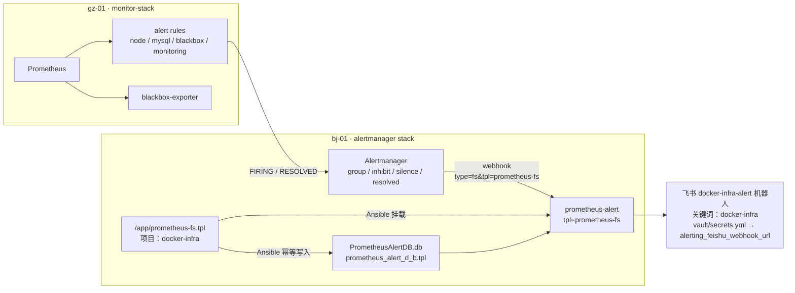

# 架构快照 v1.6

## 文档说明

V1.6 相对 V1.5 的核心变更：在既有 Ansible + Jenkins 配置管理与告警体系基础上，新增 bj-01 私有 Docker Registry（htpasswd 认证）、打通 ruoyi 镜像的 CI 自动构建与推送链路（应用仓库独立 Pipeline，GitHub webhook 触发）、在 docker-infra CD Job 中引入 `IMAGE_TAG` 参数化部署与 Prometheus Smoke Test 验证，配套 Registry GC Pipeline（每周日自动清理旧版本 tag），以及飞书 CI/CD 三类通知（CI 新版本就绪、CD 部署完成/失败）；同步拆分飞书机器人职责，Prometheus 告警专用 `docker-infra-alert`，Jenkins 通知专用 `jenkins-notify`。V1.6 已通过 Phase 9 全链路端到端验收（含参数化部署、Smoke Test、回滚），幂等检查 `failed=0`；本版本用于 Git tag `arch-v1.6` 对应的正式架构快照。

上一版本请参阅 [v1.5.md](v1.5.md)。

---

## AI 上下文引导（Context Bootstrap）

> 本节供 AI 快速建立上下文，人工阅读可跳过。

**仓库根目录与管理方式**

- Ansible 控制仓库：`/opt/docker-infra`（仅 bj-01 持有 Git 仓库）
- 各节点线上运行目录：`/opt/docker`（由 Ansible 渲染/下发配置，不在该目录执行 git pull/clone）
- Git 仓库仅 bj-01 持有，gz-01 / gz-02 / gz-03 均由 Ansible 推送配置
- 所有服务均以 Docker Compose 管理，网络为 `global_gateway`
- 节点 hostname 约定：`gz-01` / `gz-02` / `gz-03` / `bj-01`
- Ansible 控制节点：bj-01（100.118.69.78），通过 Tailscale SSH 管理远端节点
- 敏感信息管理：Registry 认证凭据统一存入 `vault/secrets.yml`，经 ansible-vault 加密后进入 Git；飞书 webhook URL 按链路分两处存储（见下方）
- 当前落地状态：V1.6 全链路（CI → Registry → CD → Smoke Test → 飞书通知）已部署并验收；全量幂等检查 `changed=0（docker login 除外）failed=0`

**CI/CD 完整交付链路**

```
开发者 git push → GitHub jjmstart/ruoyi-jenkins-docker 仓库
    → GitHub Webhook 触发 bj-01 Jenkins ruoyi CI Job
    → DOCKER_BUILDKIT=1 docker build（多阶段构建，Maven 缓存挂载）
    → docker push 100.118.69.78:5000/ruoyi:<BUILD_NUMBER>-<SHORT_SHA>
    → docker push 100.118.69.78:5000/ruoyi:latest
    → 飞书 jenkins-notify 机器人：「✅ [ruoyi] 新版本就绪」

运维手动触发 ansible-deploy（填写 IMAGE_TAG）
    → Jenkins checkout docker-infra 仓库
    → ansible-playbook --check --diff（预览变更）
    → ansible-playbook（实际部署，gz-02/gz-03 login/pull/render/restart）
    → Smoke Test：query Prometheus probe_success{service="ruoyi"} = 1
    → 飞书 jenkins-notify 机器人：「✅ [docker-infra] 部署完成」
```

**节点互联方式**

所有节点通过 **Tailscale WireGuard** 加密隧道互联，不依赖公网端口暴露。Ansible SSH、Prometheus 指标采集、Alertmanager 接入、MySQL / Redis 复制、Registry 镜像拉取均走 Tailscale 内网地址。

**飞书机器人与 Webhook 管理**

| 机器人 | 用途 | Webhook 存储位置 | 安全策略 |
|--------|------|-----------------|---------|
| `docker-infra-alert` | Prometheus Alertmanager 告警通知 | `vault/secrets.yml` → `alerting_feishu_webhook_url` | 自定义关键词：`docker-infra` |
| `jenkins-notify` | Jenkins CI/CD/GC 流水线通知 | Jenkins Credential `feishu-webhook-url-jenkins-notify` | 无关键词限制 |

**关键文件路径索引**

bj-01（Ansible 控制节点，Git 仓库所在机器）：

```
/opt/docker-infra/
├── inventory/
│   ├── hosts.yml                        ← 节点清单、分组与主机专属变量（含 registry_nodes、docker_registry_mirrors）
│   └── group_vars/
│       └── all.yml                      ← 公共变量：registry_host/port、ruoyi_image_name/tag、端口、镜像
├── vault/
│   └── secrets.yml                      ← ansible-vault 加密，含 registry_auth_username/password 和 alerting_feishu_webhook_url
├── roles/
│   ├── registry/                        ← bj-01：Docker Registry v2（htpasswd Auth + GC config）
│   │   ├── tasks/main.yml
│   │   ├── handlers/main.yml
│   │   └── templates/
│   │       ├── docker-compose.yml.j2
│   │       └── config.yml.j2
│   ├── docker-daemon/                   ← 全节点：daemon.json（insecure-registries + mirrors + dns）+ pip + Python Docker SDK
│   ├── ruoyi/                           ← gz-02/gz-03：若依后端，镜像从私有 Registry 拉取
│   │   ├── tasks/main.yml              ← docker login + docker pull（shell 模块，skip in check mode）
│   │   └── templates/docker-compose.yml.j2  ← 镜像地址：{{ registry_host }}/{{ ruoyi_image_name }}:{{ ruoyi_image_tag }}
│   ├── monitor-stack/                   ← gz-01：Prometheus / Grafana / blackbox-exporter / rules
│   ├── alertmanager/                    ← bj-01：Alertmanager + prometheus-alert（docker-infra-alert）
│   ├── node-exporter/                   ← 全节点：node-exporter；DB 节点含 mysqld_exporter
│   ├── mysql-master/                    ← gz-03：MySQL Master
│   ├── mysql-replica/                   ← gz-02、bj-01：MySQL Slave
│   ├── redis-master/                    ← gz-03：Redis Master + Sentinel1
│   ├── redis-replica/                   ← gz-02、bj-01：Redis Slave + Sentinel
│   └── proxysql/                        ← gz-03：ProxySQL
├── playbooks/
│   ├── site.yml                         ← 全量部署入口（Jenkins CD Pipeline 主调用）
│   └── setup_registry.yml              ← Registry 独立部署 playbook
├── Jenkinsfile                          ← docker-infra CD Pipeline（IMAGE_TAG 参数 + Smoke Test + 飞书通知）
├── Jenkinsfile.registry-gc              ← Registry GC Pipeline（每周日凌晨 2 点，保留最新 10 个 tag）
└── Docs/
```

ruoyi 应用仓库（bj-01 本地，独立 Git 仓库）：

```
/opt/docker/backend/ruoyi/
├── Jenkinsfile                          ← ruoyi CI Pipeline（Build → Push Registry → 飞书通知）
└── Dockerfile                          ← 多阶段构建（builder Maven + RUN --mount=type=cache,target=/root/.m2 → jre-alpine runtime）
```

远程节点（gz-01 / gz-02 / gz-03）由 Ansible 管理，无 Git：

```
/opt/docker/
├── registry/                            ← bj-01：Docker Registry 数据目录 + auth + config
│   ├── data/                            ← Registry blob 存储（当前 ~141.7M）
│   ├── auth/htpasswd
│   └── config.yml
└── backend/                             ← MySQL / ProxySQL / RuoYi / Redis / Diary 等服务
```

**本版本核心技术决策**

| 决策点 | 选型 | 理由 |
|--------|------|------|
| Registry 节点 | bj-01 | 无多余节点，bj-01 磁盘/内存最充裕；Tailscale 加密隧道覆盖镜像拉取链路 |
| Registry 传输安全 | HTTP + insecure-registries | 流量已走 Tailscale WireGuard 加密，自签名证书维护成本不合算 |
| Registry 认证 | htpasswd Basic Auth | Docker Registry v2 原生支持，无需额外组件 |
| CI/CD 触发 | CI 自动（GitHub webhook）+ CD 手动（IMAGE_TAG 参数化） | CI/CD 中间保留人工决策点；参数化 CD 天然支持回滚，填旧 tag 即可 |
| docker login/pull | `ansible.builtin.shell` | `community.docker.docker_login` 在 SDK 7.x + check mode 下有兼容性问题；shell 调用行为完全可预期 |
| Python Docker SDK 管理 | pip 7.x，纳入 `roles/docker-daemon` | apt 仓库版本 5.0.3 与 `requests` 2.28+ 不兼容；统一在 docker-daemon role 管理 pip 源和 SDK 安装 |
| Smoke Test 数据源 | Prometheus `probe_success{service="ruoyi"}` | 复用 blackbox-exporter 已有探测链路，覆盖 Nginx→ruoyi 完整路径；优于直接 curl 仅验证 bj-01→gz-01 单段网络 |
| Registry GC 策略 | DELETE API 软删除 + 裸 `garbage-collect`（不加 `--delete-untagged`） | BuildKit 推送产生 OCI image index + child manifest，`--delete-untagged` 会误删 child manifest 导致镜像损坏 |
| 飞书机器人拆分 | `docker-infra-alert`（告警）+ `jenkins-notify`（CI/CD 通知） | 告警机器人需要关键词过滤（`docker-infra`）；CI 通知含 `[ruoyi]` 无法通过关键词校验；两条链路需求不同，职责从设计阶段隔离 |

---

## 节点总览

| 节点 | 配置 | 云厂商 | Tailscale IP | 公网 IP | 角色 |
|------|------|--------|--------------|---------|------|
| gz-01 | 2C2G | 阿里云·广州 | 100.117.7.75 | 8.163.9.112 | 入口网关 + 监控主节点 + Prometheus + Grafana + blackbox-exporter |
| gz-02 | 4C4G | 腾讯云·广州 | 100.79.132.125 | 123.207.59.177 | 业务副节点 + MySQL 实时从库 + Redis 从库 + exporters |
| gz-03 | 4C8G | 火山引擎·广州 | 100.92.5.116 | 118.145.70.66 | 业务主节点 + MySQL Master + ProxySQL + Redis Master + exporters |
| bj-01 | 4C16G | 京东云·北京 | 100.118.69.78 | 117.72.174.148 | Ansible 控制节点 + Jenkins + Docker Registry + Alertmanager + prometheus-alert + 运维 + 灾备 + MySQL 延迟从库 |

---

## 各节点服务详情

### gz-01（入口网关 + 监控主节点）

| 服务 | 容器名 | 端口 | 说明 |
|------|--------|------|------|
| Nginx | nginx | 80, 443 | 对外入口，承载业务、运维和监控入口转发 |
| Prometheus | prometheus | 容器内 9090 | 指标采集、规则评估、向 Alertmanager 发送告警 |
| Grafana | grafana | 100.117.7.75:3000 | 监控面板 |
| blackbox-exporter | blackbox-exporter | 容器内 9115 | HTTP 入口探测，供 Prometheus scrape；Smoke Test 数据源 |
| Node Exporter | node-exporter | Docker 内网 9100 | 主机指标采集 |

### gz-03（业务主节点）

| 服务 | 容器名 | 端口 | 说明 |
|------|--------|------|------|
| 若依后端 | ruoyi-admin-1 | 100.92.5.116:8080 | 业务主实例，镜像来自私有 Registry |
| MySQL Master | mysql | 127.0.0.1:3306 + 100.92.5.116:3306 | MySQL 主库，server-id=1 |
| ProxySQL | proxysql | 100.92.5.116:6033 / :6032 | 应用侧读写分离入口 |
| mysqld_exporter | mysqld-exporter | 100.92.5.116:9104 | MySQL 指标采集 |
| Redis Master | redis | 100.92.5.116:6379 | Redis 主节点 |
| Sentinel1 | redis-sentinel | 100.92.5.116:26379 | Redis Sentinel |
| Node Exporter | node-exporter | 100.92.5.116:9100 | 主机指标采集 |

### gz-02（业务副节点）

| 服务 | 容器名 | 端口 | 说明 |
|------|--------|------|------|
| 若依后端 | ruoyi-admin-2 | 100.79.132.125:8080 | 业务副实例，镜像来自私有 Registry |
| MySQL Slave1 | mysql | 127.0.0.1:3306 + 100.79.132.125:3306 | MySQL 实时只读从库，server-id=2 |
| mysqld_exporter | mysqld-exporter | 100.79.132.125:9104 | MySQL 指标采集 |
| Redis Slave1 | redis | 100.79.132.125:6379 | Redis 同城从库 |
| Sentinel2 | redis-sentinel | 100.79.132.125:26379 | Redis Sentinel |
| Node Exporter | node-exporter | 100.79.132.125:9100 | 主机指标采集 |

### bj-01（Ansible 控制节点 + 运维 + 灾备 + Registry）

| 服务 | 容器名 | 端口 | 说明 |
|------|--------|------|------|
| Jenkins | jenkins | 127.0.0.1:8080 + 100.118.69.78:8080 | CD Pipeline（ansible-deploy）+ CI Job（ruoyi-jenkins-docker-auto-deploy）+ Registry GC Job（registry-gc） |
| Docker Registry | registry | 100.118.69.78:5000 | 私有镜像仓库，htpasswd Basic Auth，HTTP（insecure-registries） |
| Alertmanager | alertmanager | 100.118.69.78:9093 | 告警聚合、分组、静默、抑制、resolved 通知 |
| prometheus-alert | prometheus-alert | Compose 内网 8080 | Alertmanager webhook → 飞书 `docker-infra-alert` 机器人消息转换 |
| MySQL Slave2 | mysql | 127.0.0.1:3306 + 100.118.69.78:3306 | MySQL 延迟从库，延迟 3600s |
| mysqld_exporter | mysqld-exporter | 100.118.69.78:9104 | MySQL 指标采集 |
| Diary | diary | 100.118.69.78:5230 | Diary 服务 |
| Redis Slave2 | redis | 100.118.69.78:6379 | Redis 异地从库 |
| Sentinel3 | redis-sentinel | 100.118.69.78:26379 | Redis Sentinel |
| Node Exporter | node-exporter | 100.118.69.78:9100 | 主机指标采集 |

---

## 架构拓扑图

### 业务、数据与监控采集



### CI/CD 与 Registry 链路



### 告警链路



---

## Jenkins Jobs 总览

| Job 名称 | Pipeline 文件 | 触发方式 | 主要功能 |
|----------|--------------|---------|---------|
| `ansible-deploy` | `/opt/docker-infra/Jenkinsfile` | GitHub webhook（docker-infra 仓库 push）+ 手动（参数化） | Ansible Check + Deploy + Smoke Test + 飞书通知；支持 `IMAGE_TAG` 参数指定版本或回滚 |
| `ruoyi-jenkins-docker-auto-deploy` | `/opt/docker/backend/ruoyi/Jenkinsfile` | GitHub webhook（ruoyi 仓库 push）| Docker Build + Push Registry + 飞书「新版本就绪」通知 |
| `registry-gc` | `/opt/docker-infra/Jenkinsfile.registry-gc` | cron `0 2 * * 0`（每周日凌晨 2 点）+ 手动 | 保留最新 10 个 tag，DELETE API 软删除旧 tag，执行 Registry GC，飞书通知 |

---

## 网络互联

| 链路 | 延迟 | 用途 |
|------|------|------|
| gz-01 ↔ gz-03 | ~5ms | Nginx → ruoyi-admin-1；Prometheus → exporters；Ansible SSH 配置下发 |
| gz-01 ↔ gz-02 | ~5ms | Nginx → ruoyi-admin-2；Prometheus → exporters；Ansible SSH 配置下发 |
| gz-01 ↔ bj-01 | ~35ms | Nginx → Jenkins/Diary；Prometheus → Alertmanager / exporters；跨城灾备链路 |
| gz-03 ↔ gz-02 | ~5ms | MySQL 主从复制；Redis 同城复制 |
| gz-03 ↔ bj-01 | ~35ms | MySQL 延迟从复制；Redis 异地复制；Ansible SSH 配置下发 |
| gz-02/gz-03 ↔ bj-01 | ~35ms | **新增**：docker pull 私有 Registry 镜像（Tailscale 加密隧道，insecure-registries HTTP） |

---

## 与上一版本的差异（相对 v1.5）

- **新增私有 Docker Registry**：bj-01 部署 Docker Registry v2（容器名 `registry`，端口 5000），htpasswd Basic Auth，`roles/registry/` 管理。ruoyi 镜像不再依赖 DockerHub，全部存储在私有 Registry。
- **新增 ruoyi CI Pipeline**：`ruoyi-jenkins-docker-auto-deploy` Job，GitHub webhook 自动触发，BuildKit 多阶段构建（Maven 缓存挂载），推送 `ruoyi:<BUILD_NUMBER>-<SHORT_SHA>` 和 `ruoyi:latest` 两个 tag。
- **CD Pipeline 参数化**：`ansible-deploy` Jenkinsfile 新增 `IMAGE_TAG` string 参数（默认 `latest`），支持部署指定版本和一键回滚（填写旧 tag 即可）。
- **新增 Smoke Test**：CD Pipeline 部署后查询 Prometheus `probe_success{service="ruoyi"}`，失败时 Pipeline 报错拒绝通过。
- **新增 Registry GC Pipeline**：`registry-gc` Job 每周日自动执行，`KEEP_TAGS=10` 保留最新 tag，DELETE API 软删除 + 裸 `garbage-collect`（不加 `--delete-untagged`，防止 BuildKit OCI 场景 child manifest 误删）。
- **飞书机器人职责拆分**：V1.5 所有通知共用 `docker-infra-alert` 机器人（关键词 `docker-infra`）；V1.6 新增 `jenkins-notify` 机器人（无关键词）专用于 Jenkins CI/CD/GC 通知，告警链路不变。Jenkins Credential `feishu-webhook-url-jenkins-notify` 对应新机器人。
- **Docker daemon 更新**：`roles/docker-daemon` 新增对 `app_nodes` 和 `registry_nodes` 追加 `insecure-registries: ["100.118.69.78:5000"]`；统一管理 Python Docker SDK（pip 7.x）和 `/etc/pip.conf` 镜像源（含清除云厂商预置用户级 pip 配置）。
- **ruoyi role 更新**：compose 模板镜像地址改为 `{{ registry_host }}/{{ ruoyi_image_name }}:{{ ruoyi_image_tag }}`；新增 `docker login` 和 `docker pull` task（shell 模块，`when: not ansible_check_mode`）。

---

## 已验证状态

| 指标 | 目标状态 |
|------|----------|
| Ansible 幂等 | `latest` 触发全量部署，`bj-01/gz-01 changed=0 failed=0`；`gz-02/gz-03 changed=1`（`docker login` shell 模块预期行为）`failed=0` |
| Registry 认证 | 无认证返回 `401`；有认证返回 `200 {}`；`setup_registry.yml` 重复执行 `changed=0 failed=0` |
| Registry 内容 | `v2/ruoyi/tags/list` 返回 `["10-88d2d99","11-f0b459d","12-8e82122","13-91d3e1a","latest"]` |
| ruoyi CI 自动触发 | GitHub webhook push → `Started by GitHub push`；Build `<N>-<SHORT_SHA>` 推送成功；飞书 `jenkins-notify` 收到「✅ [ruoyi] 新版本就绪」 |
| CD 参数化部署 | `IMAGE_TAG` 填写指定 tag，Check diff 正确、Deploy `changed=4`（gz-02/gz-03 login/pull/render/restart handler）、Smoke Test `probe_success=1` |
| 回滚验收 | Build #38（`12-8e82122`）→ Build #39（`11-f0b459d`）两次 Smoke Test 均通过 |
| Smoke Test | `probe_success{service="ruoyi"} = 1` PASSED |
| 飞书通知 | `jenkins-notify` 收到 CD 部署完成/失败、CI 新版本就绪通知；`docker-infra-alert` 收到 Prometheus 告警（两条链路独立，互不影响） |
| Registry GC | 软删除旧 tag + 裸 GC 后，保留 tag 的 pull 仍成功；磁盘用量符合预期 |
| 敏感信息 | `vault/secrets.yml` AES256 加密；普通文件中无真实 Registry 密码、webhook token |
| git tag | `arch-v1.6` 已推送至 GitHub |

---

## 已知遗留项

- **Registry 尚未启用 HTTPS**：当前 Registry 使用 HTTP + insecure-registries，依赖 Tailscale 加密作为网络层保障。若未来需要更强的传输层保护，可为 Registry 配置自签名或 Let's Encrypt 证书，并在各节点 Docker daemon 中配置 `ca-cert`。
- **`community.docker.docker_login` 兼容性问题值得持续关注**：最终改用 shell 是务实之选，但没有定位到 SDK 7.x 与 collection 3.7.0 的确切 API 不兼容点。未来升级 community.docker collection 时可重新评估。
- **旧镜像 `ruoyi-jenkins-docker:latest` 仍存在于 gz-02/gz-03**：Phase 5 只更新了 compose 模板，旧镜像占用磁盘未清理。建议在各 app 节点执行 `docker image prune` 清理悬空镜像。
- **CD Pipeline 触发方式**：目前 docker-infra 仓库 push 也会触发 `ansible-deploy`（使用 `latest`），与手动触发共存。未来可考虑通过 `when { triggeredBy 'UserIdCause' }` 区分自动/手动触发行为。
