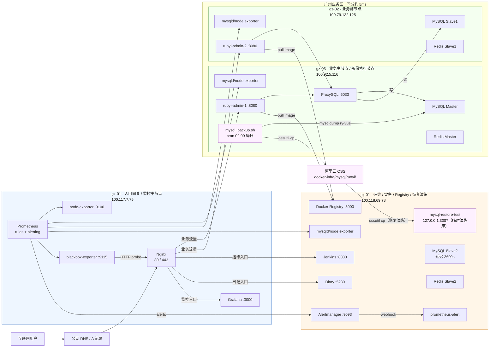
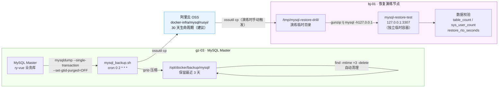
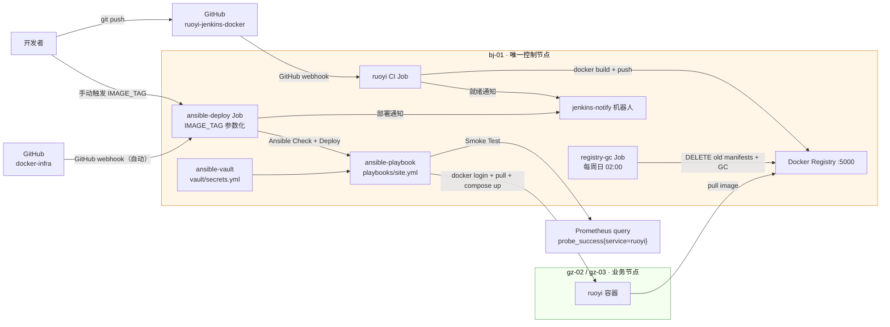

# 架构快照 v1.7

## 文档说明

V1.7 相对 V1.6 的核心变更：在既有 CI/CD 全链路和告警体系基础上，新增 `roles/mysql-backup/` Ansible role，在 gz-03 MySQL Master 配置每日 02:00 `mysqldump` 逻辑备份（仅 `ry-vue` 业务库），备份文件压缩后上传至阿里云 OSS（`docker-infra/mysql/ruoyi/` 前缀，本地保留 3 天），并在 bj-01 通过独立临时容器 `mysql-restore-test`（端口 `127.0.0.1:3307`）完成恢复演练，实测 RTO ≈ 34 秒（含 OSS 下载 + 导入 + 校验，不含人工决策）、最大 RPO 24 小时（bj-01 延迟从库提供误操作场景 3600s 缓冲窗口）。V1.7 已通过 Phase 1-7 全链路验收，幂等检查 `changed=0 failed=0`；本版本用于 Git tag `arch-v1.7` 对应的正式架构快照。

上一版本请参阅 [v1.6.md](v1.6.md)。

---

## AI 上下文引导（Context Bootstrap）

> 本节供 AI 快速建立上下文，人工阅读可跳过。

**仓库根目录与管理方式**

- Ansible 控制仓库：`/opt/docker-infra`（仅 bj-01 持有 Git 仓库）
- 各节点线上运行目录：`/opt/docker`（由 Ansible 渲染/下发配置，不在该目录执行 git pull/clone）
- Git 仓库仅 bj-01 持有，gz-01 / gz-02 / gz-03 均由 Ansible 推送配置
- 所有服务均以 Docker Compose 管理，网络为 `global_gateway`
- 节点 hostname 约定：`gz-01` / `gz-02` / `gz-03` / `bj-01`
- Ansible 控制节点：bj-01（100.118.69.78），通过 Tailscale SSH 管理远端节点
- 敏感信息管理：所有密码、OSS AccessKey、飞书 webhook URL 统一存入 `vault/secrets.yml`，经 ansible-vault 加密后进入 Git；vault 密码未落地为密码文件，所有命令需 `--ask-vault-pass` 交互输入
- 当前落地状态：V1.7 备份恢复最小闭环已部署并验收；`setup_backup.yml` 幂等检查 `bj-01/gz-03 changed=0 failed=0`

**备份与恢复链路**

```
gz-03 cron 每天 02:00
    → mysqldump --single-transaction --set-gtid-purged=OFF ry-vue
    → gzip 压缩 → /opt/docker/backup/mysql/ruoyi_backup_YYYYMMDD_HHMMSS.sql.gz
    → ossutil cp → oss://<bucket>/docker-infra/mysql/ruoyi/
    → find -mtime +3 -delete（本地保留 3 天）

恢复演练（手动触发，bj-01 root 用户）
    → ossutil cp 最新 .sql.gz → /tmp/mysql-restore-drill/
    → docker run mysql:8.0 → mysql-restore-test（127.0.0.1:3307）
    → gunzip | mysql -h127.0.0.1（导入 ry-vue）
    → 校验 table_count / sys_user_count
    → 记录 restore_rto_seconds（v1.7 实测 34s）
    → docker rm -f mysql-restore-test → 临时库销毁
```

**节点互联方式**

所有节点通过 **Tailscale WireGuard** 加密隧道互联，不依赖公网端口暴露。Ansible SSH、Prometheus 指标采集、Alertmanager 接入、MySQL / Redis 复制、Registry 镜像拉取、ossutil 上传均走 Tailscale 内网地址或各节点公网出口（OSS endpoint 为公网域名）。

**飞书机器人与 Webhook 管理**

| 机器人 | 用途 | Webhook 存储位置 | 安全策略 |
|--------|------|-----------------|---------|
| `docker-infra-alert` | Prometheus Alertmanager 告警通知 | `vault/secrets.yml` → `alerting_feishu_webhook_url` | 自定义关键词：`docker-infra` |
| `jenkins-notify` | Jenkins CI/CD/GC 流水线通知 | Jenkins Credential `feishu-webhook-url-jenkins-notify` | 无关键词限制 |

**关键文件路径索引**

bj-01（Ansible 控制节点，Git 仓库所在机器）：

```
/opt/docker-infra/
├── inventory/
│   ├── hosts.yml                        ← 节点清单、分组与主机专属变量
│   └── group_vars/
│       └── all.yml                      ← 公共变量：V1.7 新增 mysql_backup_* / ossutil_* 变量
├── vault/
│   └── secrets.yml                      ← ansible-vault 加密，V1.7 新增 oss_access_key_id/secret、oss_bucket_name、oss_endpoint
├── roles/
│   ├── mysql-backup/                    ← V1.7 新增：gz-03 备份脚本 + cron；bj-01 ossutil + OSS 配置
│   │   ├── tasks/main.yml
│   │   └── templates/
│   │       ├── ossutilconfig.j2         ← 渲染 /root/.ossutilconfig（0600 root:root）
│   │       └── mysql_backup.sh.j2       ← 渲染备份脚本（0750 root:root）
│   ├── registry/                        ← bj-01：Docker Registry v2
│   ├── docker-daemon/                   ← 全节点：daemon.json + pip + Python Docker SDK
│   ├── ruoyi/                           ← gz-02/gz-03：若依后端
│   ├── monitor-stack/                   ← gz-01：Prometheus / Grafana / blackbox-exporter
│   ├── alertmanager/                    ← bj-01：Alertmanager + prometheus-alert
│   ├── node-exporter/                   ← 全节点：node-exporter；DB 节点含 mysqld_exporter
│   ├── mysql-master/                    ← gz-03：MySQL Master
│   ├── mysql-replica/                   ← gz-02、bj-01：MySQL Slave
│   ├── redis-master/                    ← gz-03：Redis Master + Sentinel1
│   ├── redis-replica/                   ← gz-02、bj-01：Redis Slave + Sentinel
│   └── proxysql/                        ← gz-03：ProxySQL
├── playbooks/
│   ├── site.yml                         ← 全量部署入口
│   ├── setup_registry.yml              ← Registry 独立部署
│   └── setup_backup.yml                ← V1.7 新增：mysql-backup role 独立部署入口
├── Jenkinsfile                          ← docker-infra CD Pipeline
└── Jenkinsfile.registry-gc              ← Registry GC Pipeline
```

gz-03（MySQL Master + 备份执行节点）：

```
/opt/docker/
├── backend/mysql/.env                   ← MYSQL_ROOT_PASSWORD 等（由 Ansible 渲染）
└── backup/mysql/                        ← V1.7 新增：备份目录（0750 root:root）
    ├── mysql_backup.sh                  ← 由 Ansible 渲染（0750 root:root）
    ├── mysql_backup.log                 ← cron 执行日志（追加写）
    └── ruoyi_backup_YYYYMMDD_HHMMSS.sql.gz  ← 每日备份文件，本地保留 3 天

/root/.ossutilconfig                     ← V1.7 新增：ossutil 认证配置（0600 root:root）
/usr/local/bin/ossutil                   ← V1.7 新增：ossutil 二进制（固定版本 1.7.18）
```

bj-01（Ansible 控制节点 + 恢复演练节点）：

```
/root/.ossutilconfig                     ← V1.7 新增：ossutil 认证配置（0600 root:root）
/usr/local/bin/ossutil                   ← V1.7 新增：ossutil 二进制（固定版本 1.7.18）
/tmp/mysql-restore-drill/                ← 恢复演练临时目录（演练后删除）
```

**本版本核心技术决策**

| 决策点 | 选型 | 理由 |
|--------|------|------|
| 逻辑备份工具 | `mysqldump`（不选 `mydumper`） | 随 MySQL 客户端自带，无需额外安装；`ry-vue` 数据量 ~7MB，单线程备份耗时秒级；输出为单一 `.sql` 文件，恢复简单直观；`mydumper` 引入并行 + `myloader` 组合对当前规模属过度设计 |
| 对象存储 | 阿里云 OSS（不选腾讯云 COS） | 国内市场认知度更高，面试叙事认可度更强；ossutil 工具链成熟；`gz-01` 本身是阿里云节点，账号体系已有 |
| 备份源 | gz-03 MySQL Master（不选从库） | 数据最新无延迟；`--single-transaction` 对 InnoDB 不锁表，对主库读写影响可忽略；bj-01 延迟从库落后 3600s 不适合作全量基准 |
| `--set-gtid-purged=OFF` | 显式关闭 GTID 净化 | gz-03 开启了 binlog（`mysql_enable_binlog: true`），mysqldump 默认写 `SET @@GLOBAL.GTID_PURGED`；恢复到独立临时库时该语句报错（GTID 集合冲突）；加此参数使 dump 文件可在任意 MySQL 实例干净导入 |
| 恢复演练位置 | bj-01 临时容器 `mysql-restore-test:3307`（不在 gz-03） | 演练目的是验证备份可用性，不应在生产库操作；bj-01 资源最充裕（4C16G）；`3307` 避开现有延迟从库 `3306`；演练完毕 `docker rm -f` 销毁，不污染任何生产服务 |
| 不做 Redis 备份 | 缓存数据 | Redis 主要用作应用缓存，数据可重建；v1.7 范围克制，聚焦 MySQL 逻辑备份最小闭环 |
| 不做 Binlog/PITR | 范围控制 | PITR 需要持续归档 binlog，复杂度显著上升；当前 24h RPO 对学习项目已是合理起点；留给后续版本评估 |

---

## 节点总览

| 节点 | 配置 | 云厂商 | Tailscale IP | 公网 IP | 角色 |
|------|------|--------|--------------|---------|------|
| gz-01 | 2C2G | 阿里云·广州 | 100.117.7.75 | 8.163.9.112 | 入口网关 + 监控主节点 + Prometheus + Grafana + blackbox-exporter |
| gz-02 | 4C4G | 腾讯云·广州 | 100.79.132.125 | 123.207.59.177 | 业务副节点 + MySQL 实时从库 + Redis 从库 + exporters |
| gz-03 | 4C8G | 火山引擎·广州 | 100.92.5.116 | 118.145.70.66 | 业务主节点 + MySQL Master + ProxySQL + Redis Master + exporters + **备份执行节点** |
| bj-01 | 4C16G | 京东云·北京 | 100.118.69.78 | 117.72.174.148 | Ansible 控制节点 + Jenkins + Docker Registry + Alertmanager + prometheus-alert + 运维 + 灾备 + MySQL 延迟从库 + **恢复演练节点** |

---

## 各节点服务详情

### gz-01（入口网关 + 监控主节点）

| 服务 | 容器名 | 端口 | 说明 |
|------|--------|------|------|
| Nginx | nginx | 80, 443 | 对外入口，承载业务、运维和监控入口转发 |
| Prometheus | prometheus | 容器内 9090 | 指标采集、规则评估、向 Alertmanager 发送告警 |
| Grafana | grafana | 100.117.7.75:3000 | 监控面板 |
| blackbox-exporter | blackbox-exporter | 容器内 9115 | HTTP 入口探测，供 Prometheus scrape；Smoke Test 数据源 |
| Node Exporter | node-exporter | Docker 内网 9100 | 主机指标采集 |

### gz-03（业务主节点 + 备份执行节点）

| 服务 | 容器名 | 端口 | 说明 |
|------|--------|------|------|
| 若依后端 | ruoyi-admin-1 | 100.92.5.116:8080 | 业务主实例，镜像来自私有 Registry |
| MySQL Master | mysql | 127.0.0.1:3306 + 100.92.5.116:3306 | MySQL 主库，server-id=1；**V1.7：每日 02:00 由 mysql_backup.sh 执行 mysqldump 逻辑备份** |
| ProxySQL | proxysql | 100.92.5.116:6033 / :6032 | 应用侧读写分离入口 |
| mysqld_exporter | mysqld-exporter | 100.92.5.116:9104 | MySQL 指标采集 |
| Redis Master | redis | 100.92.5.116:6379 | Redis 主节点 |
| Sentinel1 | redis-sentinel | 100.92.5.116:26379 | Redis Sentinel |
| Node Exporter | node-exporter | 100.92.5.116:9100 | 主机指标采集 |
| **ossutil**（宿主机） | — | — | **V1.7 新增**：阿里云 OSS CLI，固定版本 1.7.18，`/usr/local/bin/ossutil`，供 mysql_backup.sh 调用 |

### gz-02（业务副节点）

| 服务 | 容器名 | 端口 | 说明 |
|------|--------|------|------|
| 若依后端 | ruoyi-admin-2 | 100.79.132.125:8080 | 业务副实例，镜像来自私有 Registry |
| MySQL Slave1 | mysql | 127.0.0.1:3306 + 100.79.132.125:3306 | MySQL 实时只读从库，server-id=2 |
| mysqld_exporter | mysqld-exporter | 100.79.132.125:9104 | MySQL 指标采集 |
| Redis Slave1 | redis | 100.79.132.125:6379 | Redis 同城从库 |
| Sentinel2 | redis-sentinel | 100.79.132.125:26379 | Redis Sentinel |
| Node Exporter | node-exporter | 100.79.132.125:9100 | 主机指标采集 |

### bj-01（Ansible 控制节点 + 运维 + 灾备 + Registry + 恢复演练节点）

| 服务 | 容器名 | 端口 | 说明 |
|------|--------|------|------|
| Jenkins | jenkins | 127.0.0.1:8080 + 100.118.69.78:8080 | CD Pipeline + CI Job + Registry GC Job |
| Docker Registry | registry | 100.118.69.78:5000 | 私有镜像仓库，htpasswd Basic Auth |
| Alertmanager | alertmanager | 100.118.69.78:9093 | 告警聚合、分组、静默、抑制 |
| prometheus-alert | prometheus-alert | Compose 内网 8080 | Alertmanager webhook → 飞书消息转换 |
| MySQL Slave2 | mysql | 127.0.0.1:3306 + 100.118.69.78:3306 | MySQL 延迟从库，延迟 3600s |
| mysqld_exporter | mysqld-exporter | 100.118.69.78:9104 | MySQL 指标采集 |
| Diary | diary | 100.118.69.78:5230 | Diary 服务 |
| Redis Slave2 | redis | 100.118.69.78:6379 | Redis 异地从库 |
| Sentinel3 | redis-sentinel | 100.118.69.78:26379 | Redis Sentinel |
| Node Exporter | node-exporter | 100.118.69.78:9100 | 主机指标采集 |
| **ossutil**（宿主机） | — | — | **V1.7 新增**：阿里云 OSS CLI，固定版本 1.7.18，供恢复演练时从 OSS 下载备份 |
| **mysql-restore-test**（临时） | mysql-restore-test | 127.0.0.1:3307 | **V1.7 新增**：恢复演练专用临时容器，演练完毕 `docker rm -f` 销毁，不持久运行 |

---

## 架构拓扑图

### 业务、数据与监控采集



### 备份与恢复演练链路



### CI/CD 与 Registry 链路（V1.6 起不变）



---

## Jenkins Jobs 总览

| Job 名称 | Pipeline 文件 | 触发方式 | 主要功能 |
|----------|--------------|---------|---------|
| `ansible-deploy` | `/opt/docker-infra/Jenkinsfile` | GitHub webhook（docker-infra 仓库 push）+ 手动（参数化） | Ansible Check + Deploy + Smoke Test + 飞书通知；支持 `IMAGE_TAG` 参数 |
| `ruoyi-jenkins-docker-auto-deploy` | `/opt/docker/backend/ruoyi/Jenkinsfile` | GitHub webhook（ruoyi 仓库 push） | Docker Build + Push Registry + 飞书「新版本就绪」通知 |
| `registry-gc` | `/opt/docker-infra/Jenkinsfile.registry-gc` | cron `0 2 * * 0`（每周日凌晨 2 点）+ 手动 | 保留最新 10 个 tag，DELETE API 软删除旧 tag，执行 Registry GC |

---

## 网络互联

| 链路 | 延迟 | 用途 |
|------|------|------|
| gz-01 ↔ gz-03 | ~5ms | Nginx → ruoyi-admin-1；Prometheus → exporters；Ansible SSH 配置下发 |
| gz-01 ↔ gz-02 | ~5ms | Nginx → ruoyi-admin-2；Prometheus → exporters；Ansible SSH 配置下发 |
| gz-01 ↔ bj-01 | ~35ms | Nginx → Jenkins/Diary；Prometheus → Alertmanager / exporters；跨城灾备链路 |
| gz-03 ↔ gz-02 | ~5ms | MySQL 主从复制；Redis 同城复制 |
| gz-03 ↔ bj-01 | ~35ms | MySQL 延迟从复制；Redis 异地复制；Ansible SSH 配置下发 |
| gz-02/gz-03 ↔ bj-01 | ~35ms | docker pull 私有 Registry 镜像（Tailscale 加密隧道） |
| gz-03 → OSS endpoint | 公网出口 | **V1.7 新增**：ossutil cp 备份文件上传（`oss-cn-guangzhou.aliyuncs.com`） |
| bj-01 → OSS endpoint | 公网出口 | **V1.7 新增**：ossutil cp 恢复演练时下载备份（跨地域访问，实测 ~5s/7MB） |

---

## RPO / RTO 说明

| 指标 | 策略 | 实测值 |
|------|------|--------|
| **RPO**（最多丢失多少数据） | 每日凌晨 02:00 全量逻辑备份，两次备份之间发生灾难最多丢失 24 小时变更 | 最大 **24 小时** |
| **RPO（辅助）** | bj-01 延迟从库 3600s，针对误删/误操作场景提供 1 小时回档窗口 | 辅助 **≤ 1 小时** |
| **RTO**（从 OSS 恢复需要多长时间） | OSS 下载（~5s）+ 容器初始化（~14s）+ 导入 + 校验（~15s） | 实测 **34 秒**（纯操作，不含人工决策） |

> **主从复制 vs 逻辑备份的定位**：主从复制保护的是**服务可用性**（节点故障时从库接管），但无法防止数据误删除（`DROP TABLE` 会实时同步到所有从库）。逻辑备份保护的是**数据完整性**，是两个不同维度的数据保护机制，缺一不可。

---

## 与上一版本的差异（相对 v1.6）

- **新增 MySQL 逻辑备份链路**：gz-03 新增 `mysql_backup.sh` 脚本（由 `roles/mysql-backup/` 管理），每日 02:00 对 `ry-vue` 库执行 `mysqldump --single-transaction --set-gtid-purged=OFF`，压缩后上传至阿里云 OSS，本地保留 3 天；ossutil 固定版本 1.7.18 由 Ansible 下发管理。
- **新增 bj-01 恢复演练能力**：bj-01 同样安装 ossutil 并配置 `/root/.ossutilconfig`；恢复演练时在 `127.0.0.1:3307` 启动独立临时容器 `mysql-restore-test`，导入后校验通过，实测 RTO 34 秒；演练容器演练后即销毁，不影响现有 3306 延迟从库。
- **新增 vault 凭据**：`vault/secrets.yml` 新增 `oss_access_key_id`、`oss_access_key_secret`、`oss_bucket_name`、`oss_endpoint` 四项 OSS 认证变量。
- **新增 inventory 变量**：`group_vars/all.yml` 新增 `mysql_backup_*` 和 `ossutil_*` 系列共 8 个非敏感公共变量。

---

## 已验证状态

| 指标 | 目标状态 |
|------|----------|
| Ansible 幂等 | `setup_backup.yml` 重复执行：`bj-01 ok=4 changed=0 failed=0`；`gz-03 ok=7 changed=0 failed=0`；ossutil `get_url` task 在 check mode 下 skipped（预期行为） |
| 脚本下发 | gz-03 `/opt/docker/backup/mysql/mysql_backup.sh` 存在，权限 `0750`，行数 43，内容与模板渲染一致 |
| cron 配置 | gz-03 `crontab -l` 可见 `#Ansible: docker-infra mysql logical backup to OSS` + `0 2 * * * /opt/docker/backup/mysql/mysql_backup.sh >> ... 2>&1` |
| ossutil 配置 | gz-03 / bj-01 `/root/.ossutilconfig` 存在，权限 `600`，内容包含 OSS endpoint + AK（vault 渲染） |
| 首次备份 | gz-03 手动执行产生 `ruoyi_backup_20260506_165742.sql.gz`（7,677,026 字节），`gzip -t` 通过 |
| OSS 上传 | `oss://docker-infra-mysql-ruoyi-backup/docker-infra/mysql/ruoyi/ruoyi_backup_20260506_165742.sql.gz` 存在，Size=7677026，与本地完全一致 |
| 恢复演练 | bj-01 `mysql-restore-test`（端口 3307）恢复出 `ry-vue`：`table_count=21`，`sys_user_count=4` |
| RTO 实测 | `restore_rto_seconds=34` |
| 敏感信息 | `vault/secrets.yml` AES256 加密；`grep -rEi "LTAI\|accessKeySecret" inventory roles playbooks Docs` 无明文凭据 |
| git tag | `arch-v1.7` 已推送至 GitHub |

---

## 本版本已知局限

V1.7 当前线上服务运行正常（备份恢复演练实测 RTO 34s、监控告警闭环、CI/CD 全链路均验收通过）。以下 4 条局限会在"新机器从零重建集群"时被暴露，已被识别并排进后续版本修复路线。详尽盘点见 `Docs/reviews/v1.7-iac-completeness-audit.md` 与 `Docs/reviews/v1.7-iac-ci-quality-gate-gap.md`；修复排期见 `Docs/scheme/phase-1-architecture-upgrade.md`。

| 局限 | 修复版本 |
|------|----------|
| 容器编排未引入 K8s / K3s；所有服务均以 Docker Compose 承载 | v1.13（仅迁无状态服务） |
| CI/CD 平台自身未完全 IaC 化（`jenkins-ansible:latest` Dockerfile / Job / Credentials / `jenkins_home` 备份） | v1.10 |
| 数据层 bootstrap 未完全 IaC 化（MySQL 业务库 / 复制账号 / 复制通道仍来自历史手工初始化） | v1.8 |
| HA 配置状态边界未明确（ProxySQL runtime 与 cnf 不一致；Redis Sentinel 自动 failover 与 Ansible 静态 `replicaof` 冲突） | v1.9 |
