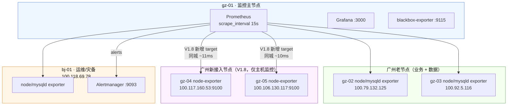
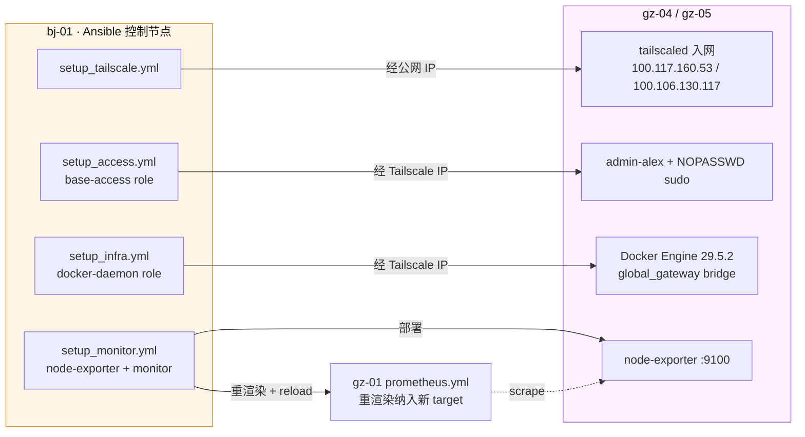

# 架构快照 v1.8

## 文档说明

V1.8 相对 V1.7 的核心变更：在既有四节点（gz-01 / gz-02 / gz-03 / bj-01）基础上，完成广州两台新节点 gz-04（百度云·Ubuntu 24.04）、gz-05（腾讯云·Ubuntu 22.04）的**基础接入**——加入 Tailscale tailnet、以与现有节点一致的方式安装 Docker Engine、纳入 Prometheus 主机监控（node-exporter）。同时新增 `roles/base-access/`，在**全部 6 台节点**幂等创建统一运维身份 `admin-alex`（纯追加授权公钥 + NOPASSWD sudoers，不删除 root）；`roles/docker-daemon/` 扩展为可管理 Docker Engine 安装与 `global_gateway` 本地 bridge 网络。本版本**只做基础接入，不在 gz-04 / gz-05 承载任何业务工作负载**；4 台老节点的 `ansible_user` 翻转与 Jenkins 凭据切换不在本次范围。V1.8 已通过 Phase 1-8 全链路验收，幂等检查 `changed=0 failed=0`；本版本对应 Git tag：`arch-v1.8`，路线主题 [`six-node-onboarding`](../scheme/phase-1-architecture-upgrade.md#six-node-onboarding)。

上一版本请参阅 [v1.7.md](v1.7.md)。

---

## AI 上下文引导（Context Bootstrap）

> 本节供 AI 快速建立上下文，人工阅读可跳过。

**仓库根目录与管理方式**

- Ansible 控制仓库：`/opt/docker-infra`（仅 bj-01 持有 Git 仓库）
- 各节点线上运行目录：`/opt/docker`（由 Ansible 渲染/下发配置，不在该目录执行 git pull/clone）
- 所有服务均以 Docker Compose 管理，网络为 `global_gateway`（各主机本地 bridge，非跨主机 overlay）
- 节点 hostname 约定：`<region>-<NN>`，当前为 `gz-01` / `gz-02` / `gz-03` / `gz-04` / `gz-05` / `bj-01`
- Ansible 控制节点：bj-01（100.118.69.78），通过 Tailscale SSH 管理远端节点
- 连接身份：老四台 `ansible_user` 仍为 `root`；新两台 gz-04 / gz-05 `ansible_user` 为 `admin-alex`，经 NOPASSWD sudo 提权。6 台均已就绪统一运维身份 `admin-alex`，老四台的连接用户翻转留到后续 `cicd-state-iac` 主题
- 敏感信息管理：密码、OSS AccessKey、飞书 webhook URL、Tailscale authkey 统一存入 `vault/secrets.yml`，经 ansible-vault 加密后进入 Git
- 当前落地状态：V1.8 六节点基础接入已部署并验收；`setup_access.yml --limit managed_nodes --check` 与 `setup_infra.yml --limit gz-04,gz-05 --check` 均 `changed=0 failed=0`

**节点接入链路（v1.8 新增）**

```
bj-01（Ansible 控制节点）
    → setup_tailscale.yml（经公网 IP）：gz-04/gz-05 安装 Tailscale 并入网
    → tailscale ip -4 取得内网 IP，回填 inventory（gz-04=100.117.160.53 / gz-05=100.106.130.117）
    → setup_access.yml：6 台幂等创建 admin-alex + 授权公钥 + NOPASSWD sudoers（纯追加）
    → setup_infra.yml（仅 gz-04/gz-05）：装 Docker Engine + 配置 daemon.json + 创建 global_gateway
    → setup_monitor.yml --tags node-exporter（gz-04/gz-05）：部署 node-exporter
    → setup_monitor.yml --tags monitor（gz-01）：重渲染 prometheus.yml，纳入新 targets
```

**节点互联方式**

所有节点通过 **Tailscale WireGuard** 加密隧道互联，不依赖公网端口暴露。Ansible SSH、Prometheus 指标采集、Alertmanager 接入、MySQL / Redis 复制、Registry 镜像拉取均走 Tailscale 内网地址。gz-04 / gz-05 本次仅承载 Tailscale 接入、Docker Engine 与 node-exporter，不参与任何业务或复制链路。

**关键文件路径索引**

bj-01（Ansible 控制节点，Git 仓库所在机器）：

```
/opt/docker-infra/
├── inventory/
│   ├── hosts.yml                        ← v1.8：新增 gz-04/gz-05 主机段、managed_nodes 分组、exporter_nodes 扩容至 6 台
│   └── group_vars/
│       └── all.yml                      ← v1.8 新增 access_user / admin_alex_authorized_keys
├── vault/
│   └── secrets.yml                      ← ansible-vault 加密；v1.8 新增 tailscale_authkey
├── roles/
│   ├── tailscale/                       ← v1.8 新增：经公网 IP 安装 Tailscale 并入网，tailscale ip -4 回填
│   ├── base-access/                     ← v1.8 新增：6 台纯追加 admin-alex + 授权公钥 + NOPASSWD sudoers
│   ├── docker-daemon/                   ← v1.8 扩展：Docker Engine 安装（能力探测）+ global_gateway（CLI 幂等）
│   ├── node-exporter/                   ← 全 exporter_nodes（v1.8 扩至 6 台）：node-exporter
│   ├── monitor-stack/                   ← gz-01：Prometheus / Grafana / blackbox-exporter
│   ├── registry/ ruoyi/ alertmanager/ ...← 其余 role 无变化（见 v1.7.md）
├── playbooks/
│   ├── site.yml                         ← 全量部署入口
│   ├── setup_tailscale.yml             ← v1.8 新增：Tailscale 入网（经公网 IP，-e 覆盖 ansible_host）
│   ├── setup_access.yml                ← v1.8 新增：base-access role 独立部署入口
│   ├── setup_infra.yml                 ← v1.8 新增：docker-daemon role 独立部署入口
│   └── setup_monitor.yml               ← 监控栈 + node-exporter + mysqld-exporter + alertmanager
└── Jenkinsfile / Jenkinsfile.registry-gc
```

gz-04 / gz-05（新接入节点，线上运行目录）：

```
/opt/docker/
└── node-exporter/
    ├── docker-compose.yml               ← 由 Ansible 渲染，node-exporter 绑定 {Tailscale IP}:9100
    └── （无其他业务栈）
```

**本版本核心技术决策**

| 决策点 | 选型 | 理由 |
|--------|------|------|
| gz-04/gz-05 本次只做基础接入 | 仅 Tailscale + Docker + node-exporter，不进业务分组 | 接入与业务承载解耦，先把鉴权身份、运行时、监控打通并独立验收；K3s 等业务承载留到 `k3s-stateless`（v1.9）主题，避免一次引入过多变量难以排障 |
| 统一运维身份 `admin-alex` 纯追加 | `base-access` role 在 6 台建 admin-alex + 授权公钥 + NOPASSWD，不删 root | 让 6 台鉴权身份提前就绪，后续 cutover 只需翻 `ansible_user`；老四台连接用户本次不翻转，保证现有 Jenkins/Ansible 链路零回归 |
| Docker Engine 安装走能力探测 | `docker --version` 探测，已装则跳过 apt repo / GPG / Engine 安装 | 新节点从零装 Docker；老节点已有 Docker 不应每次全量 check 都访问 `download.docker.com` 外网，避免无关外网抖动拖垮幂等检查 |
| `global_gateway` 用 Docker CLI 幂等管理 | `docker network inspect` + 不存在则 `docker network create`，不用 `community.docker.docker_network` | gz-05 上 `community.docker.docker_network` 触发 `Not supported URL scheme http+docker`（requests/urllib3 兼容问题）；CLI 错误面更小、更贴近人工排障 |
| Tailscale IP 回填用 `tailscale ip -4` + 重试 | 不解析 `tailscale status --json` | `tailscale up` 返回成功不代表 IP 字段已刷新；`tailscale ip -4` 配合 `until` 等待 `100.` 前缀，把"暂时未就绪"变成可控等待 |
| gz-04 Docker mirror 改用 daocloud | gz-04 `docker_registry_mirrors` 从 `mirror.baidubce.com` 改 `docker.m.daocloud.io` | 百度云默认 mirror 在 gz-04 当前 DNS 不可解析；镜像源以实际解析和拉取验证为准，不默认相信云厂商归属 |

---

## 节点总览

| 节点 | 配置 | 云厂商 | Tailscale IP | 公网 IP | 角色 |
|------|------|--------|--------------|---------|------|
| gz-01 | 2C2G | 阿里云·广州 | 100.117.7.75 | 8.163.9.112 | 入口网关 + 监控主节点 + Prometheus + Grafana + blackbox-exporter |
| gz-02 | 4C4G | 腾讯云·广州 | 100.79.132.125 | 123.207.59.177 | 业务副节点 + MySQL 实时从库 + Redis 从库 + exporters |
| gz-03 | 4C8G | 火山引擎·广州 | 100.92.5.116 | 118.145.70.66 | 业务主节点 + MySQL Master + ProxySQL + Redis Master + exporters + 备份执行节点 |
| gz-04 | 2C4G/80G | 百度云·广州 | 100.117.160.53 | 182.61.39.35 | **V1.8 新接入**：基础接入节点（Ubuntu 24.04 noble），仅 node-exporter，无业务负载 |
| gz-05 | 2C4G/70G | 腾讯云·广州 | 100.106.130.117 | 43.138.186.227 | **V1.8 新接入**：基础接入节点（Ubuntu 22.04 jammy），仅 node-exporter，无业务负载 |
| bj-01 | 4C16G | 京东云·北京 | 100.118.69.78 | 117.72.174.148 | Ansible 控制节点 + Jenkins + Docker Registry + Alertmanager + prometheus-alert + 运维 + 灾备 + MySQL 延迟从库 + 恢复演练节点 |

> gz-04 / gz-05 实测 Docker Engine 版本 `29.5.2`、Docker Compose `v5.1.4`。两台本次仅在 `managed_nodes` 与 `exporter_nodes` 分组，不在任何业务分组（`app_nodes` / `db_*` / `redis_*` / `gateway_nodes` / `monitor_nodes` / `mysqld_exporter_nodes`）。

---

## 各节点服务详情

> 老四台 gz-01 / gz-02 / gz-03 / bj-01 服务详情相对 v1.7 无变化，完整列表见 [v1.7.md](v1.7.md)。本节仅列出 V1.8 新接入的 gz-04 / gz-05。

### gz-04（基础接入节点 · 百度云·广州 · Ubuntu 24.04）

| 服务 | 容器名 | 端口 | 说明 |
|------|--------|------|------|
| Node Exporter | node-exporter | 100.117.160.53:9100 | **V1.8 新增**：主机指标采集，绑定 Tailscale IP；镜像 `prom/node-exporter:v1.8.0` |
| Docker Engine（宿主机） | — | — | **V1.8 新增**：Engine 29.5.2 + Compose v5.1.4；`global_gateway` 本地 bridge 网络已创建 |
| admin-alex（宿主机身份） | — | — | **V1.8 新增**：统一运维身份，`ansible_user`；授权公钥 + NOPASSWD sudoers |

### gz-05（基础接入节点 · 腾讯云·广州 · Ubuntu 22.04）

| 服务 | 容器名 | 端口 | 说明 |
|------|--------|------|------|
| Node Exporter | node-exporter | 100.106.130.117:9100 | **V1.8 新增**：主机指标采集，绑定 Tailscale IP；镜像 `prom/node-exporter:v1.8.0` |
| Docker Engine（宿主机） | — | — | **V1.8 新增**：Engine 29.5.2 + Compose v5.1.4；`global_gateway` 本地 bridge 网络已创建 |
| admin-alex（宿主机身份） | — | — | **V1.8 新增**：统一运维身份，`ansible_user`；授权公钥 + NOPASSWD sudoers |

---

## 架构拓扑图

### 监控采集拓扑（V1.8 视角）



### 节点接入控制链路（V1.8 新增）



> 业务、数据、CI/CD 与 Registry 拓扑相对 v1.7 无变化，完整图见 [v1.7.md](v1.7.md)。

---

## 网络互联

> 老节点之间（gz-01/02/03 ↔ bj-01）链路相对 v1.7 无变化，完整矩阵见 [v1.7.md](v1.7.md)。本节列出 V1.8 新增节点实际承载流量的链路（`tailscale ping -c 10` 实测）。

| 链路 | 延迟 | 用途 |
|------|------|------|
| gz-01 ↔ gz-04 | ~11ms | **V1.8 新增**：Prometheus → gz-04 node-exporter（广州同城，跨云厂商：阿里云↔百度云）|
| gz-01 ↔ gz-05 | ~10ms | **V1.8 新增**：Prometheus → gz-05 node-exporter（广州同城，跨云厂商：阿里云↔腾讯云）|
| bj-01 ↔ gz-04 | ~38ms | **V1.8 新增**：Ansible SSH 配置下发（北京↔广州跨城）|
| bj-01 ↔ gz-05 | ~35ms | **V1.8 新增**：Ansible SSH 配置下发（北京↔广州跨城）|

> 同城跨云厂商链路（~10-11ms）略高于老节点同城链路（~5ms），因 gz-04/gz-05 与 gz-01 分属不同云厂商，Tailscale 经各自公网出口建立 WireGuard 直连。跨城链路（~35-38ms）与现有 gz↔bj 链路量级一致。

---

## 与上一版本的差异（相对 v1.7）

- **接入广州两台新节点 gz-04 / gz-05**：完成 Tailscale 入网、Docker Engine 29.5.2 安装、node-exporter 监控接入；两台仅在 `managed_nodes` 与 `exporter_nodes`，不承载任何业务负载。Prometheus `up{job="node-exporter"}` 由 4 个 target 扩到 6 个，全部 `up=1`。
- **新增 `roles/base-access/`**：在 6 台节点幂等创建统一运维身份 `admin-alex`（授权公钥 + NOPASSWD sudoers，纯追加不删 root）；gz-04 / gz-05 `ansible_user` 已切为 `admin-alex`，老四台仍为 `root`。
- **扩展 `roles/docker-daemon/`**：新增 Docker Engine 安装（能力探测，已装则跳过外网安装源）与 `global_gateway` 本地 bridge 网络管理（Docker CLI 幂等，规避 `community.docker` 的 `http+docker` 兼容问题）。
- **新增 inventory 结构与 vault 凭据**：`hosts.yml` 新增 gz-04/gz-05 主机段、`managed_nodes` 分组、`exporter_nodes` 扩容；`group_vars/all.yml` 新增 `access_user` / `admin_alex_authorized_keys`；`vault/secrets.yml` 新增 `tailscale_authkey`。
- **新增三个 playbook**：`setup_tailscale.yml`（入网）、`setup_access.yml`（base-access）、`setup_infra.yml`（docker-daemon），分别对应接入的三个逻辑检查点。

---

## 已验证状态

| 指标 | 目标状态 |
|------|----------|
| Tailscale 接入 | gz-04 / gz-05 控制台 `connected`；`tailscale ping` `pong` 丢包 0% |
| Tailscale 延迟实测 | gz-01↔gz-04 ~11ms、gz-01↔gz-05 ~10ms（同城）；bj-01↔gz-04 ~38ms、bj-01↔gz-05 ~35ms（跨城）|
| admin-alex 供给（6 台）| 每台 `getent passwd admin-alex` 存在；`sudo -n true` 返回 0；`visudo -cf` 通过 |
| 老四台连接不变 | gz-01/02/03/bj-01 `ansible_user` 仍 root；经 root `ansible -m ping` 全绿；root authorized_keys 未改 |
| SSH 切换（仅新节点）| gz-04/gz-05 `ansible_user` 为 admin-alex；经 admin-alex + become `ansible -m ping` 全绿 |
| Docker 运行时 | gz-04/gz-05 Docker Engine 29.5.2、Compose v5.1.4；`global_gateway` bridge 可见，二次 `--check` `changed=0` |
| Prometheus 抓取 | `up{job="node-exporter"}` 含 `100.117.160.53:9100`、`100.106.130.117:9100`，值为 1 |
| mysqld-exporter 边界 | gz-04/gz-05 无 mysqld-exporter 容器；mysqld-exporter job 仍仅 gz-02/03/bj-01 |
| Ansible 幂等 | `setup_access.yml --limit managed_nodes --check`、`setup_infra.yml --limit gz-04,gz-05 --check` 均 `changed=0 failed=0` |
| 业务隔离 | gz-04/gz-05 仅在 `managed_nodes` 与 `exporter_nodes`，不在任何业务分组 |
| 敏感信息 | `vault/secrets.yml` AES256；`grep -rEi "tskey-" inventory roles playbooks Docs` 无明文；`tailscale up` 任务 `no_log: true` |
| git tag | `arch-v1.8`（待全流程确认后打） |

---

## 范围边界（本次不做，拆出到后续）

| 维度 | 本次（v1.8）做 | 拆出到后续主题 |
|------|----------------|----------------|
| admin-alex 用户 | 6 台全节点幂等创建 + 授权公钥 + NOPASSWD（纯追加）| — |
| `ansible_user` 翻转 | 仅 gz-04 / gz-05 | gz-01/02/03/bj-01 四台翻转（[`cicd-state-iac`](../scheme/phase-1-architecture-upgrade.md#cicd-state-iac)）|
| Jenkins `ansible-ssh-key` 凭据 | 不动（仍 root），仅把公钥提前授权给 admin-alex | 凭据用户名改为 admin-alex |
| gz-04/gz-05 业务承载 | 不承载任何业务 | K3s 双节点迁 ruoyi 无状态后端（[`k3s-stateless`](../scheme/phase-1-architecture-upgrade.md#k3s-stateless)，v1.9）|
| 老四台 docker-daemon Engine 安装 | 不执行（仅新节点装 Docker）| 单独评估后对老节点执行 |

---

## 本版本已知局限

V1.8 当前线上服务运行正常（六节点接入实测全部验收通过）。以下局限会在后续演进中处理，修复排期见 `Docs/scheme/phase-1-architecture-upgrade.md`（路线主题以 slug 锚点引用，目标版本号以路线图主文件为准）。

| 局限 | 修复主题 |
|------|----------|
| gz-04/gz-05 尚未承载业务，集群算力未被利用 | [`k3s-stateless`](../scheme/phase-1-architecture-upgrade.md#k3s-stateless) |
| 容器编排未引入 K8s / K3s；所有服务均以 Docker Compose 承载 | [`k3s-stateless`](../scheme/phase-1-architecture-upgrade.md#k3s-stateless) |
| CI/CD 平台自身未完全 IaC 化；老四台 `ansible_user` 仍为 root | [`cicd-state-iac`](../scheme/phase-1-architecture-upgrade.md#cicd-state-iac) |
| 数据层 bootstrap 未完全 IaC 化（MySQL 业务库 / 复制账号 / 复制通道仍来自历史手工初始化）| [`base-reproducibility-fix`](../scheme/phase-1-architecture-upgrade.md#base-reproducibility-fix) |
| 告警出口端单点（Alertmanager / prometheus-alert / bj-01 整机）未冗余 | [`dms-outlet-redundancy`](../scheme/phase-1-architecture-upgrade.md#dms-outlet-redundancy) |
