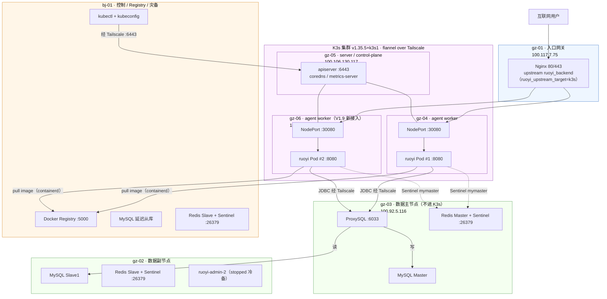
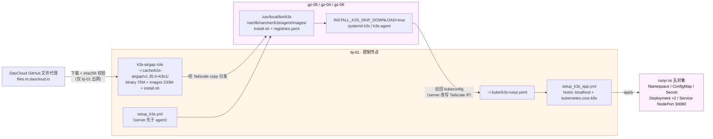

# 架构快照 v1.9

## 文档说明

V1.9 相对 V1.8 的核心变更：新接入腾讯云·广州常驻节点 **gz-06**（复用 v1.8 onboarding 流程），并在 **gz-05（server）+ gz-04 / gz-06（agent worker）** 上以**全离线 airgap** 方式拉起 K3s `v1.35.5+k3s1` 三节点集群（节点间 apiserver / flannel 流量强制走 Tailscale）；ruoyi 无状态后端从 gz-02 / gz-03 的 Docker Compose 迁移为 K3s `ruoyi` namespace 下的 **Deployment 2 副本**（跨 gz-04 / gz-06 打散），经 NodePort `30080` 暴露，gz-01 Nginx upstream 已切流至 K3s。有状态服务（MySQL / Redis / ProxySQL）**不进 K3s**，ruoyi Pod 经 Tailscale 直连 gz-03 ProxySQL（`100.92.5.116:6033`）与 Redis Sentinel（`mymaster`），数据层零配置变更。gz-02 / gz-03 的 Compose ruoyi 已 `stop`，作为**有界冷备**保留至 2026-06-19。V1.9 已通过 runbook Phase 0-11 全量验收（含滚动更新、`rollout undo`、四类故障演练与公网探针 305/305 `200`）；本版本对应 Git tag：`arch-v1.9`，路线主题 [`k3s-stateless`](../scheme/phase-1-architecture-upgrade.md#k3s-stateless)。

上一版本请参阅 [v1.8.md](v1.8.md)。

---

## AI 上下文引导（Context Bootstrap）

> 本节供 AI 快速建立上下文，人工阅读可跳过。

**仓库根目录与管理方式**

- Ansible 控制仓库：`/opt/docker-infra`（仅 bj-01 持有 Git 仓库）
- 各节点线上运行目录：`/opt/docker`（由 Ansible 渲染/下发配置，不在该目录执行 git pull/clone）
- 服务承载分两层：**有状态与基础设施服务**（MySQL / Redis / ProxySQL / Nginx / 监控 / Jenkins / Registry）仍以 Docker Compose 管理，网络为 `global_gateway`（各主机本地 bridge）；**ruoyi 无状态后端**自 V1.9 起由 K3s 承载（gz-05 server + gz-04 / gz-06 agent，flannel VXLAN over Tailscale）
- 节点 hostname 约定：`<region>-<NN>`，当前为 `gz-01` ~ `gz-06` / `bj-01`。**例外说明**：K3s 节点的 K8s node name 取自 OS hostname（`ops-lab-gz-04` / `ops-lab-gz-05` / `ops-lab-gz-06`，带历史 `ops-lab-` 前缀），与 inventory 主机名（`gz-04` 等）是两套命名；kubectl 的 drain / uncordon 等节点操作必须先 `kubectl get nodes` 确认真实 node name
- Ansible / kubectl 控制节点：bj-01（100.118.69.78）。kubeconfig 位于 bj-01 `~/.kube/k3s-ruoyi.yaml`（`server:` 指向 gz-05 Tailscale IP），K8s 对象经 `playbooks/setup_k3s_app.yml`（`hosts: localhost`，`kubernetes.core.k8s`）从控制节点 apply
- 连接身份：老四台 `ansible_user` 仍为 `root`；gz-04 / gz-05 / gz-06 为 `admin-alex` + NOPASSWD sudo
- 敏感信息管理：统一存入 `vault/secrets.yml`（ansible-vault 加密）；V1.9 新增 `k3s_token`（集群加入 token）。K3s 各节点 `/etc/rancher/k3s/registries.yaml`（含私有 Registry 凭据）权限 0600、渲染任务 `no_log`
- 当前落地状态：V1.9 全量验收通过；`setup_k3s.yml --check` `changed=0 failed=0`；`setup_k3s_app.yml --check` 中 ns/configmap/secret/service `changed=0`，Deployment image 字段因「Ansible `latest` + CI/CD 精确 tag」双轨制存在预期内 `changed`（详见"本版本已知局限"）

**K3s 离线 airgap 安装链路（v1.9 新增）**

```
bj-01（roles/k3s-airgap，run_once）
    → 经 DaoCloud GitHub 文件代理下载 k3s 二进制（75M）+ airgap 镜像包（233M）+ install.sh
      （sha256 校验，缓存 ~/.cache/k3s-airgap/v1.35.5+k3s1/，k3s_version 为唯一升级旋钮）
    → 经 Tailscale 分发到 K3s 节点：/usr/local/bin/k3s、
      /var/lib/rancher/k3s/agent/images/（首次启动 containerd 自动本地导入）、install.sh
    → INSTALL_K3S_SKIP_DOWNLOAD=true 离线安装；gz 节点零公网依赖
      （背景：gz 节点 docker.io / GitHub egress 不可达，为长期事实）
    → server（gz-05）：--node-ip=<Tailscale IP> --flannel-iface=tailscale0 --disable=traefik
    → agent（gz-04 / gz-06）：K3S_URL=https://100.106.130.117:6443 join，同样强制 tailscale0
    → kubeconfig 拉回 bj-01 ~/.kube/k3s-ruoyi.yaml（server 改写为 gz-05 Tailscale IP）
```

**ruoyi 业务流量链路（v1.9 切流后）**

```
公网 https://ruoyi.jjmstart.com
    → gz-01 Nginx（upstream ruoyi_backend，ruoyi_upstream_target=k3s）
    → gz-04 / gz-06 NodePort 30080（iptables DNAT，无进程监听该端口）
    → Service ruoyi（ClusterIP）→ ruoyi Pod ×2（Deployment，跨 gz-04 / gz-06 打散）
    → Pod 出站经节点 SNAT 走 Tailscale：
        MySQL：gz-03 ProxySQL 100.92.5.116:6033（读写分离入口，配置零变更）
        Redis：Sentinel mymaster（gz-03 / gz-02 / bj-01 :26379）
    → 镜像拉取：bj-01 私有 Registry 100.118.69.78:5000（containerd registries.yaml，HTTP + Basic Auth）
```

**节点互联方式**

所有节点通过 **Tailscale WireGuard** 加密隧道互联，不依赖公网端口暴露。V1.9 起 K3s apiserver（6443）、flannel VXLAN、kubectl 管理流量、airgap 产物分发同样全部走 Tailscale（server / agent 进程显式 `--flannel-iface=tailscale0`，三节点 `INTERNAL-IP` 均为 Tailscale IP）。

**关键文件路径索引**

bj-01（Ansible / kubectl 控制节点，Git 仓库所在机器）：

```
/opt/docker-infra/
├── inventory/
│   ├── hosts.yml                        ← v1.9：新增 gz-06 主机段；新增 k3s_server_nodes /
│   │                                       k3s_agent_nodes / k3s_nodes 分组（三台不进 app_nodes）
│   └── group_vars/
│       └── all.yml                      ← v1.9 新增 K3s 段（k3s_server_host / ruoyi_k3s_* /
│                                           ruoyi_upstream_target=k3s）+ airgap 离线安装段
├── vault/
│   └── secrets.yml                      ← v1.9 新增 k3s_token
├── roles/
│   ├── k3s-airgap/                      ← v1.9 新增：bj-01 下载 k3s 产物到本地缓存（run_once）
│   ├── k3s-server/                      ← v1.9 新增：gz-05 离线装 server + registries.yaml + 拉回 kubeconfig
│   ├── k3s-agent/                       ← v1.9 新增：gz-04/gz-06 离线 join
│   ├── k3s-ruoyi/                       ← v1.9 新增：控制节点经 kubeconfig apply ruoyi 五对象
│   │   └── templates/                   ← namespace/configmap/secret/deployment/service .yaml.j2
│   ├── nginx/templates/conf.d/ruoyi.conf ← v1.9 修改：upstream 由 ruoyi_upstream_target 变量驱动
│   └── ...                              ← 其余 role 无变化（见 v1.8.md / v1.7.md）
├── playbooks/
│   ├── setup_k3s.yml                    ← v1.9 新增：k3s-server 先于 k3s-agent
│   ├── setup_k3s_app.yml                ← v1.9 新增：hosts: localhost，经 kubeconfig apply ruoyi
│   └── site.yml                         ← v1.9 修改：末尾追加上述两个 import
├── jenkins-build/Dockerfile             ← v1.9 修改：pip 追加 kubernetes SDK（Jenkins 容器执行 k8s 模块所需）
└── Jenkinsfile / Jenkinsfile.registry-gc ← 无变化

~/.kube/k3s-ruoyi.yaml                   ← v1.9 新增：K3s kubeconfig（mode 0600）
~/.cache/k3s-airgap/v1.35.5+k3s1/        ← v1.9 新增：airgap 产物缓存（binary / images / install.sh）
/usr/local/bin/kubectl                   ← v1.9 新增：kubectl 客户端
```

K3s 节点 gz-04 / gz-05 / gz-06（节点侧）：

```
/etc/rancher/k3s/registries.yaml         ← containerd 私有 Registry 接入（0600，含凭据）
/usr/local/bin/k3s                       ← airgap 预置二进制
/var/lib/rancher/k3s/agent/images/       ← airgap 系统镜像包（首次启动自动导入）
/usr/local/share/k3s/install.sh          ← 离线安装脚本
/opt/docker/node-exporter/               ← node-exporter Compose 栈（gz-06 为 v1.9 新增）
```

**本版本核心技术决策**

| 决策点 | 选型 | 理由 |
|--------|------|------|
| ruoyi 迁 K3s，有状态服务不迁 | 仅无状态后端进 K3s；MySQL / Redis / ProxySQL 留 Compose | 无状态服务的副本数、滚动更新、自愈是 K8s 价值最大化的场景；有状态服务进 K3s 引入 PVC / 拓扑约束等复杂度而收益有限，违背项目"讲得清、能排障"红线 |
| K3s 安装走全离线 airgap | bj-01 预置二进制 + 官方 airgap 镜像包 + install.sh，`INSTALL_K3S_SKIP_DOWNLOAD=true` | gz 节点实测 docker.io 不可达（`curl` 返回 000）、GitHub 慢且不稳，`INSTALL_K3S_MIRROR=cn` 对官方脚本是空操作；airgap 是唯一同时覆盖"二进制 + 运行时系统镜像"两段的方案，gz 节点零公网依赖 |
| 下载基址走 DaoCloud GitHub 文件代理 | `files.m.daocloud.io/github.com/...`，收敛为 `k3s_release_base` 单变量 | 直连 GitHub release CDN `HEAD` 通但 `GET` 卡死；rancher-mirror 对二进制 / airgap 路径 404；DaoCloud 代理 ranged `GET` 206 稳定可达 |
| 集群流量强制走 Tailscale | server / agent `--node-ip=<Tailscale IP>` + `--flannel-iface=tailscale0` | 跨三个云厂商组集群，flannel VXLAN 叠加在 WireGuard 隧道上，apiserver 与 Pod 网络均不暴露公网端口；Pod 出站经节点 SNAT 后天然可达 Tailscale 上的数据层 |
| 入口切流用 NodePort + 变量开关 | Service NodePort 30080；Nginx upstream 由 `ruoyi_upstream_target`（compose/k3s）驱动 | 不引入 Ingress / LoadBalancer，gz-01 入口架构零变更；切流 = 改一个变量重渲染 reload，回滚秒级；Ingress 化留给 `service-migration` 主题 |
| 禁用 K3s 自带 traefik | `--disable=traefik` | 入口由 gz-01 Nginx 统一承担，集群内不需要第二个 ingress controller，少一个讲不清的组件 |
| 配置注入沿用 .env 语义 | 非敏感项进 ConfigMap，DB 账号/密码、Redis 密码三项进 Secret（vault 值 b64encode 内存渲染，`no_log`） | 与 Compose 时代的 Spring 环境变量一一对应，"连接目标不变"可验证；Secret 不落盘 |
| 发布策略 `maxSurge:1 + maxUnavailable:0` | 滚动期间先起新副本再撤旧副本 | 公网零中断（演练实测坏镜像 / 坏探针均只影响新 Pod）；配合 `topologySpreadConstraints`（maxSkew:1, DoNotSchedule）跨 worker 打散、nodeAffinity 排除 control-plane |
| probe 用基线 TCP | readiness / liveness 均 `tcpSocket: 8080` | 零依赖、不误判；httpGet 待确认 RuoYi 健康端点后升级 |
| Compose 老副本"条件放行 + 有界冷备" | 放行不等日历窗口，改为可验证条件（连通 / 滚动 / 演练 / reboot 自愈）；10.3 摘除延后为冷备 7 天（至 2026-06-19） | 零真实流量下机械等 3 天买不到流量驱动的验证；冷备给"K3s 控制面整体不可用"留逃生舱，且设明确退役时间避免冻结备份静默退化为不等价兜底 |
| 单 server 不做控制面 HA | gz-05 单 server（可调度但稳态无业务 Pod） | 学习集群规模下 etcd quorum / 多 server 属过度设计；server 故障只影响调度面，已运行 Pod 与 NodePort 流量不受影响 |

---

## 节点总览

| 节点 | 配置 | 云厂商 | Tailscale IP | 公网 IP | 角色 |
|------|------|--------|--------------|---------|------|
| gz-01 | 2C2G | 阿里云·广州 | 100.117.7.75 | 8.163.9.112 | 入口网关 + 监控主节点 + Prometheus + Grafana + blackbox-exporter；**V1.9**：ruoyi upstream 切至 K3s NodePort |
| gz-02 | 4C4G | 腾讯云·广州 | 100.79.132.125 | 123.207.59.177 | MySQL 实时从库 + Redis 从库 + exporters；**V1.9**：Compose ruoyi 已 `stop`（有界冷备至 2026-06-19） |
| gz-03 | 4C8G | 火山引擎·广州 | 100.92.5.116 | 118.145.70.66 | MySQL Master + ProxySQL + Redis Master + exporters + 备份执行节点；**V1.9**：Compose ruoyi 已 `stop`（有界冷备至 2026-06-19） |
| gz-04 | 2C4G/80G | 百度云·广州 | 100.117.160.53 | 182.61.39.35 | **V1.9**：K3s agent worker（K8s node `ops-lab-gz-04`），承载 1 个 ruoyi Pod + node-exporter |
| gz-05 | 2C4G/70G | 腾讯云·广州 | 100.106.130.117 | 43.138.186.227 | **V1.9**：K3s server（control-plane，K8s node `ops-lab-gz-05`，可调度但稳态无业务 Pod）+ node-exporter |
| gz-06 | 4C4G | 腾讯云·广州 | 100.80.61.68 | 43.139.122.202 | **V1.9 新接入**（Ubuntu 24.04 noble）：K3s agent worker（K8s node `ops-lab-gz-06`），承载 1 个 ruoyi Pod + node-exporter |
| bj-01 | 4C16G | 京东云·北京 | 100.118.69.78 | 117.72.174.148 | Ansible / kubectl 控制节点 + Jenkins + Docker Registry + Alertmanager + prometheus-alert + MySQL 延迟从库 + 恢复演练节点；**V1.9**：airgap 产物缓存 + kubeconfig 持有方 |

> gz-04 / gz-05 / gz-06 叠加 `k3s_server_nodes` / `k3s_agent_nodes` / `k3s_nodes` 分组后，仍**不在任何 Compose 业务分组**（`app_nodes` / `db_*` / `redis_*` / `gateway_nodes` / `monitor_nodes` / `mysqld_exporter_nodes`），避免 Compose 业务 play 与 K3s 工作负载冲突。gz-02 / gz-03 冷备窗口内**继续留在 `app_nodes`**（Nginx compose 分支遍历该分组，摘除即冷备失效）。

---

## 各节点服务详情

> gz-01 / gz-02 / gz-03 / bj-01 未列出的服务相对 v1.8 / v1.7 无变化，完整列表见 [v1.7.md](v1.7.md)。本节列出 V1.9 有变化的节点。

### gz-05（K3s server · 腾讯云·广州 · Ubuntu 22.04）

| 服务 | 容器名 | 端口 | 说明 |
|------|--------|------|------|
| K3s server | —（systemd `k3s`） | 100.106.130.117:6443 | **V1.9 新增**：control-plane（apiserver / scheduler / 内嵌 etcd-sqlite），`--flannel-iface=tailscale0 --disable=traefik`；可调度但被 Deployment nodeAffinity 排除，稳态无业务 Pod |
| K3s 系统组件 | —（kube-system Pod） | 集群内 | **V1.9 新增**：coredns / local-path-provisioner / metrics-server，镜像来自 airgap 本地导入 |
| containerd Registry 接入 | — | — | **V1.9 新增**：`/etc/rancher/k3s/registries.yaml`（0600）指向 `100.118.69.78:5000`（HTTP + Basic Auth） |
| Node Exporter | node-exporter | 100.106.130.117:9100 | 无变化（v1.8 接入） |

### gz-04（K3s agent worker · 百度云·广州 · Ubuntu 24.04）

| 服务 | 容器名 | 端口 | 说明 |
|------|--------|------|------|
| K3s agent | —（systemd `k3s-agent`，`enabled`） | NodePort 30080（iptables DNAT） | **V1.9 新增**：worker，join `https://100.106.130.117:6443`，`--flannel-iface=tailscale0`；reboot 冷启动自愈实测通过 |
| ruoyi Pod | —（containerd，`ruoyi` ns） | 容器内 8080 | **V1.9 新增**：Deployment 2 副本之一，镜像 `100.118.69.78:5000/ruoyi`（当前线上 tag `15-33303b7`，经 Jenkins 参数化发布）；实测内存 ~533Mi / limit 1.5Gi，`restarts=0` |
| Node Exporter | node-exporter | 100.117.160.53:9100 | 无变化（v1.8 接入） |

### gz-06（K3s agent worker · 腾讯云·广州 · Ubuntu 24.04，V1.9 新接入）

| 服务 | 容器名 | 端口 | 说明 |
|------|--------|------|------|
| K3s agent | —（systemd `k3s-agent`，`enabled`） | NodePort 30080（iptables DNAT） | **V1.9 新增**：worker，join 方式同 gz-04 |
| ruoyi Pod | —（containerd，`ruoyi` ns） | 容器内 8080 | **V1.9 新增**：Deployment 2 副本之一；实测内存 ~522Mi / limit 1.5Gi，`restarts=0` |
| Node Exporter | node-exporter | 100.80.61.68:9100 | **V1.9 新增**：随 onboarding 部署，Prometheus `up=1` |
| Docker Engine（宿主机） | — | — | **V1.9 新增**：onboarding 随 docker-daemon role 安装（K3s 用自带 containerd，Docker 仅作为节点基线运行时） |
| admin-alex（宿主机身份） | — | — | **V1.9 新增**：统一运维身份，`ansible_user`；授权公钥 + NOPASSWD sudoers |

### gz-01（入口网关，仅列变化项）

| 服务 | 容器名 | 端口 | 说明 |
|------|--------|------|------|
| Nginx | nginx | 80, 443 | **V1.9**：`upstream ruoyi_backend` 由 `ruoyi_upstream_target` 变量驱动，当前 `k3s` → `100.117.160.53:30080` / `100.80.61.68:30080`；回滚改回 `compose` 重渲染即可 |

### gz-02 / gz-03（仅列变化项）

| 服务 | 容器名 | 端口 | 说明 |
|------|--------|------|------|
| 若依后端（Compose） | ruoyi-admin-2 / ruoyi-admin-1 | —（已停止） | **V1.9**：`docker compose stop`，作为"K3s 整体不可用"的有界冷备保留至 2026-06-19；回滚为手动三步（`up -d` → `ruoyi_upstream_target=compose` → 重渲染 Nginx），镜像冻结在 stop 时刻，到期执行 `down` + 摘出 `app_nodes` |

### bj-01（控制节点，仅列变化项）

| 服务 | 容器名 | 端口 | 说明 |
|------|--------|------|------|
| kubectl + kubeconfig（宿主机） | — | — | **V1.9 新增**：`/usr/local/bin/kubectl`；`~/.kube/k3s-ruoyi.yaml`（0600，server 指向 gz-05 Tailscale IP），经 Tailscale 直连 K3s API |
| airgap 产物缓存（宿主机） | — | — | **V1.9 新增**：`~/.cache/k3s-airgap/v1.35.5+k3s1/`（k3s 二进制 75M + 镜像包 233M + install.sh，sha256 校验） |
| Jenkins | jenkins | 127.0.0.1:8080 + 100.118.69.78:8080 | **V1.9**：`jenkins-ansible:latest` 镜像内固化 `kubernetes` Python SDK（36.0.2），支撑流水线内 `kubernetes.core.k8s` 在 Jenkins 容器（控制节点）执行；Jenkinsfile 本身无变化 |
| Docker Registry | registry | 100.118.69.78:5000 | 无配置变化；**V1.9 新增消费方**：K3s 节点 containerd 经 registries.yaml 拉取 ruoyi 镜像（跨城首拉 148MB 实测 ~10.5min，已缓存后秒级） |

---

## 架构拓扑图

### ruoyi 业务流量与数据链路（V1.9 视角）



### K3s 离线 airgap 安装与管理链路（V1.9 新增）



> 监控采集、CI/CD 与 Registry、备份恢复拓扑相对 v1.8 / v1.7 无结构变化（gz-06 node-exporter 仅为 Prometheus 新增一个 target），完整图见 [v1.8.md](v1.8.md) 与 [v1.7.md](v1.7.md)。

---

## 网络互联

> 既有链路（gz-01/02/03 ↔ bj-01、gz-01/bj-01 ↔ gz-04/gz-05）相对 v1.8 无变化，见 [v1.8.md](v1.8.md) / [v1.7.md](v1.7.md)。本节列出 V1.9 新增节点与新承载流量的链路（`tailscale ping -c 10` 实测）。

| 链路 | 延迟 | 用途 |
|------|------|------|
| gz-06 ↔ gz-05 | ~2ms | **V1.9 新增**：K3s agent ↔ apiserver（6443）、flannel VXLAN（同城同厂商：腾讯云↔腾讯云） |
| gz-06 ↔ gz-04 | ~7ms | **V1.9 新增**：flannel VXLAN（Pod 网络跨 worker；同城跨云：腾讯云↔百度云） |
| gz-06 ↔ gz-01 | ~10ms | **V1.9 新增**：Nginx → gz-06 NodePort 30080；Prometheus → gz-06 node-exporter |
| gz-06 ↔ bj-01 | ~35ms | **V1.9 新增**：Ansible SSH / airgap 产物分发；containerd → 私有 Registry 拉镜像（跨城） |
| gz-04 ↔ gz-05 | ~8ms | **V1.9 新承载**：gz-04 agent ↔ gz-05 apiserver（6443）、flannel VXLAN（同城跨云：百度云↔腾讯云） |
| bj-01 ↔ gz-05 | ~35ms | **V1.9 新承载**：bj-01 kubectl / `setup_k3s_app.yml` → gz-05 apiserver 6443（沿用 v1.8 实测跨城链路） |
| K3s Pod → gz-03 | 同城毫秒级 | **V1.9 新承载**：ruoyi Pod 经节点 SNAT → ProxySQL 6033 / Redis Sentinel 26379（Q1 实测连通，Pod 日志无 DB / Redis 异常） |

> 跨城链路对一次性操作的影响已实测：233M airgap 镜像包 bj-01 → gz 分发 ~24min/批（两台并行）；ruoyi 镜像（148MB）跨城首拉 ~10.5min（节点已缓存后秒级）。

---

## 与上一版本的差异（相对 v1.8）

- **新接入 gz-06 并组建 K3s 三节点集群**：gz-06（腾讯云·广州 4C4G）复用 v1.8 onboarding 流程接入；gz-05 server + gz-04 / gz-06 agent 以全离线 airgap 方式安装 K3s `v1.35.5+k3s1`（bj-01 预置产物 + `INSTALL_K3S_SKIP_DOWNLOAD`），三节点 `Ready`、`INTERNAL-IP` 均为 Tailscale IP，集群流量强制走 `tailscale0`。
- **ruoyi 从 Compose 迁移到 K3s 并完成切流**：`ruoyi` namespace 下五对象（Namespace / ConfigMap / Secret / Deployment / Service），2 副本跨 gz-04 / gz-06 打散，`maxUnavailable:0` 滚动更新与 `rollout undo` 验证通过；gz-01 Nginx upstream 切至 NodePort 30080，公网探针演练期间 305/305 `200`。gz-02 / gz-03 Compose ruoyi `stop` 转为有界冷备（至 2026-06-19）。
- **新增 K3s IaC 资产**：`roles/k3s-airgap|k3s-server|k3s-agent|k3s-ruoyi/`、`playbooks/setup_k3s{,_app}.yml`、inventory K3s 分组、group_vars K3s + airgap 变量段、vault `k3s_token`；`jenkins-ansible` 镜像固化 `kubernetes` Python SDK 使流水线可在 Jenkins 容器内执行 `kubernetes.core.k8s`。

---

## 已验证状态

| 指标 | 目标状态 |
|------|----------|
| gz-06 onboarding | Tailscale 控制台 `connected`（设备名 `gz-06`）；`ansible gz-06 -m ping` 经 admin-alex + become 全绿；node-exporter `up=1` |
| 集群就绪 | `kubectl get nodes -o wide` 三节点 `Ready`（`ops-lab-gz-04/05/06`），`INTERNAL-IP` 为各自 Tailscale IP；server / agent 进程参数含 `--flannel-iface=tailscale0` |
| 私有 Registry 拉取 | `ruoyi` ns 无 `ErrImagePull` / `ImagePullBackOff`；节点 `k3s crictl images` 可见 `100.118.69.78:5000/ruoyi` |
| 副本分布 | 2 Pod `Running` 分别落 gz-04 / gz-06；gz-05 control-plane 稳态无业务 Pod；内存 ~522/533Mi（≪ 1.5Gi limit）、`restarts=0` |
| 数据 / 缓存连通（Q1） | Pod 日志无 DB / Redis 连接异常；经 ProxySQL `100.92.5.116:6033` 与 Sentinel `mymaster` 读写正常 |
| 公网可达 | `https://ruoyi.jjmstart.com/` 经 gz-01 Nginx → NodePort 30080 → Pod 返回 `200` |
| 滚动更新 + 回滚 | `set image`（精确 tag `15-33303b7`）滚动期间公网无 5xx；`rollout undo` 回到上一 ReplicaSet |
| 故障演练（4 类） | ImagePullBackOff / 坏 readinessProbe / drain / reboot 冷启动自愈全部通过；公网探针 305/305 `200`（含 drain 单副本窗口 ≈50s）；详见 [`Docs/drills/v1.9-k3s-failure-drills.md`](../drills/v1.9-k3s-failure-drills.md) |
| reboot 冷启动自愈 | gz-04 reboot 后 ~60s `Ready`，Pod 原地重启（同名、`RESTARTS+1`）~1.5min 回 `1/1`；`k3s-agent enabled + active` |
| Compose 冷备 | gz-02 / gz-03 ruoyi `stop`、留在 `app_nodes`；有界冷备至 2026-06-19，到期执行 `down` + 摘除 |
| Ansible 幂等 | `setup_k3s.yml --check` `changed=0 failed=0`；`setup_k3s_app.yml --check` ns/configmap/secret/service `changed=0`，Deployment image 为预期内 `changed`（双轨制，见已知局限） |
| 业务隔离 | gz-04 / gz-05 / gz-06 不在任何 Compose 业务分组 |
| 敏感信息 | `vault/secrets.yml` AES256（含 `k3s_token`）；明文扫描 `no plaintext secret`；`registries.yaml` 渲染 / `k3s_token` / Secret 任务均 `no_log`；节点 `registries.yaml` 权限 0600 |
| git tag | `arch-v1.9`（待全流程确认后打） |

---

## 范围边界（本次不做，拆出到后续）

| 维度 | 本次（v1.9）做 | 拆出到后续主题 |
|------|----------------|----------------|
| K3s 控制面 | gz-05 单 server | 控制面 HA / etcd quorum（当前规模不引入） |
| worker 拓扑 | gz-04 + gz-06 双 worker 承载 2 副本 | gz-04 退池接 Nginx / 监控，副本落 gz-06 + gz-05（[`service-migration`](../scheme/phase-1-architecture-upgrade.md#service-migration)） |
| 应用编排 | ruoyi 裸 YAML 五对象 | Helm Chart 化、多环境 values、精确 tag 统一注入（[`helm-chart-mgmt`](../scheme/phase-1-architecture-upgrade.md#helm-chart-mgmt)） |
| probe | 基线 `tcpSocket:8080` | 确认 RuoYi 健康端点后升级 httpGet |
| 网关 | gz-01 Nginx upstream 指 NodePort | gz-01 入口迁移 + Ingress 化（[`service-migration`](../scheme/phase-1-architecture-upgrade.md#service-migration)） |
| 数据库访问 | Pod 直连 gz-03 单 ProxySQL | ProxySQL 双实例 + JDBC 多端点 failover（[`proxysql-ha`](../scheme/phase-1-architecture-upgrade.md#proxysql-ha)） |
| 持久化 | 不申请 PVC | Loki 用 local-path PVC（[`loki-logging`](../scheme/phase-1-architecture-upgrade.md#loki-logging)） |
| K3s 监控 | 仅主机层 node-exporter | kube-state-metrics、Pod / rollout 告警与 Dashboard（[`observability-integration`](../scheme/phase-1-architecture-upgrade.md#observability-integration)） |
| CI/CD | Jenkinsfile 不变，K8s apply 走 Ansible；镜像 tag 双轨（Ansible `latest` / Jenkins 精确 tag） | Jenkins 经 Helm 部署 + 统一 tag 注入（[`helm-chart-mgmt`](../scheme/phase-1-architecture-upgrade.md#helm-chart-mgmt)） |

---

## 本版本已知局限

V1.9 当前线上服务运行正常（K3s 三节点集群、ruoyi 双副本、切流与四类故障演练全部验收通过）。以下局限会在后续演进中处理，修复排期见 `Docs/scheme/phase-1-architecture-upgrade.md`（路线主题以 slug 锚点引用，目标版本号以路线图主文件为准）。

| 局限 | 修复主题 |
|------|----------|
| Deployment image 双轨制：Ansible 模板用 `latest`、CI/CD 发布用精确 tag，`setup_k3s_app.yml --check` 对 image 字段稳定报预期内 `changed` | [`helm-chart-mgmt`](../scheme/phase-1-architecture-upgrade.md#helm-chart-mgmt) |
| 2 worker + `topologySpreadConstraints: DoNotSchedule` 下，任一 worker 维护 / 故障期间 ruoyi 降为单副本（零冗余窗口，实测公网仍全 `200`） | [`service-migration`](../scheme/phase-1-architecture-upgrade.md#service-migration)（worker 拓扑调整时一并评估） |
| K3s 集群无 Pod / rollout 级监控告警（仅主机层 node-exporter） | [`observability-integration`](../scheme/phase-1-architecture-upgrade.md#observability-integration) |
| gz 节点 docker.io / GitHub egress 长期受限，后续 Helm / Loki 镜像拉取会复现 airgap 需求（建议单开 review 系统化镜像供应链策略） | [`helm-chart-mgmt`](../scheme/phase-1-architecture-upgrade.md#helm-chart-mgmt) / [`loki-logging`](../scheme/phase-1-architecture-upgrade.md#loki-logging) |
| Compose 冷备窗口（至 2026-06-19）内回滚是手动三步、镜像冻结在 stop 时刻；到期需执行 `down` + 从 `app_nodes` 摘除 | 本主题收尾动作（runbook Phase 10.3） |
| CI/CD 平台自身未完全 IaC 化；老四台 `ansible_user` 仍为 root | [`cicd-state-iac`](../scheme/phase-1-architecture-upgrade.md#cicd-state-iac) |
| 数据层 bootstrap 未完全 IaC 化 | [`base-reproducibility-fix`](../scheme/phase-1-architecture-upgrade.md#base-reproducibility-fix) |
| 告警出口端单点（Alertmanager / prometheus-alert / bj-01 整机）未冗余 | [`dms-outlet-redundancy`](../scheme/phase-1-architecture-upgrade.md#dms-outlet-redundancy) |
