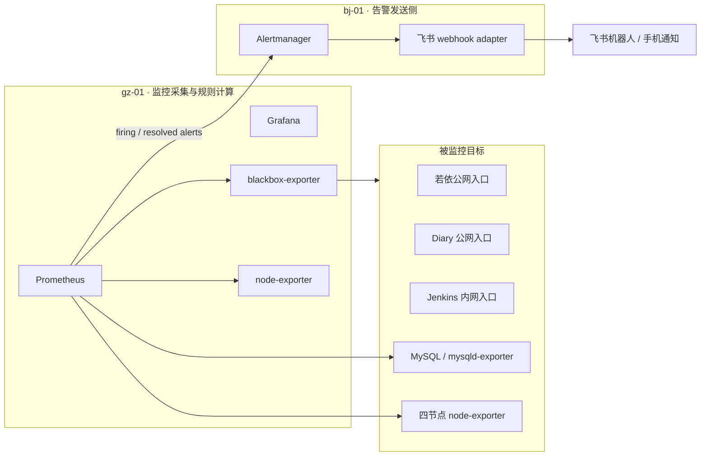

# V1.5 告警系统设计草案

## 文档说明

本文件是 V1.5 告警系统的设计草案，用于讨论和确认后续实施方向，不代表当前线上状态。正式架构状态只有在 Jenkins / Ansible 部署验证通过后，才能沉淀到 `Docs/architecture/`。

V1.5 的目标是在现有 Prometheus + Grafana 可观测能力基础上，补齐“服务异常时主动通知到手机”的告警闭环：Prometheus 负责采集和规则计算，Alertmanager 负责告警分组、去重、静默、抑制和路由，飞书负责手机端通知。

---

## 1. 设计目标

当前 V1.4 已经具备基础监控能力：`gz-01` 运行 Prometheus 和 Grafana，能够查看节点、MySQL 与业务相关指标。但现状仍以“人主动打开 Grafana 查看”为主，缺少服务宕机、数据库复制异常、磁盘即将满等场景下的主动通知能力。

V1.5 希望达到以下目标：

- 建立从指标采集、规则判断、告警聚合到手机通知的完整链路。
- 对齐生产环境思路，优先监控入口可用性、核心依赖、基础设施和监控系统自身，而不是对每个容器机械铺满告警。
- 当节点、业务入口、MySQL 主从复制、磁盘容量等关键风险出现时，通过飞书机器人及时通知手机端。
- 告警系统本身由 Ansible 管理，继续沿用 V1.4 的 bj-01 中控节点和 Jenkins 自动部署链路。
- 为后续企业微信、Alertmanager 高可用、外部探活、Redis 深度指标和多地域拨测预留演进空间。

---

## 2. 生产对齐原则

V1.5 不以“每个服务、每个容器都配置一组告警”为目标。真实生产环境更关注用户是否受影响、核心依赖是否退化、容量风险是否会扩大，以及监控链路自身是否可靠。

本次告警体系按四层设计：

| 层级 | 关注点 | V1.5 处理方式 |
|------|--------|---------------|
| 入口可用性 | 用户是否能访问核心服务 | 通过 blackbox-exporter 探测若依、Diary、Jenkins、Grafana、Prometheus、Alertmanager |
| 核心依赖 | 数据库复制、主库可用性、关键 exporter | 通过 mysqld-exporter 和 Prometheus alert rules 检测 MySQL 状态 |
| 基础设施 | 节点、磁盘、inode、CPU、内存 | 通过 node-exporter 指标设置基础设施告警 |
| 监控自身 | Prometheus、Alertmanager、blackbox-exporter、告警通知链路 | 通过自监控规则和验收演练确认链路有效 |

因此，V1.5 不做逐容器全量告警，不引入复杂值班排班，也不一次性覆盖 Redis 深度指标。Redis、容器级指标、外部探活和多渠道通知放入后续版本。

---

## 3. 方案范围

### 3.1 新增组件

| 组件 | 部署节点 | 作用 | 管理方式 |
|------|----------|------|----------|
| Alertmanager | bj-01 | 告警分组、去重、恢复通知、静默、抑制、路由 | 新增 Ansible role |
| 飞书 webhook adapter | bj-01 | 将 Alertmanager webhook 转换为飞书机器人消息 | 与 Alertmanager 同节点部署 |
| blackbox-exporter | gz-01 | 从监控节点视角探测 HTTP / TCP 目标可用性 | 纳入 `monitor-stack` role |
| Prometheus alert rules | gz-01 | 定义节点、MySQL、入口和监控自身告警规则 | 纳入 `monitor-stack` role |

### 3.2 计划新增或调整的 Ansible 范围

- 新增 `roles/alertmanager/`，用于部署 Alertmanager 和飞书 webhook adapter。
- 更新 `roles/monitor-stack/`，增加 blackbox-exporter、Prometheus alertmanager 配置和规则文件渲染。
- 更新 `inventory/group_vars/all.yml`，新增非敏感告警变量，例如端口、探测目标、规则阈值。
- 更新 `vault/secrets.yml`，新增飞书 webhook token，真实值必须使用 ansible-vault 加密保存。
- 更新 `playbooks/setup_monitor.yml` 或 `playbooks/site.yml` 的 role 编排，确保所有变更仍由 bj-01 统一下发。

### 3.3 不纳入 V1.5 的内容

- 企业微信通知渠道。
- Alertmanager 高可用集群。
- 多地域外部拨测或第三方云拨测。
- Redis exporter 深度指标。
- cAdvisor / Docker daemon metrics 等容器级全量监控。
- 值班排班、升级策略、电话告警等 on-call 体系。

---

## 4. 目标架构

V1.5 的告警链路如下：

```text
node-exporter / mysqld-exporter / blackbox-exporter
        ↓
Prometheus（gz-01）
        ↓ alert rules
Alertmanager（bj-01）
        ↓ webhook
飞书 webhook adapter（bj-01）
        ↓
飞书机器人
        ↓
手机通知
```

部署分工：

- `gz-01` 继续作为监控采集和规则计算节点，运行 Prometheus、Grafana、node-exporter、blackbox-exporter。
- `bj-01` 作为中控和运维节点，新增 Alertmanager 与飞书 webhook adapter。
- Prometheus 通过 Tailscale 网络访问 `bj-01` 的 Alertmanager。
- Alertmanager UI / API 仅绑定 Tailscale 访问地址，不暴露公网入口。
- 所有配置由 `bj-01:/opt/docker-infra` 中的 Ansible role 渲染并下发，不在各节点手工维护。



---

## 5. 告警流程说明

Prometheus 告警流程分为两段：Prometheus 负责判断“是否触发告警”，Alertmanager 负责处理“告警如何通知”。

1. exporter 暴露指标，例如 node-exporter 暴露 CPU、内存、磁盘指标，mysqld-exporter 暴露 MySQL 主从复制指标，blackbox-exporter 暴露 HTTP 探测结果。
2. Prometheus 定时采集指标，并按 `prometheus/rules/*.yml` 中的 alert rules 计算告警表达式。
3. 当某条规则满足条件并持续超过 `for` 时间后，告警从 `pending` 进入 `firing`。
4. Prometheus 将 firing 告警发送给 bj-01 上的 Alertmanager。
5. Alertmanager 对告警进行分组、去重、抑制、静默和重复提醒控制。
6. Alertmanager 将需要通知的告警发送给飞书 webhook adapter。
7. 飞书 webhook adapter 将告警转换为飞书机器人消息，推送到手机。
8. 故障恢复后，Prometheus 发送 resolved 状态，Alertmanager 继续通知飞书，形成闭环。

---

## 6. 告警规则设计

### 6.1 规则文件拆分

Prometheus 规则文件按领域拆分，避免所有规则堆在一个大文件中：

```text
prometheus/rules/
├── node.yml
├── mysql.yml
├── blackbox.yml
└── monitoring.yml
```

### 6.2 节点与基础设施告警

| 告警项 | 建议等级 | 说明 |
|--------|----------|------|
| 节点不可达 | critical | 任一节点 node-exporter 长时间不可采集 |
| node-exporter 不可用 | warning / critical | exporter 异常，需结合节点是否整体不可达判断 |
| 根分区磁盘空间不足 | critical | 防止 MySQL、Prometheus、日志或业务写入失败 |
| inode 即将耗尽 | warning | 避免大量小文件导致写入失败 |
| 内存持续不足 | warning | 提前发现内存压力 |
| CPU 长时间高负载 | warning | 用于容量或异常负载预警 |

### 6.3 MySQL 告警

| 告警项 | 建议等级 | 说明 |
|--------|----------|------|
| MySQL Master 不可采集 | critical | `gz-03` 主库不可达或 mysqld-exporter 异常 |
| MySQL Slave 复制中断 | critical | 从库 IO / SQL 线程异常 |
| MySQL Slave 复制延迟过高 | warning | 复制延迟超过阈值，存在 RPO 风险 |
| mysqld-exporter 不可用 | warning | MySQL 指标不可观测，需要排查 exporter 或网络 |

### 6.4 blackbox 入口探测告警

| 探测目标 | 建议等级 | 说明 |
|----------|----------|------|
| 若依公网入口 | critical | 核心业务展示入口，用户不可访问时必须通知 |
| Diary 公网入口 | warning | 个人业务服务，不作为半夜强唤醒级别 |
| Jenkins 内网入口 | warning | 运维入口异常，通常不直接影响业务访问 |
| Grafana 内网入口 | warning | 监控可视化异常，但 Prometheus 可能仍在工作 |
| Prometheus 内网入口 | critical | 监控采集与规则计算核心 |
| Alertmanager 内网入口 | critical | 告警发送核心 |

### 6.5 监控系统自身告警

| 告警项 | 建议等级 | 说明 |
|--------|----------|------|
| Prometheus target down | warning / critical | 按目标类型区分严重级别 |
| Alertmanager 不可达 | critical | Prometheus 无法投递告警 |
| blackbox-exporter 不可达 | warning | 入口探测能力失效 |
| Prometheus 配置或规则加载失败 | critical | 告警规则可能未生效 |
| Prometheus TSDB 磁盘空间不足 | critical | 监控数据和规则计算可能受影响 |

---

## 7. Alertmanager 策略

### 7.1 通知渠道

V1.5 只落地飞书通知，不同时部署企业微信。

选择飞书的原因：

- 机器人 webhook 配置简单，适合个人面试项目快速形成闭环。
- 手机推送体验稳定。
- 可通过自定义关键词做基础安全控制，满足 V1.5 的轻量告警闭环要求。
- 与 Alertmanager webhook adapter 集成成本低。

企业微信作为后续增强，不在 V1.5 实施。后续可将企业微信配置为备用 receiver，或仅对 `critical` 告警启用双通道通知。

### 7.2 敏感信息管理

飞书 webhook token 必须进入 `vault/secrets.yml`，由 ansible-vault 加密管理。草案、runbook、architecture 和 Git 普通变量文件不得记录真实 token。

建议变量名：

```yaml
alerting_feishu_webhook_url: "<由 ansible-vault 管理的完整飞书机器人 webhook URL>"
```

草案阶段曾建议选用 `bougou/alertmanager-webhook-adapter`，但实际落地时发现它生成的消息结构与当前飞书自定义机器人 API 不兼容。V1.5 最终改用 `feiyu563/prometheus-alert`，Alertmanager webhook 使用 `/prometheusalert?type=fs&tpl=prometheus-fs&fsurl=...`，并将 `prometheus-fs` 模板中的 `项目：docker-infra` 关键词兜底纳入 Ansible 持久化。

飞书机器人安全设置仍采用“自定义关键词”，关键词包含 `docker-infra`；如后续必须启用飞书签名校验，可在 V1.6 更换 adapter 或自维护极简 adapter。

### 7.3 分组与重复提醒

建议初始策略：

```yaml
group_wait: 30s
group_interval: 5m
repeat_interval: 4h
```

含义：

- 首次告警等待 30 秒，便于同一批告警聚合。
- 同一告警组有新告警时，间隔 5 分钟后再通知。
- 同一告警持续未恢复时，每 4 小时重复提醒一次。

### 7.4 恢复通知

V1.5 开启恢复通知。飞书消息需要区分：

- `FIRING`：故障正在发生。
- `RESOLVED`：故障已恢复。

恢复通知用于确认告警闭环完整，也便于故障演练和面试展示。

### 7.5 基础抑制

V1.5 配置基础抑制规则：

- 当某节点触发 `NodeDown` 时，抑制同一节点上的 CPU、内存、磁盘、inode、exporter down 等派生告警。

这样可以避免节点整体宕机时，手机同时收到大量由同一根因引发的告警。

### 7.6 Alertmanager UI

Alertmanager UI 是 Alertmanager 自带的 Web 界面，用于查看当前告警、确认分组结果、创建 silence、观察抑制效果和排查告警路由。

V1.5 中 Alertmanager UI 只允许通过 Tailscale 内网访问，不通过 Nginx 暴露公网入口。维护期间可以通过 UI 创建临时 silence，避免计划内操作触发通知轰炸。

---

## 8. 影响范围

### 8.1 节点影响

| 节点 | 影响 |
|------|------|
| gz-01 | 新增 blackbox-exporter；Prometheus 增加 alertmanager 配置、blackbox scrape config 和 alert rules |
| bj-01 | 新增 Alertmanager 和飞书 webhook adapter；继续作为 Ansible/Jenkins 中控节点下发全部变更 |
| gz-02 | 不新增服务，仅作为 node-exporter、mysqld-exporter、业务入口和 MySQL 从库监控目标 |
| gz-03 | 不新增服务，仅作为业务主节点、MySQL Master、Redis Master 和 exporter 监控目标 |

### 8.2 网络与端口影响

- Prometheus 需要通过 Tailscale 访问 bj-01 的 Alertmanager API。
- Alertmanager UI / API 建议仅监听或仅暴露在 `100.118.69.78:9093`。
- 飞书 webhook adapter 建议仅在 Docker 内网暴露给 Alertmanager，不对宿主机或公网开放。
- blackbox-exporter 可由 Prometheus 在 gz-01 本机或 Docker 网络内访问，不需要公网暴露。
- 飞书通知需要 bj-01 能访问飞书机器人 webhook 所在公网地址。

### 8.3 CI/CD 与运维习惯影响

- 所有告警配置、规则、模板和容器编排均由 Git + Ansible 管理。
- 变更通过 bj-01 Jenkins Pipeline 执行 `ansible-playbook` 后下发。
- 不在远程节点手工修改 Alertmanager、Prometheus 或 blackbox 配置。
- 日常维护时，如果需要屏蔽计划内告警，优先使用 Alertmanager UI 创建 silence，而不是临时删除规则。

---

## 9. 验收标准

V1.5 只有在以下验收项全部通过后，才能沉淀为正式 `architecture/v1.5.md`：

### 9.1 部署验收

- Jenkins / Ansible 部署完成，目标节点无 failed。
- `gz-01` 上 Prometheus、Grafana、blackbox-exporter 正常运行。
- `bj-01` 上 Alertmanager、飞书 webhook adapter 正常运行。
- Prometheus `/targets` 中新增的 blackbox、Alertmanager 和相关 exporter target 状态符合预期。
- Prometheus 规则文件加载成功，无 rule evaluation 错误。

### 9.2 通知链路验收

- 触发测试告警后，飞书能收到 `FIRING` 通知。
- 故障恢复后，飞书能收到 `RESOLVED` 通知。
- 飞书消息中至少包含告警状态、告警名称、严重等级、实例或节点、摘要和开始时间。
- 飞书 webhook token 未出现在普通配置文件和文档中。

### 9.3 故障演练验收

后续 runbook 必须包含以下演练：

1. 停止一个 node-exporter，验证 exporter down 告警和恢复通知。
2. 配置临时不可达 URL，验证 blackbox 入口探测告警和恢复通知。
3. 停止 MySQL 从库复制线程，验证 MySQL 复制异常告警和恢复通知。
4. 触发测试告警，验证 Prometheus → Alertmanager → 飞书 webhook adapter → 飞书手机通知链路。
5. 在 Alertmanager UI 创建 silence，验证维护期静默生效。
6. 触发节点不可达或模拟节点级告警，验证基础抑制规则能减少派生告警噪音。

---

## 10. 风险与后续演进

### 10.1 已知风险

- Prometheus 仍是单实例部署在 `gz-01`。如果 `gz-01` 整机宕机，Prometheus 自身无法继续发出告警。
- Alertmanager V1.5 仅单实例部署在 `bj-01`，暂不提供 Alertmanager 集群高可用。
- 飞书通知依赖公网 webhook，如果 bj-01 出公网异常，通知可能失败。
- blackbox-exporter 部署在 `gz-01`，只能代表监控节点视角，不能代表多地域用户真实访问体验。
- Redis 暂不接入 Redis exporter 深度指标，V1.5 只能通过后续可选 TCP 探测或业务入口侧间接发现部分问题。

### 10.2 后续演进方向

- V1.6 引入 dead man's switch 或外部探活，解决 Prometheus 自身宕机无人通知的问题。
- 增加企业微信 receiver，作为备用通知渠道或 critical 双通道通知。
- 引入 Redis exporter，补齐 Redis Master、replica、Sentinel quorum 和 failover 告警。
- 引入 Alertmanager HA，降低告警发送侧单点风险。
- 引入多地域 blackbox 探测或云拨测，覆盖真实用户访问路径。
- 视需要引入 cAdvisor 或 Docker daemon metrics，但不作为当前优先级。

---

## 11. 待确认问题

以下问题不阻塞草案方向，但需要在进入 runbook 和实施前确认：

- 飞书 webhook adapter 采用哪个现成开源镜像，或是否自维护一个极简 adapter。
- 若依、Diary、Jenkins、Grafana、Prometheus、Alertmanager 的最终 blackbox 探测 URL 和期望状态码。
- CPU、内存、磁盘、inode、MySQL 复制延迟等告警阈值的具体数值。
- Alertmanager 与飞书 webhook adapter 的最终端口、容器名和数据目录命名。
- 是否需要在 Grafana dashboard 中补充 Alertmanager / blackbox 相关面板，作为 V1.5 附加项。
