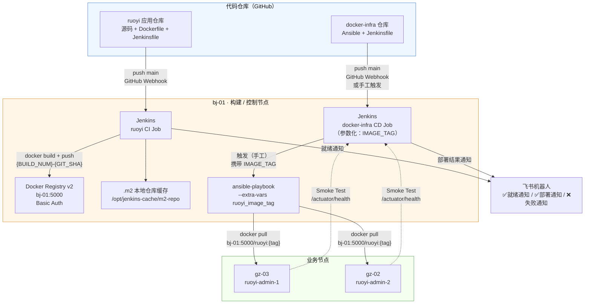
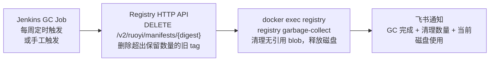

# V1.6 应用自动化交付流水线设计草案

## 文档说明

本文件是 V1.6 应用自动化交付流水线的设计草案，用于讨论和确认后续实施方向，不代表当前线上状态。正式架构状态只有在 Jenkins / Ansible 部署验证通过后，才能沉淀到 `Docs/architecture/`。

V1.6 的目标是在既有 Ansible + Jenkins 基础设施交付体系上，补齐应用镜像的构建、版本化存储、分发与部署验证能力，将当前「基础设施配置下发流水线」升级为「代码提交到服务上线的完整应用交付流水线」。

---

## 1. 设计目标

### 1.1 当前 V1.5 的交付断裂点

V1.5 已建立「git push → Jenkins → Ansible → 节点」的基础设施配置交付链路，但应用镜像的交付存在明显断裂：

- `ruoyi-jenkins-docker:latest` 镜像仅在 bj-01 本机构建，**没有中央存储**，gz-02/gz-03 上的镜像是第 8 次构建后手工 `docker save/scp/docker load` 传过去的
- 镜像 tag 固定为 `latest`，**无版本追溯**：出问题时不知道当前跑的是哪次构建的代码，无法快速回滚到已知稳定版本
- 应用构建（ruoyi CI Job）与基础设施部署（docker-infra Job）**完全割裂**，两者之间靠手工协调
- Ansible 部署完成 ≠ 应用正常提供服务，**没有部署后验证**机制

### 1.2 V1.6 希望达到的目标

- 建立私有镜像仓库，镜像有中央存储、有版本记录、可按版本拉取
- 应用代码变更后，自动完成构建、推送镜像，并通过飞书通知运维「新版本已就绪」
- 运维人工确认后，通过参数化 CD Job 将指定版本部署到目标节点
- 部署完成后自动执行 Smoke Test，确认应用真正可提供服务，而不只是容器在运行
- 历史版本镜像可随时选择部署，实现快速回滚
- 私有 Registry 定期 GC，防止镜像堆积导致 bj-01 磁盘打满
- 所有新增基础设施（Registry、认证配置）继续由 Ansible 管理，纳入 Git 版本控制

---

## 2. 生产对齐原则

### 2.1 Continuous Delivery，而非 Continuous Deployment

V1.6 采用 **CI/CD 解耦**设计：CI Pipeline 负责构建和推送镜像，CD Pipeline 由人工触发部署。

这一决策的理由：Continuous Deployment（CI 完成即自动部署到生产）适合有完整自动化测试覆盖、有灰度或蓝绿发布保护的成熟团队。在当前没有 staging 环境、没有完整集成测试覆盖的现状下，CI 不自动触发 CD，由运维确认后手工触发，是更接近中小型公司实际生产实践的做法，也规避了构建成功但代码有业务问题时自动上线的风险。

### 2.2 职责分离

应用仓库（ruoyi）的 CI Pipeline 只负责「把可部署的制品（镜像）推送到仓库」，docker-infra 仓库的 CD Pipeline 只负责「把制品部署到目标环境」。两个 Pipeline 可以独立迭代：基础设施配置变更（告警规则、compose 模板等）不需要重新构建镜像即可触发部署。

### 2.3 镜像版本可追溯

任何时刻都能通过 image tag 定位到对应的代码状态，并能通过 Registry 找到历史版本镜像重新部署。

---

## 3. 方案范围

### 3.1 新增组件

| 组件 | 部署节点 | 作用 | 管理方式 |
|------|----------|------|----------|
| Docker Registry v2 | bj-01 | 私有镜像仓库，存储 ruoyi 应用历史版本镜像 | 新增 Ansible role |
| Registry GC Job | bj-01（Jenkins） | 定期清理旧版本镜像，防止磁盘打满 | Jenkins Pipeline + cron 触发器 |

### 3.2 计划新增或调整的 Ansible 范围

- 新增 `roles/registry/`：部署 Docker Registry v2 容器，配置 Basic Auth 认证、数据目录挂载、重启策略；认证密码纳入 `vault/secrets.yml` 管理
- 更新 `roles/ruoyi/`：`docker-compose.yml.j2` 中镜像地址改为从私有 Registry 拉取，使用参数化 `ruoyi_image_tag` 变量；新增 `docker pull` task，确保 Ansible 在 compose up 前主动拉取新版本镜像
- 更新 `inventory/group_vars/all.yml`：新增 Registry 地址、镜像名称、默认 tag 等非敏感变量
- 更新 `vault/secrets.yml`：新增 Registry Basic Auth 用户名和密码，真实值必须使用 ansible-vault 加密
- 新增 `playbooks/setup_registry.yml`：单独 Registry 初始化 playbook，供首次部署独立执行

### 3.3 计划调整的 Jenkins Pipeline

- **ruoyi 应用仓库 Jenkinsfile**（`/opt/docker/backend/ruoyi/Jenkinsfile`，不在本仓库，但草案描述其变更）：新增 Docker Build、Push Registry、飞书「就绪通知」阶段；新增分支策略，只有 `main` 分支触发完整 CI
- **docker-infra Jenkinsfile**（本仓库）：新增 `IMAGE_TAG` 参数（默认 `latest`）；部署阶段携带 `IMAGE_TAG` extra-var 传递给 Ansible；新增 `Smoke Test` stage；新增 `post` 块发送飞书部署结果通知

### 3.4 不纳入 V1.6 的内容

- Registry HTTPS / TLS（Tailscale 内网 + Basic Auth 双层保护，V1.6 阶段足够；HTTPS 配置留 V1.7 补充）
- Maven 单元测试集成（需先了解若依测试用例健康度，不阻塞 CD 核心链路）
- 蓝绿部署 / 滚动部署（当前节点数不足以支撑无停机切换，V2.x 引入 k8s 时再考虑）
- 镜像安全扫描（Trivy 等），留后续版本
- Harbor（功能过剩，维护成本超出当前规模收益）
- Diary 镜像版本变量化（第三方镜像，不涉及自构建，可作为轻量附带项，但不是 V1.6 主线）

---

## 4. 目标架构

### 4.1 完整交付链路

```
应用代码变更触发路径：
  开发者 push to ruoyi GitHub main 分支
      → GitHub Webhook → bj-01 Jenkins ruoyi CI Job
      → Stage: Maven 构建 + 打包（复用 bj-01 本机 .m2 缓存目录）
      → Stage: Docker Build，tag: {BUILD_NUMBER}-{GIT_SHORT_SHA}，同时打 latest
      → Stage: Docker Push to bj-01:5000/ruoyi:{tag}
      → Post: 飞书通知「✅ 新版本就绪：ruoyi:{tag}，可手工触发部署」

运维人工触发部署路径：
  运维确认飞书通知，前往 Jenkins 手动触发 docker-infra CD Job
      → 填写 IMAGE_TAG 参数（例如：42-a3f8c1d）
      → Stage: Ansible Check（--extra-vars "ruoyi_image_tag={tag}"，dry-run）
      → Stage: Deploy（--extra-vars "ruoyi_image_tag={tag}"）
          → Ansible SSH 到 gz-02/gz-03
          → docker pull bj-01:5000/ruoyi:{tag}
          → docker compose up -d（使用新镜像）
      → Stage: Smoke Test（等待 Spring Boot 初始化，验证 /actuator/health）
      → Post: 飞书通知「✅ 部署完成：ruoyi:{tag} 已上线 / ❌ 部署失败，请查看 Jenkins」

基础设施配置变更路径（无镜像变更时）：
  运维 push to docker-infra GitHub
      → GitHub Webhook → Jenkins docker-infra CD Job
      → IMAGE_TAG 使用默认值 latest
      → 正常走 Ansible Check → Deploy → Smoke Test → 通知
```

### 4.2 架构拓扑图



### 4.3 Registry GC 链路



---

## 5. 关键技术决策

| 决策点 | 选型 | 理由 |
|--------|------|------|
| 私有镜像仓库 | Docker Registry v2（bj-01 自托管） | 多云环境不绑定任何云厂商；Registry 与 Jenkins 同节点，push 不走网络，效率最高；gz-02/gz-03 通过 Tailscale 内网 pull，不走公网；轻量（镜像 ~30MB），bj-01 资源不构成瓶颈；Harbor 对当前规模是 overkill，RBAC/镜像扫描/复制策略均用不到 |
| Registry 认证 | Basic Auth（htpasswd） | Registry 仅在 Tailscale 内网暴露，但纵深防御原则要求加一层认证；实现极简（挂载 htpasswd 文件），密码走 ansible-vault 管理，与全局 vault 体系一致 |
| 镜像 Tag 策略 | `{BUILD_NUMBER}-{GIT_SHORT_SHA}` | BUILD_NUMBER 单调递增，可直接判断版本新旧；GIT_SHORT_SHA 能追溯到具体代码 commit，出问题时可直接 `git checkout` 还原；同时打 `latest` 方便兼容现有配置作为默认值 |
| CI/CD 解耦方式 | CI 不触发 CD，人工触发 | Continuous Delivery 而非 Continuous Deployment；当前无 staging 环境、无完整自动化测试，人工门控保障生产安全；运维确认飞书就绪通知后手工触发 |
| 构建分支策略 | 只有 `main` 分支触发完整 CI + Push | feature 分支只做编译验证，不推送镜像；与 docker-infra Jenkinsfile 现有 `when { branch 'main' }` 逻辑一致 |
| Smoke Test 实现 | 调用若依 `/actuator/health` 端点 | Ansible 执行完成只能保证容器重启，不能保证 Spring Boot 初始化成功；数据库连接失败、JVM OOM 等问题容器不会退出，只有 Spring Boot Actuator 健康端点能真实反映应用状态 |
| Maven 构建缓存 | bj-01 宿主机固定目录挂载 | 若依是 Maven 多模块项目，首次下载依赖耗时长；通过 `MAVEN_OPTS=-Dmaven.repo.local=/opt/jenkins-cache/m2-repo` 复用本地仓库，大幅缩短后续构建时间 |
| Registry GC 策略 | 按数量保留最近 10 个 tag | 按时间保留不稳定（构建频率不均匀）；保留 10 个足够回滚任意近期版本；GC 分两步：先通过 Registry API 软删除 manifest，再 `registry garbage-collect` 真正释放 blob 数据 |
| 飞书通知分层 | CI 就绪通知 + CD 部署结果通知 | 两类通知语义不同：「新版本已就绪」是运维的行动触发信号；「部署完成/失败」是结果确认；分开通知能清晰区分构建状态和部署状态 |

---

## 6. Pipeline 详细设计

### 6.1 ruoyi CI Pipeline（应用仓库 Jenkinsfile）

```
Stage: Checkout
  - 拉取 ruoyi 应用仓库最新代码

Stage: Maven Build（仅 main 分支执行完整构建）
  - 使用 bj-01 本机 JDK + Maven
  - MAVEN_OPTS 指向 /opt/jenkins-cache/m2-repo 复用依赖缓存
  - mvn clean package -DskipTests（V1.6 先跳过测试，V1.7 再集成）

Stage: Docker Build（仅 main 分支）
  - 构建镜像：ruoyi:{BUILD_NUMBER}-{GIT_SHORT_SHA}
  - 同时打 tag：ruoyi:latest

Stage: Docker Push（仅 main 分支）
  - 使用 Registry 认证凭据（Jenkins Credentials 中存储）
  - push bj-01:5000/ruoyi:{BUILD_NUMBER}-{GIT_SHORT_SHA}
  - push bj-01:5000/ruoyi:latest

Post:
  - success: 飞书通知「✅ 新版本就绪：ruoyi:{tag}，可手工触发部署，构建耗时 Xs」
  - failure: 飞书通知「❌ 构建失败：ruoyi Job #{BUILD_NUMBER}，请查看 Jenkins」
```

### 6.2 docker-infra CD Pipeline（本仓库 Jenkinsfile）

```
参数：
  IMAGE_TAG（string，默认值：latest，说明：ruoyi 镜像 tag，例如 42-a3f8c1d）

Stage: Checkout
  - 拉取 docker-infra 仓库最新代码

Stage: Verify Ansible（不变）
  - ansible --version / ansible-playbook --version

Stage: Ansible Check
  - ansible-playbook playbooks/site.yml
    --extra-vars "ruoyi_image_tag=${IMAGE_TAG}"
    --check --diff

Stage: Deploy（仅 main 分支）
  - ansible-playbook playbooks/site.yml
    --extra-vars "ruoyi_image_tag=${IMAGE_TAG}"

Stage: Smoke Test（仅 main 分支，Deploy 之后）
  - 等待 30s，留给 Spring Boot 完成初始化
  - 对 gz-03 和 gz-02 分别调用若依健康检查端点
  - 任一节点返回非 200 或 status 非 UP，构建标记为 FAILURE

Post:
  - success: 飞书通知「✅ 部署完成：ruoyi:{IMAGE_TAG} 已上线，Smoke Test 通过」
  - failure: 飞书通知「❌ 部署失败：Job #{BUILD_NUMBER}，版本 {IMAGE_TAG}，请查看 Jenkins」
```

### 6.3 Registry GC Pipeline（新增独立 Job）

```
触发：每周定时（cron）+ 支持手工触发

Stage: Query Tags
  - 调用 Registry API GET /v2/ruoyi/tags/list，获取全部 tag 列表
  - 按 BUILD_NUMBER 排序，确定保留最新的 10 个 tag，其余标记为待删除

Stage: Delete Old Manifests
  - 对每个待删除 tag，先获取 manifest digest
  - 调用 Registry API DELETE /v2/ruoyi/manifests/{digest} 软删除

Stage: Garbage Collect
  - docker exec registry registry garbage-collect /etc/docker/registry/config.yml
  - 真正清理无引用的 blob layer 数据，释放磁盘空间

Post:
  - success: 飞书通知「✅ Registry GC 完成：清理 N 个旧 tag，当前磁盘使用 XXG」
```

---

## 7. Ansible 变更详情

### 7.1 新增 `roles/registry/`

```
roles/registry/
├── tasks/main.yml          ← 部署 registry 容器，渲染配置，确保 htpasswd 文件存在
├── templates/
│   ├── docker-compose.yml.j2   ← registry 容器编排，挂载数据目录和 auth 目录
│   └── config.yml.j2           ← registry 配置（认证、存储路径）
└── handlers/main.yml       ← restart registry
```

Registry 容器数据目录：`/opt/docker/registry/data/`  
认证文件目录：`/opt/docker/registry/auth/htpasswd`（由 Ansible 渲染，内容来自 vault）

### 7.2 更新 `roles/ruoyi/templates/docker-compose.yml.j2`

```yaml
# 变更前
image: ruoyi-jenkins-docker:latest

# 变更后
image: {{ registry_host }}/{{ ruoyi_image_name }}:{{ ruoyi_image_tag }}
```

### 7.3 更新 `roles/ruoyi/tasks/main.yml`

在现有 task 前新增：

```yaml
- name: Pull ruoyi image from registry
  community.docker.docker_image:
    name: "{{ registry_host }}/{{ ruoyi_image_name }}:{{ ruoyi_image_tag }}"
    source: pull
    force_source: true
```

### 7.4 更新 `inventory/group_vars/all.yml`

新增以下变量：

```yaml
# ── 私有镜像仓库 ──────────────────────────────────────────────────────────────
registry_host: "100.118.69.78:5000"
registry_port: 5000
registry_image_tag: "registry:2"

# ── 应用镜像版本 ──────────────────────────────────────────────────────────────
ruoyi_image_name: "ruoyi"
ruoyi_image_tag: "latest"          # 默认值，Jenkins CD Job 传参时覆盖
```

### 7.5 更新 `vault/secrets.yml`（加密，不记录真实值）

新增：

```yaml
registry_auth_username: "<ansible-vault 管理>"
registry_auth_password: "<ansible-vault 管理>"
```

---

## 8. 影响范围

### 8.1 节点影响

| 节点 | 影响 |
|------|------|
| bj-01 | 新增 Docker Registry v2 容器；Jenkins 新增 GC Job；`.m2` 缓存目录新增于宿主机；ruoyi CI Jenkinsfile 更新 |
| gz-02 | ruoyi 镜像来源从本机已有镜像改为从 bj-01:5000 pull；需要在 Docker daemon 配置中信任 insecure registry（HTTP）|
| gz-03 | 同 gz-02 |
| gz-01 | 不新增服务；可考虑在 Nginx 为 Registry 添加内网代理入口（不暴露公网，仅 Tailscale 访问，留 V1.7）|

### 8.2 网络与端口

| 新增链路 | 端口 | 说明 |
|----------|------|------|
| bj-01 本机 → Registry | 100.118.69.78:5000 | Jenkins push 镜像，走本机回环或 Tailscale 地址 |
| gz-02/gz-03 → bj-01 Registry | 100.118.69.78:5000 | Ansible 触发节点 pull 镜像，走 Tailscale 内网（~35ms）|
| Jenkins Smoke Test → gz-02/gz-03 | 100.79.132.125:8080 / 100.92.5.116:8080 | 健康检查，走 Tailscale 内网 |

Registry 仅监听 Tailscale 地址，不暴露公网端口。gz-02/gz-03 的 Docker daemon 需添加 `insecure-registries: ["100.118.69.78:5000"]`（V1.6 阶段 HTTP，V1.7 升级 HTTPS 后去掉）。

### 8.3 运维习惯变化

- 不再手工 `docker save/scp/docker load` 传镜像
- 不再使用 `ruoyi-jenkins-docker:latest` 本机镜像名，统一改为 `bj-01:5000/ruoyi:{tag}`
- 部署前需确认飞书就绪通知中的 tag，填入 Jenkins CD Job 参数
- 查看镜像历史版本：通过 `curl http://100.118.69.78:5000/v2/ruoyi/tags/list` 或 Registry API

---

## 9. 验收标准

### 9.1 Registry 部署验收

- `roles/registry` Ansible 重复执行 `changed=0 failed=0`
- `curl -u {user}:{pass} http://100.118.69.78:5000/v2/` 返回 `{}`
- 无认证请求返回 401
- Registry 容器重启后数据目录中历史镜像不丢失

### 9.2 CI Pipeline 验收

- ruoyi 应用仓库 push to main → Jenkins Job 自动触发
- 构建完成后 `curl http://100.118.69.78:5000/v2/ruoyi/tags/list` 能看到新 tag
- 飞书群收到「新版本就绪」通知，通知中包含正确的 tag（含 Build Number 和 Git SHA）
- feature 分支 push 不触发 Docker Build 和 Push
- 构建失败时飞书收到失败通知

### 9.3 CD Pipeline 验收

- docker-infra Job 以 `IMAGE_TAG=xxx` 参数触发
- Ansible Check 阶段输出确认 `ruoyi_image_tag` 为传入值
- Deploy 阶段 gz-02/gz-03 上容器使用新镜像（`docker inspect` 验证 image digest）
- Smoke Test 阶段调用 `/actuator/health` 返回 `{"status":"UP"}` 且 Jenkins stage 绿色
- 飞书群收到「部署完成」通知，通知中包含正确的 tag

### 9.4 回滚验收

- docker-infra Job 以旧版本 `IMAGE_TAG` 参数触发
- 节点上容器成功回到旧版本镜像（`docker inspect` 验证 image digest）
- Smoke Test 通过

### 9.5 GC Job 验收

- 手工触发 GC Job，Registry 中保留最新 10 个 tag，多余 tag 被删除
- `docker exec registry registry garbage-collect` 执行后磁盘占用减少
- 飞书收到 GC 完成通知

---

## 10. 风险与后续演进

### 10.1 已知风险

- Registry 单实例部署在 bj-01，Registry 不可用时 CI Push 和节点 Pull 均失败；但 Registry 本身是轻量无状态服务，重启即恢复，影响可控
- gz-02/gz-03 拉取镜像需经过 bj-01 → gz-0x 的跨城链路（~35ms），镜像较大（Java 应用镜像通常 300MB+）时部署耗时较长；可通过 Dockerfile 多阶段构建优化最终镜像体积
- HTTP Registry（无 TLS）在 Tailscale 内网传输，虽然 WireGuard 隧道本身加密，但属于非标准配置，Docker 需配置 `insecure-registries`
- Maven 缓存目录在 bj-01 宿主机增长；若依依赖较多时 `.m2` 可能占用数 GB，需纳入磁盘监控视野

### 10.2 后续演进方向

- **V1.7**：Registry 升级 HTTPS（自签证书或 Let's Encrypt），去掉 `insecure-registries` 配置；集成 Maven 单元测试；为 Registry 添加 Nginx 内网代理入口（Grafana 同款模式）
- **V1.7+**：引入 Maven 单元测试阶段，CD 只有测试全部通过才能执行
- **后续**：Trivy 镜像安全扫描，在 Push 前检测镜像中的 CVE；若引入 k8s 可迁移到 Harbor 并启用 RBAC 和扫描

---

## 11. 已确认问题（实施前核查结果）

以下问题已于草案评审阶段通过线上环境直接核查确认，结果如下。

### 11.1 Maven 构建环境

**结论：Maven 在 Docker 多阶段构建容器内运行，不在 bj-01 裸机执行。**

Dockerfile 第一阶段使用 `FROM maven:3.8.6-eclipse-temurin-17 AS builder`，由 `RUN mvn clean package -Dmaven.test.skip=true` 完成构建，第二阶段从 builder 中复制 `ruoyi-admin.jar` 到 `eclipse-temurin:17-jre-alpine` 运行镜像。

**对 V1.6 的影响：** Maven 缓存挂载不能用宿主机目录挂载方式（`MAVEN_OPTS=-Dmaven.repo.local=...`），需改用 Docker BuildKit 的构建缓存挂载：

```dockerfile
RUN --mount=type=cache,target=/root/.m2 \
    mvn clean package -Dmaven.test.skip=true
```

BuildKit 缓存会持久化在 bj-01 的 Docker BuildKit 缓存目录中，后续构建自动复用，无需手工维护缓存目录。执行 `docker build` 时需确保开启 BuildKit（`DOCKER_BUILDKIT=1`）。

### 11.2 若依健康检查端点

**结论：`/actuator/health` 路径存在但被 Spring Security 拦截，不可直接用于 Smoke Test。**

`curl http://100.92.5.116:8080/actuator/health` 返回 HTTP 200，但响应体为：

```json
{"msg":"请求访问：/actuator/health，认证失败，无法访问系统资源","code":401}
```

这是若依 Spring Security 统一拦截了 Actuator 端点，返回自定义 401 消息体（HTTP 状态码仍为 200），导致无法通过检查响应体的方式判断服务健康。

**Smoke Test 备选方案：复用 V1.5 已有的 blackbox-exporter 探测结果。**

blackbox-exporter 已在探测若依入口，Prometheus 中有 `probe_success{service="ruoyi"}` 指标。Smoke Test 改为在 Jenkins 中调用 Prometheus Query API，查询该指标值是否为 `1`：

```bash
curl -s "http://100.117.7.75:9090/api/v1/query" \
  --data-urlencode 'query=min(probe_success{service="ruoyi"})' \
| python3 -c "
import sys, json
data = json.load(sys.stdin)
val = data['data']['result'][0]['value'][1]
assert val == '1', f'Smoke Test FAILED: probe_success={val}'
print('Smoke Test PASSED')
"
```

此方案完全复用现有监控基础设施，不需要对若依代码做任何改动，也不依赖直接访问业务节点端口。

### 11.3 bj-01 磁盘空间

**结论：剩余空间充裕，磁盘压力不构成约束。**

```
/dev/vda3  99G total  23G used  71G avail  (25% used)
```

71GB 剩余空间足以容纳 Registry 镜像数据（估算 10 个 tag × 实际增量层 ≈ 1–2GB）和 Docker BuildKit 构建缓存（首次全量缓存约 500MB–1GB）。Registry 数据目录、BuildKit 缓存目录均在同一挂载点下，无需单独规划分区。

### 11.4 gz-02/gz-03 Docker daemon 配置

**结论：两台节点均已有 `/etc/docker/daemon.json`，内容各不相同，Ansible 需合并写入而非全量覆盖。**

gz-02 现有内容：

```json
{
  "registry-mirrors": ["https://mirror.ccs.tencentyun.com"]
}
```

gz-03 现有内容：

```json
{
  "registry-mirrors": ["https://mirror.baidubce.com", "https://docker.m.daocloud.io"],
  "dns": ["223.5.5.5", "114.114.114.114", "8.8.8.8"]
}
```

V1.6 需在两台节点的现有配置基础上追加 `insecure-registries` 字段：

```json
"insecure-registries": ["100.118.69.78:5000"]
```

Ansible 实现方式：使用 `ansible.builtin.template` 渲染完整 `daemon.json`，模板中合并保留各节点原有的 `registry-mirrors` 和 `dns` 配置，再追加 `insecure-registries`。需在 `inventory/hosts.yml` 中为 gz-02/gz-03 各自记录现有 `registry_mirrors` 值作为主机变量，避免渲染时丢失。修改后需 `systemctl reload docker` 或 `systemctl restart docker` 使配置生效，Ansible handler 中添加此操作。

### 11.5 Registry GC 触发频率

**结论：每周一次，周日凌晨 2:00，cron 表达式 `0 2 * * 0`。**

理由：当前构建频率属于学习项目节奏（每周 0–20 次不等），保留最新 10 个 tag 可覆盖约 1–4 周的历史构建，每周 GC 一次即可将未使用 tag 稳定清理。`garbage-collect` 执行期间 Registry 进入只读模式（通常持续数秒），低峰期执行对 CI 无影响。GC Job 同时支持手工触发，方便在磁盘告警时按需执行。
