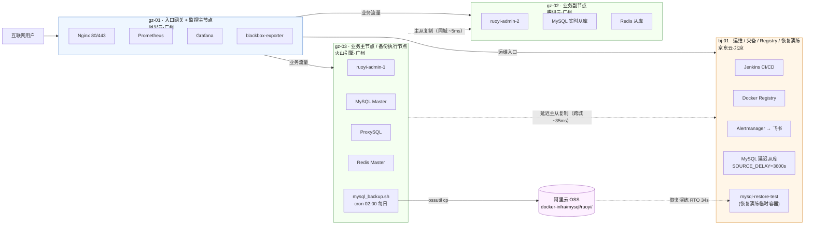

# docker-infra

> 一个跨四个云厂商、按版本演进的自建多云集群项目。从 V1.0 单机 Docker Compose 起步，逐步演进到当前的完整 IaC + CI/CD + 监控告警 + 备份恢复闭环；V1.7 备份恢复演练实测 **RTO 34 秒、最大 RPO 24 小时**。

集群运行在真实付费的跨多云节点上（阿里云 / 腾讯云 / 火山引擎 / 京东云），所有节点通过 **Tailscale WireGuard** 加密隧道走内网互联，不依赖公网端口暴露。当前对应 Git tag `arch-v1.7`。

---

## 当前架构（V1.7）

完整快照（每个节点详细服务清单、端口、网络延迟、决策原因）：[`Docs/architecture/v1.7.md`](Docs/architecture/v1.7.md)

---

## 技术栈

| 层 | 选型 | 落地形态 |
|---|---|---|
| 节点互联 | Tailscale（WireGuard） | 跨多云加密隧道，零公网端口暴露 |
| 配置即代码 | Ansible + ansible-vault | bj-01 为唯一控制节点；vault 加密敏感信息后入 Git；`playbooks/site.yml` 全量幂等 |
| CI / CD | Jenkins + Pipeline as Code | `Jenkinsfile` 在仓库内；GitHub webhook 触发 + 参数化手动；含 Smoke Test 与飞书通知 |
| 容器编排 | Docker + Docker Compose | 网络 `global_gateway`；K3s 计划在 phase-1 路线图 [`k3s-stateless`](Docs/scheme/phase-1-architecture-upgrade.md#k3s-stateless) 主题引入（仅承载无状态服务） |
| 私有镜像 | Docker Registry v2 | bj-01 自建，htpasswd Basic Auth，每周日 02:00 自动 GC（DELETE + 裸 GC 两段式） |
| 入口网关 | Nginx | TLS 终止、反向代理、按域名分流（业务 / 运维 / 监控） |
| 监控采集 | Prometheus + node-exporter + mysqld-exporter + blackbox-exporter | gz-01 |
| 监控展示 | Grafana | gz-01 |
| 告警 | Alertmanager + prometheus-alert → 飞书 | bj-01；双机器人分离告警通知与 CI/CD 通知 |
| 数据库 | MySQL 8.0 一主两从 + 半同步 + GTID | gz-03 主 · gz-02 实时从 · bj-01 延迟 3600s 从（提供误操作回档窗口） |
| 读写分离 | ProxySQL | gz-03 |
| 缓存 | Redis 主从 + Sentinel | gz-03 主 · gz-02 / bj-01 从 |
| 备份与恢复 | mysqldump + 阿里云 OSS + ossutil | gz-03 每日 02:00 备份 · bj-01 临时容器演练（端口 3307，演练后销毁） |

---

## 版本演进

每个版本聚焦一个主题，按 **proposal → Ansible 实施 → runbook → 部署验证 → architecture 快照 → retrospective** 完整闭环，发布时打 `arch-vX.Y` tag。

| 版本 | Tag | 主题 | 关键成果 |
|---|---|---|---|
| V1.0 | — | 初始四节点拓扑 | gz-01 / gz-02 / gz-03 / bj-01 跨四云 Tailscale 内网互联；ruoyi 业务 + Redis 主从 |
| V1.1 | — | 监控栈迁至 gz-01 | Prometheus / Grafana 迁移；node-exporter 全节点覆盖 |
| V1.2 | `arch-v1.2` | **MySQL 主从高可用** | 半同步 + GTID + ProxySQL 读写分离；bj-01 延迟 3600s 从库提供误操作回档窗口 |
| V1.3 | — | 配置纳入 Git | `/opt/docker` 入 GitHub Private；V1.4 引入 Ansible 后正式启用 |
| V1.4 | `arch-v1.4` | **Ansible + Jenkins CI/CD 配置管理** | git push 自动下发；vault 加密敏感信息 |
| V1.5 | `arch-v1.5` | **告警闭环** | Prometheus 规则 + blackbox-exporter + Alertmanager + 飞书机器人 |
| V1.6 | `arch-v1.6` | **应用交付流水线** | 私有 Registry + ruoyi CI/CD 全链路 + 周 GC + Smoke Test + 双机器人 |
| V1.7 | `arch-v1.7` | **备份恢复闭环** | mysqldump + 阿里云 OSS + bj-01 临时容器演练，**实测 RTO 34 秒、最大 RPO 24 小时** |
| 未来主题 | — | DMS 出口冗余 / IaC 完整性 / ProxySQL HA / Redis Sentinel 边界 / CI/CD IaC / K3s 演进 等（slug 化映射，目标版本号以路线图主文件为准） | 路线图见 [`Docs/scheme/phase-1-architecture-upgrade.md`](Docs/scheme/phase-1-architecture-upgrade.md) |

按版本聚合的完整变更日志：[`CHANGELOG.md`](CHANGELOG.md)

---

## 文档体系

`Docs/` 下按"做什么"分子目录，全部跟随 Git 工作流管理：

| 子目录 | 定位 |
|---|---|
| [`proposals/`](Docs/proposals/) | **未落地的设计草案**——每次架构演进开始前撰写，记录目标、方案、影响范围、风险与验收标准 |
| [`runbooks/`](Docs/runbooks/) | **操作手册**——从旧版本到新版本的分步清单，每步含目标 / 命令 / 预期输出 / 验证 / 回滚 |
| [`architecture/`](Docs/architecture/) | **架构快照**——每版本一份，记录落地后的完整集群状态（节点、服务、网络、决策） |
| [`retrospectives/`](Docs/retrospectives/) | **单版本演进复盘**——Q/A 形式解释技术决策原因，配踩坑记录与操作心得 |
| [`reviews/`](Docs/reviews/) | **跨版本主题型审计**——从一个具体细节倒推、系统性盘点同类盲点，给出修复排期 |
| [`narratives/`](Docs/narratives/) | **面试叙事素材**——按"触发点 → 发现的问题 → 已解决 → 决策分析 → 面试一句话版 → 可追问 Q&A → 可迁移的工程原则"七要素组织 |
| [`drills/`](Docs/drills/) | **故障演练记录**——主动验证已有能力（告警链路时延、故障摘除自动性、恢复 RTO 等） |
| [`sli-slo.md`](Docs/sli-slo.md) | **运营层指标契约**——集群对外承诺哪些可靠性指标、用什么衡量、违约如何兜底 |

几个值得直接打开的文件：

- [`Docs/architecture/v1.7.md`](Docs/architecture/v1.7.md) — 当前集群完整快照
- [`Docs/narratives/v1.7.md`](Docs/narratives/v1.7.md) — V1.7 期间识别到的 6 条可面试叙事点（每条含一句话版 + 可追问 Q&A）
- [`Docs/reviews/v1.7-iac-completeness-audit.md`](Docs/reviews/v1.7-iac-completeness-audit.md) — 从 `mysql_source_delay` 一个变量倒推出的 21 个 IaC 完整性问题
- [`Docs/reviews/v1.7-ingress-probe-functional-depth-gap.md`](Docs/reviews/v1.7-ingress-probe-functional-depth-gap.md) — 一次 ruoyi 后端死 5 天无人感知的故障，倒推入口探测的功能深度盲区
- [`Docs/retrospectives/v1.7-retrospective.md`](Docs/retrospectives/v1.7-retrospective.md) — V1.7 完整复盘
- [`CHANGELOG.md`](CHANGELOG.md) — 按 Git tag 聚合的版本变更日志

完整文档地图（含历史归档与索引）见 [`Docs/README.md`](Docs/README.md)。

---

## 关于这个项目

这是一个**学习项目**——目标是系统性掌握云运维核心技能，并形成可在面试中复述、可追问、可排障的工程经验。集群本身运行在跨多个云厂商的真实付费服务器上，所有节点、服务、配置都是真实工作的，不存在示意图节点或假数据。

设计原则：

- **每个版本只解决一个主题**——克制复杂度，确保每个新引入的组件都"能讲清为什么选 X 而不是 Y"
- **不为"看起来专业"堆砌组件**——架构对齐中小型科技公司的真实生产实践，不参考大厂超大规模架构
- **文档体系本身是产物**——proposals / runbooks / architecture / retrospectives / reviews / narratives 互补，每次演进都完整闭环
- **真故障是免费的素材**——出过的坑会被同时写进 retrospective（事件层）和 review（如果同类问题跨版本存在），不浪费任何一次故障

