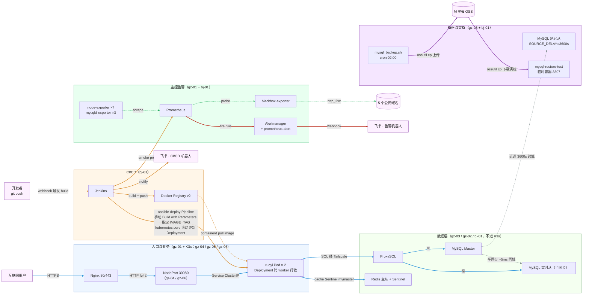

# docker-infra

> 一个跨五个云厂商、按版本演进的自建多云集群项目。从 V1.0 单机 Docker Compose 起步，逐步演进到当前的完整 IaC + CI/CD + 监控告警 + 备份恢复 + K3s 无状态业务承载闭环；V1.7 备份恢复演练实测 **RTO 34 秒、最大 RPO 24 小时**，V1.9 K3s 四类故障演练期间公网探针 **305/305 全 200**。

集群运行在真实付费的跨多云节点上（阿里云 / 腾讯云 / 火山引擎 / 京东云 / 百度云），所有节点通过 **Tailscale WireGuard** 加密隧道走内网互联，不依赖公网端口暴露。当前对应 Git tag `arch-v1.9`。

---

## 当前架构（V1.9）

```mermaid
flowchart LR
    U["互联网用户"] --> NG

    subgraph NG["gz-01 · 入口网关 + 监控主节点<br/>阿里云·广州"]
        direction TB
        NGINX["Nginx 80/443"]
        PROM["Prometheus"]
        GRAF["Grafana"]
        BB["blackbox-exporter"]
    end

    NG -->|"业务流量 → NodePort 30080"| K3S
    NG -->|"运维入口"| BJ01

    subgraph K3S["K3s v1.35.5+k3s1 · 三节点 · flannel over Tailscale"]
        direction TB
        subgraph GZ05["gz-05 · server / control-plane<br/>腾讯云·广州"]
            API["apiserver :6443"]
        end
        subgraph GZ04["gz-04 · agent worker<br/>百度云·广州"]
            POD1["ruoyi Pod #1"]
        end
        subgraph GZ06["gz-06 · agent worker<br/>腾讯云·广州"]
            POD2["ruoyi Pod #2"]
        end
    end

    subgraph GZ03["gz-03 · 数据主节点 / 备份执行节点<br/>火山引擎·广州"]
        direction TB
        MYM["MySQL Master"]
        PXY["ProxySQL"]
        RDM["Redis Master"]
        BK["mysql_backup.sh<br/>cron 02:00 每日"]
    end

    subgraph GZ02["gz-02 · 数据副节点<br/>腾讯云·广州"]
        direction TB
        MYS1["MySQL 实时从库"]
        RDS1["Redis 从库"]
        COLD["ruoyi-admin-2<br/>（stopped 有界冷备）"]
    end

    subgraph BJ01["bj-01 · 运维 / 灾备 / Registry / kubectl 控制节点<br/>京东云·北京"]
        direction TB
        JK["Jenkins CI/CD"]
        REG["Docker Registry"]
        AM["Alertmanager → 飞书"]
        KCTL["kubectl + kubeconfig"]
        MYS2["MySQL 延迟从库<br/>SOURCE_DELAY=3600s"]
    end

    OSS[("阿里云 OSS<br/>docker-infra/mysql/ruoyi/")]

    K3S -->|"JDBC / Redis 经 Tailscale"| GZ03
    GZ03 -.->|"主从复制（同城 ~5ms）"| GZ02
    GZ03 -.->|"延迟主从复制（跨城 ~35ms）"| BJ01
    BJ01 -.->|"kubectl 6443 / 镜像拉取（跨城 ~35ms）"| K3S
    BK -->|"ossutil cp"| OSS

    classDef edge fill:#eef6ff,stroke:#4f83cc,color:#111;
    classDef k3s fill:#fdf0ff,stroke:#9b59b6,color:#111;
    classDef app fill:#f4fff0,stroke:#65a765,color:#111;
    classDef ops fill:#fff6e8,stroke:#d99036,color:#111;
    class NG edge;
    class K3S,GZ05,GZ04,GZ06 k3s;
    class GZ03,GZ02 app;
    class BJ01 ops;
    class OSS k3s;
```

完整快照（每个节点详细服务清单、端口、网络延迟、决策原因）：[`Docs/architecture/v1.9.md`](Docs/architecture/v1.9.md)

### 数据流分层

上面那张是**物理拓扑**（"集群里有什么 · 部署在哪"）；下面这张换成**数据流视角**——按业务、监控采集、告警、CI/CD、主从复制、备份恢复 6 类数据流分别给边上色，便于一眼看出每条链路的归属与方向。

```mermaid
flowchart LR
    USER["互联网用户"]
    DEV["开发者<br/>git push"]
    DOMAINS[("5 个公网域名")]
    OSS[("阿里云 OSS")]
    FB_AL["飞书 · 告警机器人"]
    FB_CI["飞书 · CI/CD 机器人"]

    subgraph FRONT["入口与业务（gz-01 + K3s：gz-04 / gz-05 / gz-06）"]
        NGINX["Nginx 80/443"]
        NP["NodePort 30080<br/>（gz-04 / gz-06）"]
        RY["ruoyi Pod × 2<br/>Deployment 跨 worker 打散"]
    end

    subgraph DATA["数据层（gz-03 / gz-02 / bj-01，不进 K3s）"]
        PXY["ProxySQL"]
        MYM["MySQL Master"]
        MYS1["MySQL 实时从（半同步）"]
        RD["Redis 主从 + Sentinel"]
    end

    subgraph OBSV["监控告警（gz-01 + bj-01）"]
        EXP["node-exporter ×7<br/>mysqld-exporter ×3"]
        BB["blackbox-exporter"]
        PROM["Prometheus"]
        AM["Alertmanager<br/>+ prometheus-alert"]
    end

    subgraph CICD["CI/CD（bj-01）"]
        JK["Jenkins"]
        REG["Docker Registry v2"]
    end

    subgraph BCKDR["备份与灾备（gz-03 + bj-01）"]
        BK["mysql_backup.sh<br/>cron 02:00"]
        MYS2["MySQL 延迟从<br/>SOURCE_DELAY=3600s"]
        REST["mysql-restore-test<br/>临时容器:3307"]
    end

    USER -->|HTTPS| NGINX
    NGINX -->|HTTP 反代| NP
    NP -->|Service ClusterIP| RY
    RY -->|SQL 经 Tailscale| PXY
    PXY -->|写| MYM
    PXY -->|读| MYS1
    RY -->|cache Sentinel mymaster| RD

    EXP -.->|scrape| PROM
    PROM -.->|probe| BB
    BB -.->|http_2xx| DOMAINS

    PROM ==>|fire rule| AM
    AM ==>|webhook| FB_AL

    DEV -->|webhook 触发 build| JK
    JK -->|build + push| REG
    JK -->|ansible-deploy Pipeline<br/>手动 Build with Parameters 指定 IMAGE_TAG<br/>kubernetes.core 滚动更新 Deployment| RY
    REG -.->|containerd pull image| RY
    JK -->|smoke probe| PROM
    JK -->|notify| FB_CI

    MYM -.->|半同步 ~5ms 同城| MYS1
    MYM -.->|延迟 3600s 跨城| MYS2

    BK -->|ossutil cp 上传| OSS
    OSS -->|ossutil cp 下载演练| REST

    linkStyle 0,1,2,3,4,5,6 stroke:#3498db,stroke-width:2px
    linkStyle 7,8,9 stroke:#27ae60,stroke-width:2px
    linkStyle 10,11 stroke:#c0392b,stroke-width:2.5px
    linkStyle 12,13,14,15,16,17 stroke:#d99036,stroke-width:2px
    linkStyle 18,19 stroke:#7f8c8d,stroke-width:1.5px
    linkStyle 20,21 stroke:#8e44ad,stroke-width:2px

    style FRONT fill:#eef6ff,stroke:#4f83cc,color:#111
    style DATA fill:#f4fff0,stroke:#65a765,color:#111
    style OBSV fill:#e8fff0,stroke:#27ae60,color:#111
    style CICD fill:#fff6e8,stroke:#d99036,color:#111
    style BCKDR fill:#f5e6ff,stroke:#8e44ad,color:#111

    classDef ext fill:#fdf0ff,stroke:#9b59b6,color:#111
    class USER,DEV,DOMAINS,OSS,FB_AL,FB_CI ext
```

| 边色 / 样式 | 数据流 | 路径说明 |
|---|---|---|
| 蓝 · 实线 | **业务流量** | 用户 → gz-01 Nginx → K3s NodePort 30080（gz-04 / gz-06）→ ruoyi Pod × 2 → 经 Tailscale 直连 gz-03 ProxySQL（写主 / 读从）/ Redis Sentinel `mymaster` |
| 绿 · 虚线 | **监控采集** | 各节点 exporter → Prometheus；Prometheus → blackbox → 5 个公网域名（用户视角探测） |
| 红 · 粗实线 | **告警链路** | Prometheus 规则触发 → Alertmanager + prometheus-alert 适配 → 飞书告警机器人（端到端 < 5 分钟） |
| 橙 · 实线 / 虚线 | **CI/CD 镜像与构建** | ① git push webhook → Jenkins 自动 build & push 镜像至 Registry;② 手动在 `ansible-deploy` Pipeline 通过 Build with Parameters 指定 `IMAGE_TAG` 触发部署,Jenkins 经 `kubernetes.core.k8s` 对 K3s Deployment 做滚动更新（`maxUnavailable:0` 公网零中断）,K3s 节点 containerd 从 Registry pull 镜像（图中橙色虚线 = 镜像数据流）;③ 部署后 Jenkins 调 Prometheus 做 smoke probe,结果发飞书 CI/CD 机器人。构建与部署解耦,按 tag 精确回滚另有 `kubectl rollout undo`。**优化**：`ansible-deploy` Pipeline 内置 `Path Filter` stage,以 `GIT_PREVIOUS_SUCCESSFUL_COMMIT` 为基准 diff,若本次 push 仅命中 docs 白名单（`Docs/` / `.cursor/` / `CHANGELOG.md` / `README.md` / `.gitignore`）则早退 `NOT_BUILT`,避免 60% 以上的纯文档 push 触发无意义的 Ansible 全量执行 |
| 灰 · 虚线 | **MySQL 主从复制** | 主 → 同城实时从（半同步 ~5ms）/ 跨城延迟从（SOURCE_DELAY=3600s,提供误操作回档窗口） |
| 紫 · 实线 | **备份与恢复** | mysql_backup.sh 每日 02:00 上传至阿里云 OSS；演练时下载到 bj-01 临时容器,实测 RTO 34 秒 |

---

## 技术栈

| 层 | 选型 | 落地形态 |
|---|---|---|
| 节点互联 | Tailscale（WireGuard） | 跨多云加密隧道，零公网端口暴露 |
| 配置即代码 | Ansible + ansible-vault | bj-01 为唯一控制节点；vault 加密敏感信息后入 Git；`playbooks/site.yml` 全量幂等 |
| CI / CD | Jenkins + Pipeline as Code | `Jenkinsfile` 在仓库内；GitHub webhook 触发 + 参数化手动；含 Smoke Test 与飞书通知 |
| 容器编排 | Docker Compose + K3s `v1.35.5+k3s1` | 有状态与基础设施服务留 Compose（网络 `global_gateway`）；ruoyi 无状态后端进 K3s（gz-05 server + gz-04/gz-06 worker，全离线 airgap 安装，flannel over Tailscale，`--disable=traefik`） |
| 私有镜像 | Docker Registry v2 | bj-01 自建，htpasswd Basic Auth，每周日 02:00 自动 GC（DELETE + 裸 GC 两段式） |
| 入口网关 | Nginx | TLS 终止、反向代理、按域名分流（业务 / 运维 / 监控）；V1.9 起 ruoyi upstream 由变量驱动指向 K3s NodePort 30080，回滚改一个变量重渲染即可 |
| 监控采集 | Prometheus + node-exporter + mysqld-exporter + blackbox-exporter | gz-01 |
| 监控展示 | Grafana | gz-01 |
| 告警 | Alertmanager + prometheus-alert → 飞书 | bj-01；双机器人分离告警通知与 CI/CD 通知 |
| 数据库 | MySQL 8.0 一主两从 + 半同步 + GTID | gz-03 主 · gz-02 实时从 · bj-01 延迟 3600s 从（提供误操作回档窗口） |
| 读写分离 | ProxySQL | gz-03 |
| 缓存 | Redis 主从 + Sentinel | gz-03 主 · gz-02 / bj-01 从 |
| 备份与恢复 | mysqldump + 阿里云 OSS + ossutil | gz-03 每日 02:00 备份 · bj-01 临时容器演练（端口 3307，演练后销毁） |

---

## 版本演进

每个版本聚焦一个主题，按 **proposal → Ansible 实施 → runbook → 部署验证 → architecture 快照 → retrospective** 完整闭环，发布时打 `arch-vX.Y` tag。

| 版本 | Tag | 主题 | 关键成果 |
|---|---|---|---|
| V1.0 | — | 初始四节点拓扑 | gz-01 / gz-02 / gz-03 / bj-01 跨四云 Tailscale 内网互联；ruoyi 业务 + Redis 主从 |
| V1.1 | — | 监控栈迁至 gz-01 | Prometheus / Grafana 迁移；node-exporter 全节点覆盖 |
| V1.2 | `arch-v1.2` | **MySQL 主从高可用** | 半同步 + GTID + ProxySQL 读写分离；bj-01 延迟 3600s 从库提供误操作回档窗口 |
| V1.3 | — | 配置纳入 Git | `/opt/docker` 入 GitHub Private；V1.4 引入 Ansible 后正式启用 |
| V1.4 | `arch-v1.4` | **Ansible + Jenkins CI/CD 配置管理** | git push 自动下发；vault 加密敏感信息 |
| V1.5 | `arch-v1.5` | **告警闭环** | Prometheus 规则 + blackbox-exporter + Alertmanager + 飞书机器人 |
| V1.6 | `arch-v1.6` | **应用交付流水线** | 私有 Registry + ruoyi CI/CD 全链路 + 周 GC + Smoke Test + 双机器人 |
| V1.7 | `arch-v1.7` | **备份恢复闭环** | mysqldump + 阿里云 OSS + bj-01 临时容器演练，**实测 RTO 34 秒、最大 RPO 24 小时** |
| V1.8 | `arch-v1.8` | **六节点基础接入** | gz-04 / gz-05 Tailscale + Docker Engine + node-exporter 纳管；base-access 在 6 台幂等创建统一运维身份 admin-alex |
| V1.9 | `arch-v1.9` | **K3s 无状态迁移** | gz-06 接入 + 三节点全离线 airgap K3s（flannel over Tailscale）；ruoyi Deployment 2 副本切流 NodePort，四类故障演练期间公网探针 **305/305 全 200**；有状态服务留 Compose |
| 未来主题 | — | Helm Chart 化 / 入口与监控迁移 / Loki 日志 / DMS 出口冗余 / TLS 自动续期 / ProxySQL HA / Redis Sentinel 边界 / CI/CD IaC 等（slug 化映射，目标版本号以路线图主文件为准） | 路线图见 [`Docs/scheme/phase-1-architecture-upgrade.md`](Docs/scheme/phase-1-architecture-upgrade.md) |

按版本聚合的完整变更日志：[`CHANGELOG.md`](CHANGELOG.md)

---

## 文档体系

`Docs/` 下按"做什么"分子目录，全部跟随 Git 工作流管理：

| 子目录 | 定位 |
|---|---|
| [`proposals/`](Docs/proposals/) | **未落地的设计草案**——每次架构演进开始前撰写，记录目标、方案、影响范围、风险与验收标准 |
| [`runbooks/`](Docs/runbooks/) | **操作手册**——从旧版本到新版本的分步清单，每步含目标 / 命令 / 预期输出 / 验证 / 回滚 |
| [`architecture/`](Docs/architecture/) | **架构快照**——每版本一份，记录落地后的完整集群状态（节点、服务、网络、决策） |
| [`retrospectives/`](Docs/retrospectives/) | **单版本演进复盘**——Q/A 形式解释技术决策原因，配踩坑记录与操作心得 |
| [`reviews/`](Docs/reviews/) | **跨版本主题型审计**——从一个具体细节倒推、系统性盘点同类盲点，给出修复排期 |
| [`drills/`](Docs/drills/) | **故障演练记录**——主动验证已有能力（告警链路时延、故障摘除自动性、恢复 RTO 等） |
| [`sli-slo.md`](Docs/sli-slo.md) | **运营层指标契约**——集群对外承诺哪些可靠性指标、用什么衡量、违约如何兜底 |

几个值得直接打开的文件：

- [`Docs/architecture/v1.9.md`](Docs/architecture/v1.9.md) — 当前集群完整快照
- [`Docs/retrospectives/v1.9-retrospective.md`](Docs/retrospectives/v1.9-retrospective.md) — V1.9 完整复盘（airgap 决策、9 条踩坑、条件放行与有界冷备）
- [`Docs/drills/v1.9-k3s-failure-drills.md`](Docs/drills/v1.9-k3s-failure-drills.md) — K3s 四类故障演练实测（坏镜像 / 坏探针 / drain / reboot 冷启动自愈）
- [`Docs/reviews/v1.7-iac-completeness-audit.md`](Docs/reviews/v1.7-iac-completeness-audit.md) — 从 `mysql_source_delay` 一个变量倒推出的 21 个 IaC 完整性问题
- [`Docs/reviews/v1.7-ingress-probe-functional-depth-gap.md`](Docs/reviews/v1.7-ingress-probe-functional-depth-gap.md) — 一次 ruoyi 后端死 5 天无人感知的故障，倒推入口探测的功能深度盲区
- [`CHANGELOG.md`](CHANGELOG.md) — 按 Git tag 聚合的版本变更日志

完整文档地图（含历史归档与索引）见 [`Docs/README.md`](Docs/README.md)。

---

## 关于这个项目

这是一个**个人学习项目**——目标是系统性掌握云运维核心技能，并把每一次演进都沉淀为可被读懂、可被追问、可被排障的工程记录。集群本身运行在跨多个云厂商的真实付费服务器上，所有节点、服务、配置都是真实工作的，不存在示意图节点或假数据。

本仓库**不接受 Issue / PR 用户支持**，也不提供 fork-and-deploy 模板——它是一个公开的"个人云运维演进日志"，欢迎阅读、学习与借鉴，但请按你自己的环境和决策另起一份再做改造。

设计原则：

- **每个版本只解决一个主题**——克制复杂度，确保每个新引入的组件都"能讲清为什么选 X 而不是 Y"
- **不为"看起来专业"堆砌组件**——架构对齐中小型科技公司的真实生产实践，不参考大厂超大规模架构
- **文档体系本身是产物**——proposals / runbooks / architecture / retrospectives / reviews / drills 互补，每次演进都完整闭环
- **真故障是免费的素材**——出过的坑会被同时写进 retrospective（事件层）和 review（如果同类问题跨版本存在），不浪费任何一次故障

---

## 如何阅读这个仓库

如果是第一次打开这个仓库，建议按下面的顺序快速建立全局印象：

1. **当前架构是什么样**：先看 [`Docs/architecture/v1.9.md`](Docs/architecture/v1.9.md)——节点角色、服务分布、网络拓扑、关键技术决策都在一份快照里。
2. **过去是怎么走到现在的**：从 [`CHANGELOG.md`](CHANGELOG.md) 按 `arch-vX.Y` tag 顺序扫一遍，对应版本可以打开 `Docs/architecture/vX.Y.md` 看每个里程碑的完整状态。
3. **每次演进具体怎么落地**：在 [`Docs/runbooks/`](Docs/runbooks/) 找 `vX.Y-to-vX.Z.md`，里面是分步可复现的操作清单（命令 + 预期输出 + 验证 + 回滚）。
4. **当时为什么这么决定**：在 [`Docs/retrospectives/`](Docs/retrospectives/) 找对应版本的 `-retrospective.md`，里面以 Q&A 形式记录决策理由与踩坑。
5. **跨版本的隐性盲点是怎么被识别的**：[`Docs/reviews/`](Docs/reviews/) 按主题组织，每份审计都从一个具体细节倒推到系统性结论。
6. **真实故障下系统的实际表现**：[`Docs/drills/`](Docs/drills/) 记录受控演练的实测数据（告警时延、故障摘除耗时、恢复 RTO 等）。

如果是来看代码，主入口是仓库根的 [`Jenkinsfile`](Jenkinsfile) 和 [`playbooks/site.yml`](playbooks/site.yml)；具体每个组件的实现在 [`roles/`](roles/) 下按模块组织。

